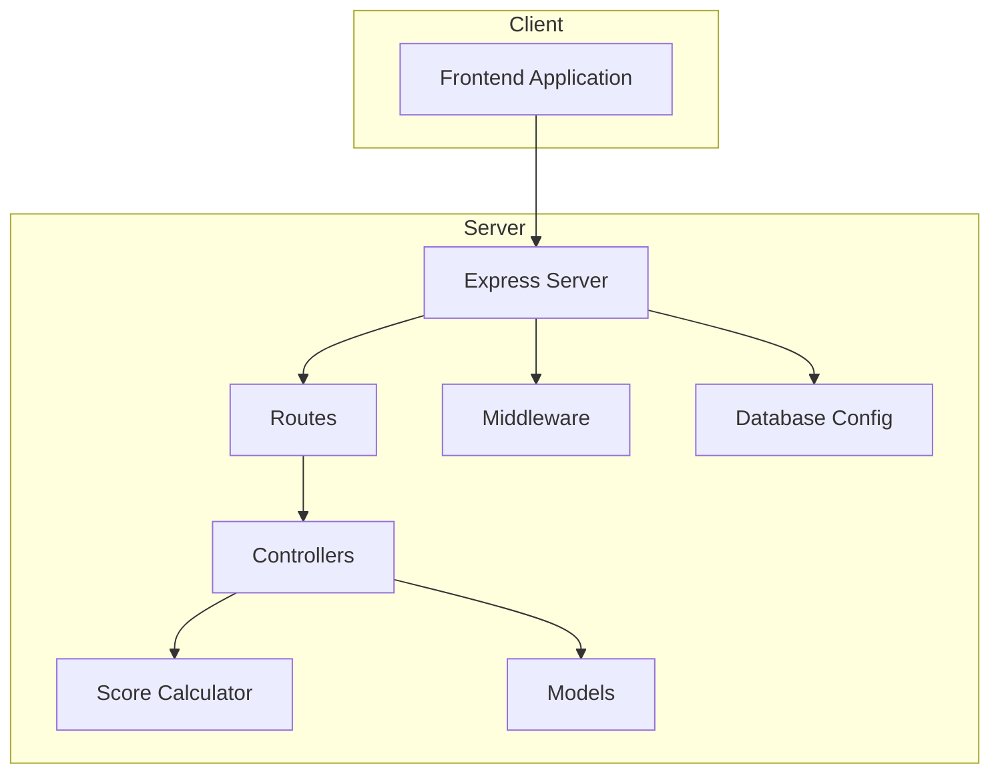
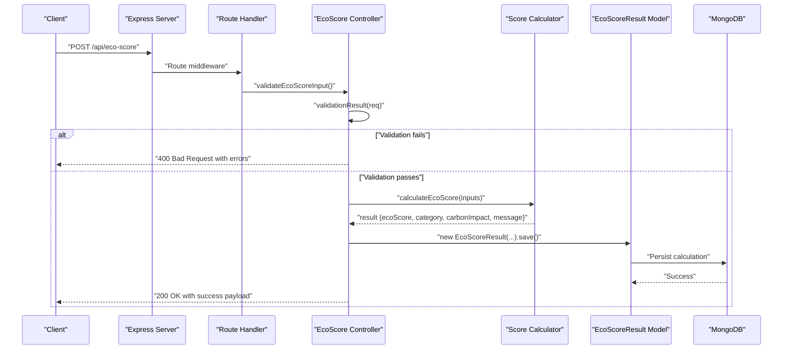
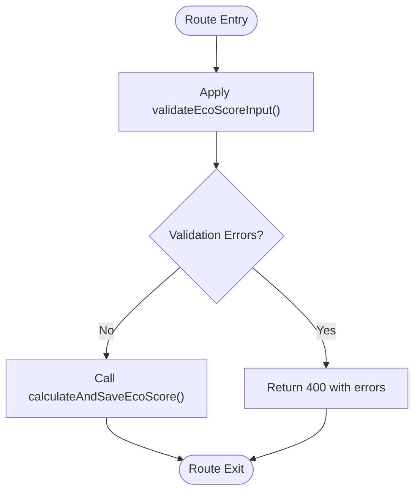
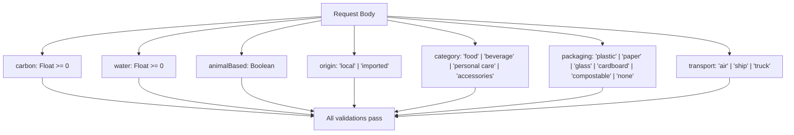
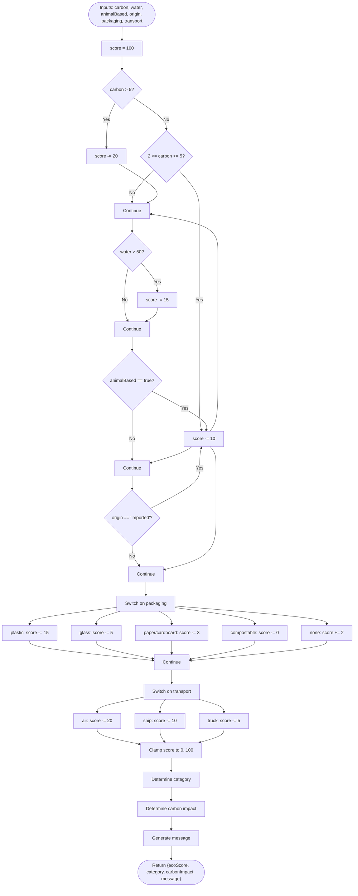
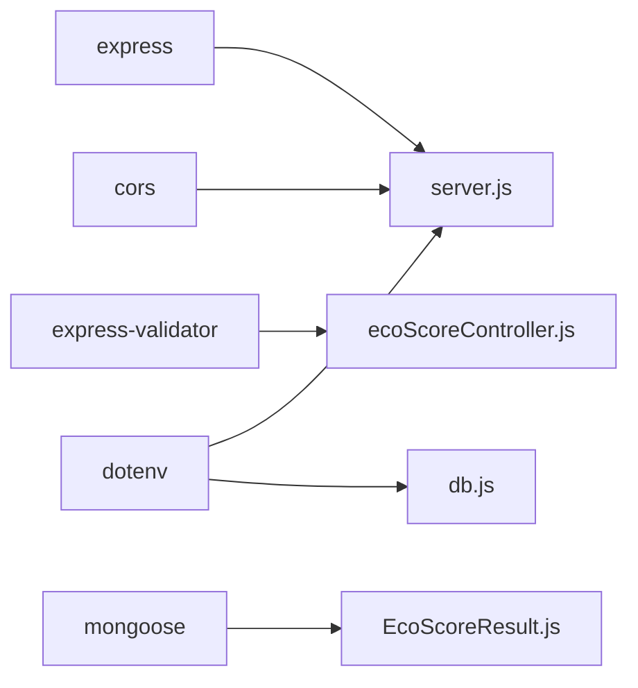

# API Documentation

<cite>
**Referenced Files in This Document**
- [server.js](file://server/server.js)
- [ecoScore.js](file://server/routes/ecoScore.js)
- [ecoScoreController.js](file://server/controllers/ecoScoreController.js)
- [scoreCalculator.js](file://server/utils/scoreCalculator.js)
- [EcoScoreResult.js](file://server/models/EcoScoreResult.js)
- [errorHandler.js](file://server/middleware/errorHandler.js)
- [db.js](file://server/config/db.js)
- [package.json](file://server/package.json)
- [api.js](file://client/src/services/api.js)
- [README.md](file://README.md)
</cite>

## Table of Contents
1. [Introduction](#introduction)
2. [Project Structure](#project-structure)
3. [Core Components](#core-components)
4. [Architecture Overview](#architecture-overview)
5. [Detailed Component Analysis](#detailed-component-analysis)
6. [Dependency Analysis](#dependency-analysis)
7. [Performance Considerations](#performance-considerations)
8. [Troubleshooting Guide](#troubleshooting-guide)
9. [Conclusion](#conclusion)
10. [Appendices](#appendices)

## Introduction
This document provides comprehensive API documentation for the Eco Score Predictor RESTful API, focusing on the POST /api/eco-score endpoint. It covers request/response schemas, parameter validation rules, error handling, scoring logic, and integration patterns. The API is built with Node.js, Express, and MongoDB, and exposes a rule-based eco scoring service that evaluates product sustainability based on environmental impact factors.

## Project Structure
The API follows a layered architecture with clear separation of concerns:
- Routes define the endpoint and apply validation middleware
- Controllers handle request processing, validation, and response formatting
- Utilities encapsulate the scoring algorithm
- Models persist calculation results to MongoDB
- Middleware provides centralized error handling
- Configuration connects to the database and enables CORS



**Diagram sources**
- [server.js](file://server/server.js#L1-L34)
- [ecoScore.js](file://server/routes/ecoScore.js#L1-L9)
- [ecoScoreController.js](file://server/controllers/ecoScoreController.js#L1-L73)
- [scoreCalculator.js](file://server/utils/scoreCalculator.js#L1-L113)
- [EcoScoreResult.js](file://server/models/EcoScoreResult.js#L1-L20)
- [errorHandler.js](file://server/middleware/errorHandler.js#L1-L14)
- [db.js](file://server/config/db.js#L1-L18)

**Section sources**
- [server.js](file://server/server.js#L1-L34)
- [README.md](file://README.md#L50-L74)

## Core Components
The POST /api/eco-score endpoint performs the following operations:
- Validates incoming request parameters against strict rules
- Computes an eco score using a rule-based algorithm
- Persists the calculation result to MongoDB
- Returns a structured JSON response with success status and computed metrics

Key validations enforced:
- Numeric fields must be positive floats
- Boolean fields must be true/false
- Enumerated fields must match predefined values
- All fields are required

Scoring outcomes include:
- Eco score (0-100)
- Category classification
- Carbon impact level
- Descriptive message

**Section sources**
- [ecoScore.js](file://server/routes/ecoScore.js#L5-L6)
- [ecoScoreController.js](file://server/controllers/ecoScoreController.js#L6-L14)
- [scoreCalculator.js](file://server/utils/scoreCalculator.js#L6-L110)
- [EcoScoreResult.js](file://server/models/EcoScoreResult.js#L3-L17)

## Architecture Overview
The API flow integrates validation, computation, persistence, and response handling:



**Diagram sources**
- [server.js](file://server/server.js#L13-L27)
- [ecoScore.js](file://server/routes/ecoScore.js#L5-L6)
- [ecoScoreController.js](file://server/controllers/ecoScoreController.js#L17-L67)
- [scoreCalculator.js](file://server/utils/scoreCalculator.js#L6-L110)
- [EcoScoreResult.js](file://server/models/EcoScoreResult.js#L4-L16)

## Detailed Component Analysis

### Endpoint Definition and Routing
The route defines the POST /api/eco-score endpoint and applies validation middleware before invoking the controller.



**Diagram sources**
- [ecoScore.js](file://server/routes/ecoScore.js#L5-L6)
- [ecoScoreController.js](file://server/controllers/ecoScoreController.js#L17-L26)

**Section sources**
- [ecoScore.js](file://server/routes/ecoScore.js#L5-L6)

### Request Validation Rules
Validation ensures data integrity and prevents invalid inputs from reaching the scoring algorithm.



**Diagram sources**
- [ecoScoreController.js](file://server/controllers/ecoScoreController.js#L6-L14)

**Section sources**
- [ecoScoreController.js](file://server/controllers/ecoScoreController.js#L6-L14)

### Scoring Algorithm
The algorithm computes an eco score by applying penalties based on product characteristics and clamps the result between 0 and 100. It also determines category and carbon impact levels with descriptive messages.



**Diagram sources**
- [scoreCalculator.js](file://server/utils/scoreCalculator.js#L6-L110)

**Section sources**
- [scoreCalculator.js](file://server/utils/scoreCalculator.js#L6-L110)

### Response Schema
On successful validation and calculation, the endpoint returns a structured JSON response containing:
- success: Boolean indicating operation outcome
- ecoScore: Integer score between 0 and 100
- category: String classification
- carbonImpact: String level description
- message: Human-readable evaluation

On validation failure, the endpoint returns:
- success: False
- errors: Array of validation error objects

**Section sources**
- [ecoScoreController.js](file://server/controllers/ecoScoreController.js#L56-L62)
- [ecoScoreController.js](file://server/controllers/ecoScoreController.js#L22-L25)

### Persistence Layer
Each calculation result is persisted to MongoDB with the following schema:
- inputs: Object containing original parameters
- calculatedScore: Number representing the eco score
- category: String classification
- carbonImpact: String level description
- message: Human-readable evaluation
- timestamps: Automatic creation/update metadata

**Section sources**
- [EcoScoreResult.js](file://server/models/EcoScoreResult.js#L3-L17)
- [ecoScoreController.js](file://server/controllers/ecoScoreController.js#L44-L53)

### Error Handling
Centralized error handling:
- Logs error stack traces
- Returns standardized JSON with success=false
- Uses 500 status code by default or respects custom error codes
- In development mode, includes stack traces for debugging

**Section sources**
- [errorHandler.js](file://server/middleware/errorHandler.js#L1-L14)

## Dependency Analysis
External dependencies and their roles:
- Express: Web framework for routing and middleware
- express-validator: Input validation library
- cors: Cross-origin resource sharing
- mongoose: MongoDB object modeling
- dotenv: Environment configuration



**Diagram sources**
- [package.json](file://server/package.json#L15-L21)
- [server.js](file://server/server.js#L1-L34)
- [ecoScoreController.js](file://server/controllers/ecoScoreController.js#L1-L3)

**Section sources**
- [package.json](file://server/package.json#L15-L21)

## Performance Considerations
- Validation occurs synchronously before computation; keep request payloads minimal
- Scoring algorithm is O(1); performance scales linearly with number of requests
- Database writes occur after successful scoring; ensure MongoDB connection is stable
- Consider implementing rate limiting at the application or reverse proxy level for production deployments

## Troubleshooting Guide
Common issues and resolutions:
- Validation failures: Ensure all fields match required types and enumerations
- Database connectivity: Verify MONGODB_URI environment variable and MongoDB availability
- CORS errors: Confirm frontend URL matches backend CORS configuration
- Network errors: Check API URL configuration and firewall settings

**Section sources**
- [errorHandler.js](file://server/middleware/errorHandler.js#L1-L14)
- [db.js](file://server/config/db.js#L3-L14)
- [server.js](file://server/server.js#L14-L16)

## Conclusion
The Eco Score Predictor API provides a robust, rule-based solution for calculating product sustainability scores. Its clean architecture, comprehensive validation, and persistent storage make it suitable for integration into larger applications. The documented endpoint, schemas, and error handling patterns enable reliable client integrations.

## Appendices

### API Endpoint Details
- Method: POST
- Path: /api/eco-score
- Content-Type: application/json

**Section sources**
- [ecoScore.js](file://server/routes/ecoScore.js#L5-L6)
- [server.js](file://server/server.js#L19-L24)

### Request Body Fields
- carbon: Positive float representing carbon footprint
- water: Positive float representing water usage
- animalBased: Boolean indicating animal-derived ingredients
- origin: Enumerated string ("local" or "imported")
- category: Enumerated string ("food", "beverage", "personal care", "accessories")
- packaging: Enumerated string ("plastic", "paper", "glass", "cardboard", "compostable", "none")
- transport: Enumerated string ("air", "ship", "truck")

**Section sources**
- [ecoScoreController.js](file://server/controllers/ecoScoreController.js#L6-L14)
- [scoreCalculator.js](file://server/utils/scoreCalculator.js#L6-L110)

### Response Body Fields
- success: Boolean indicating operation outcome
- ecoScore: Integer score between 0 and 100
- category: String classification
- carbonImpact: String level description
- message: Human-readable evaluation

**Section sources**
- [ecoScoreController.js](file://server/controllers/ecoScoreController.js#L56-L62)

### HTTP Status Codes
- 200: Successful calculation and persistence
- 400: Validation errors present
- 500: Internal server error

**Section sources**
- [ecoScoreController.js](file://server/controllers/ecoScoreController.js#L22-L25)
- [ecoScoreController.js](file://server/controllers/ecoScoreController.js#L56-L62)
- [errorHandler.js](file://server/middleware/errorHandler.js#L4)

### Error Response Format
- success: False
- errors: Array of validation error objects

**Section sources**
- [ecoScoreController.js](file://server/controllers/ecoScoreController.js#L22-L25)

### Practical Examples

#### Example Request
```json
{
  "carbon": 2.5,
  "water": 30,
  "animalBased": false,
  "origin": "local",
  "category": "food",
  "packaging": "plastic",
  "transport": "truck"
}
```

#### Example Response
```json
{
  "success": true,
  "ecoScore": 70,
  "category": "Good",
  "carbonImpact": "Low",
  "message": "Your product has a good environmental impact."
}
```

**Section sources**
- [README.md](file://README.md#L150-L172)

### Integration Patterns
- Frontend integration: Use Axios to POST to /api/eco-score with form data
- Environment configuration: Set VITE_API_URL to match backend base URL
- Error handling: Catch and display validation errors or server responses

**Section sources**
- [api.js](file://client/src/services/api.js#L3-L12)
- [README.md](file://README.md#L132-L142)

### Rate Limiting Considerations
- Not implemented in current codebase
- Recommended: Add rate limiting middleware or configure at reverse proxy level
- Consider per-IP limits and burst protection for production

### Security Headers and CORS
- CORS enabled globally for development
- Production deployment should restrict origins and add security headers
- Consider adding Content-Security-Policy and HSTS headers

**Section sources**
- [server.js](file://server/server.js#L14-L16)

### API Versioning Strategy
- Current implementation does not include explicit versioning
- Recommended: Use path-based versioning (/v1/api/eco-score) or header-based versioning
- Maintain backward compatibility by deprecating endpoints rather than removing

### Backward Compatibility
- Current schema is stable and minimal
- Future enhancements should preserve existing fields while adding optional ones
- Document breaking changes and migration paths