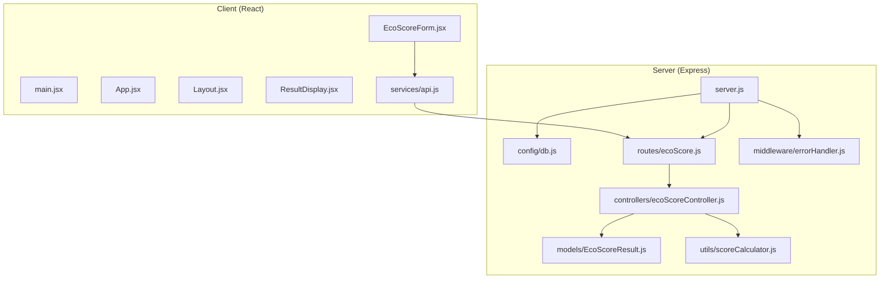
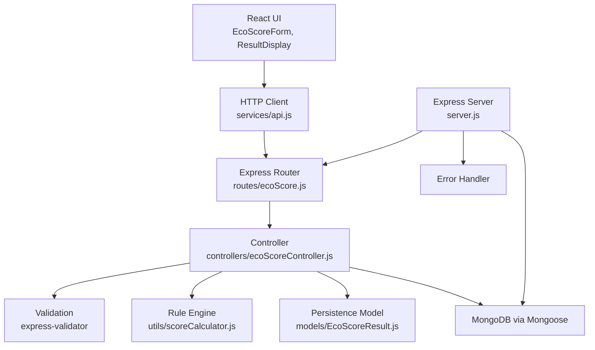
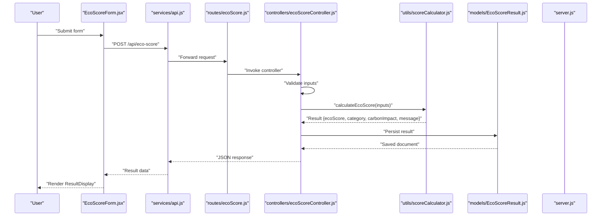
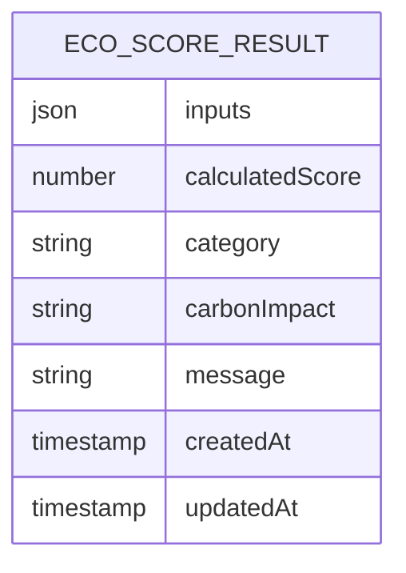
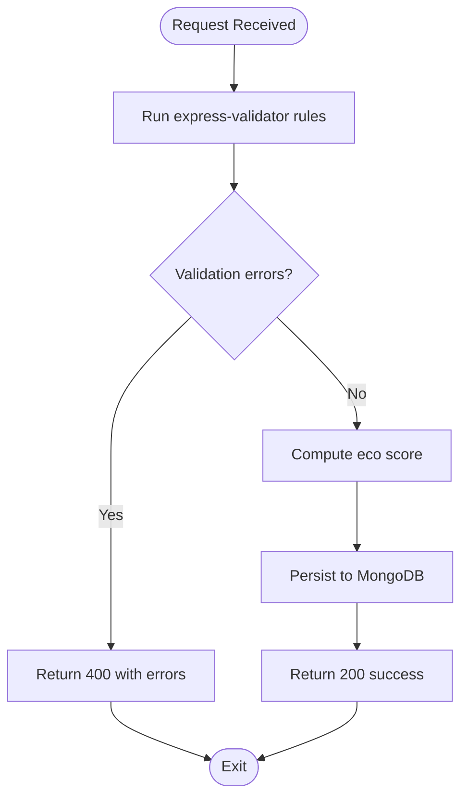
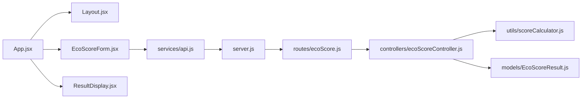
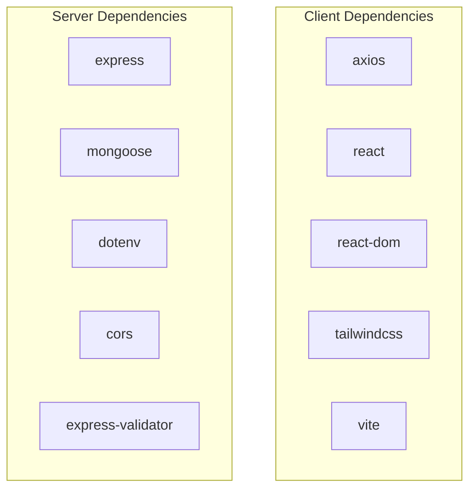

# Architecture Overview

<cite>
**Referenced Files in This Document**
- [README.md](file://README.md)
- [client/package.json](file://client/package.json)
- [server/package.json](file://server/package.json)
- [server/server.js](file://server/server.js)
- [server/config/db.js](file://server/config/db.js)
- [server/routes/ecoScore.js](file://server/routes/ecoScore.js)
- [server/controllers/ecoScoreController.js](file://server/controllers/ecoScoreController.js)
- [server/models/EcoScoreResult.js](file://server/models/EcoScoreResult.js)
- [server/utils/scoreCalculator.js](file://server/utils/scoreCalculator.js)
- [server/middleware/errorHandler.js](file://server/middleware/errorHandler.js)
- [client/src/main.jsx](file://client/src/main.jsx)
- [client/src/App.jsx](file://client/src/App.jsx)
- [client/src/services/api.js](file://client/src/services/api.js)
- [client/src/components/Layout.jsx](file://client/src/components/Layout.jsx)
- [client/src/components/EcoScoreForm.jsx](file://client/src/components/EcoScoreForm.jsx)
- [client/src/components/ResultDisplay.jsx](file://client/src/components/ResultDisplay.jsx)
</cite>

## Table of Contents
1. [Introduction](#introduction)
2. [Project Structure](#project-structure)
3. [Core Components](#core-components)
4. [Architecture Overview](#architecture-overview)
5. [Detailed Component Analysis](#detailed-component-analysis)
6. [Dependency Analysis](#dependency-analysis)
7. [Performance Considerations](#performance-considerations)
8. [Troubleshooting Guide](#troubleshooting-guide)
9. [Conclusion](#conclusion)

## Introduction
This document presents the architecture of the Eco Score Predictor, a MERN stack application that computes product sustainability scores using rule-based logic. The system is designed with clear separation between the frontend React application and the backend Express.js server. It follows a layered architecture with presentation, business logic, and data access layers, and integrates MongoDB via Mongoose for persistence. The RESTful API exposes a single endpoint for calculating eco scores, while the frontend provides a responsive UI with real-time feedback.

## Project Structure
The project is organized into two primary directories:
- client/: React application built with Vite, Tailwind CSS, and Axios for UI and HTTP requests.
- server/: Express.js backend with modularized layers for configuration, routes, controllers, models, utilities, and middleware.

**Diagram sources**
- [client/src/main.jsx](file://client/src/main.jsx#L1-L11)
- [client/src/App.jsx](file://client/src/App.jsx#L1-L37)
- [client/src/components/Layout.jsx](file://client/src/components/Layout.jsx#L1-L12)
- [client/src/components/EcoScoreForm.jsx](file://client/src/components/EcoScoreForm.jsx#L1-L225)
- [client/src/components/ResultDisplay.jsx](file://client/src/components/ResultDisplay.jsx#L1-L82)
- [client/src/services/api.js](file://client/src/services/api.js#L1-L13)
- [server/server.js](file://server/server.js#L1-L34)
- [server/config/db.js](file://server/config/db.js#L1-L18)
- [server/routes/ecoScore.js](file://server/routes/ecoScore.js#L1-L9)
- [server/controllers/ecoScoreController.js](file://server/controllers/ecoScoreController.js#L1-L73)
- [server/models/EcoScoreResult.js](file://server/models/EcoScoreResult.js#L1-L20)
- [server/utils/scoreCalculator.js](file://server/utils/scoreCalculator.js#L1-L113)
- [server/middleware/errorHandler.js](file://server/middleware/errorHandler.js)

**Section sources**
- [README.md](file://README.md#L50-L74)
- [client/package.json](file://client/package.json#L1-L32)
- [server/package.json](file://server/package.json#L1-L23)

## Core Components
- Presentation Layer (Client)
  - App container manages state and orchestrates layout, form, and result display.
  - EcoScoreForm handles user input, validation, and submission.
  - ResultDisplay renders the computed eco score, category, carbon impact, and message.
  - services/api.js encapsulates HTTP calls to the backend API.

- Business Logic Layer (Server)
  - ecoScoreController.js validates inputs, delegates scoring to scoreCalculator.js, persists results, and returns structured responses.
  - scoreCalculator.js implements the rule-based scoring algorithm and categorization.

- Data Access Layer (Server)
  - EcoScoreResult model defines the schema persisted to MongoDB.
  - db.js connects to MongoDB using Mongoose.

- Infrastructure (Server)
  - server.js initializes Express, enables CORS, parses JSON, mounts routes, and registers error handling middleware.
  - errorHandler.js centralizes error responses.

**Section sources**
- [client/src/App.jsx](file://client/src/App.jsx#L1-L37)
- [client/src/components/EcoScoreForm.jsx](file://client/src/components/EcoScoreForm.jsx#L1-L225)
- [client/src/components/ResultDisplay.jsx](file://client/src/components/ResultDisplay.jsx#L1-L82)
- [client/src/services/api.js](file://client/src/services/api.js#L1-L13)
- [server/controllers/ecoScoreController.js](file://server/controllers/ecoScoreController.js#L1-L73)
- [server/utils/scoreCalculator.js](file://server/utils/scoreCalculator.js#L1-L113)
- [server/models/EcoScoreResult.js](file://server/models/EcoScoreResult.js#L1-L20)
- [server/config/db.js](file://server/config/db.js#L1-L18)
- [server/server.js](file://server/server.js#L1-L34)
- [server/middleware/errorHandler.js](file://server/middleware/errorHandler.js)

## Architecture Overview
The system adheres to layered architecture:
- Presentation: React components render forms and results, manage user interactions, and communicate with the backend via Axios.
- Business Logic: Express routes delegate to controllers that validate inputs, compute scores, and persist outcomes.
- Data Access: Mongoose models and Mongoose connections handle schema enforcement and persistence.
- Cross-Cutting Concerns: CORS, input validation, error handling, and environment configuration.

**Diagram sources**
- [client/src/components/EcoScoreForm.jsx](file://client/src/components/EcoScoreForm.jsx#L1-L225)
- [client/src/components/ResultDisplay.jsx](file://client/src/components/ResultDisplay.jsx#L1-L82)
- [client/src/services/api.js](file://client/src/services/api.js#L1-L13)
- [server/routes/ecoScore.js](file://server/routes/ecoScore.js#L1-L9)
- [server/controllers/ecoScoreController.js](file://server/controllers/ecoScoreController.js#L1-L73)
- [server/utils/scoreCalculator.js](file://server/utils/scoreCalculator.js#L1-L113)
- [server/models/EcoScoreResult.js](file://server/models/EcoScoreResult.js#L1-L20)
- [server/server.js](file://server/server.js#L1-L34)
- [server/middleware/errorHandler.js](file://server/middleware/errorHandler.js)

## Detailed Component Analysis

### RESTful API Design
- Endpoint: POST /api/eco-score
- Request Body Fields:
  - carbon: number (>= 0)
  - water: number (>= 0)
  - animalBased: boolean
  - origin: "local" | "imported"
  - category: "food" | "beverage" | "personal care" | "accessories"
  - packaging: "plastic" | "paper" | "glass" | "cardboard" | "compostable" | "none"
  - transport: "air" | "ship" | "truck"
- Response Fields:
  - success: boolean
  - ecoScore: number (0–100)
  - category: string
  - carbonImpact: string
  - message: string

**Diagram sources**
- [client/src/components/EcoScoreForm.jsx](file://client/src/components/EcoScoreForm.jsx#L26-L47)
- [client/src/services/api.js](file://client/src/services/api.js#L5-L12)
- [server/routes/ecoScore.js](file://server/routes/ecoScore.js#L5-L6)
- [server/controllers/ecoScoreController.js](file://server/controllers/ecoScoreController.js#L17-L67)
- [server/utils/scoreCalculator.js](file://server/utils/scoreCalculator.js#L6-L110)
- [server/models/EcoScoreResult.js](file://server/models/EcoScoreResult.js#L3-L17)
- [server/server.js](file://server/server.js#L19-L27)

**Section sources**
- [README.md](file://README.md#L144-L182)
- [server/routes/ecoScore.js](file://server/routes/ecoScore.js#L1-L9)
- [server/controllers/ecoScoreController.js](file://server/controllers/ecoScoreController.js#L1-L73)
- [server/utils/scoreCalculator.js](file://server/utils/scoreCalculator.js#L1-L113)

### Data Persistence Strategy
- Schema: EcoScoreResult stores inputs, calculatedScore, category, carbonImpact, and message with timestamps.
- Persistence: Controller creates and saves a new document after successful calculation.
- Connection: Mongoose connects to MongoDB using URI from environment variables.

**Diagram sources**
- [server/models/EcoScoreResult.js](file://server/models/EcoScoreResult.js#L3-L17)

**Section sources**
- [server/models/EcoScoreResult.js](file://server/models/EcoScoreResult.js#L1-L20)
- [server/config/db.js](file://server/config/db.js#L1-L18)
- [server/controllers/ecoScoreController.js](file://server/controllers/ecoScoreController.js#L44-L53)

### Validation and Error Handling
- Validation: express-validator enforces field types and allowed values; invalid inputs return 400 with errors array.
- Error Handling: errorHandler middleware standardizes error responses and prevents crashes.
- Frontend: services/api.js normalizes network errors into user-friendly messages.

**Diagram sources**
- [server/controllers/ecoScoreController.js](file://server/controllers/ecoScoreController.js#L6-L26)
- [server/utils/scoreCalculator.js](file://server/utils/scoreCalculator.js#L6-L110)
- [server/models/EcoScoreResult.js](file://server/models/EcoScoreResult.js#L3-L17)
- [server/middleware/errorHandler.js](file://server/middleware/errorHandler.js)

**Section sources**
- [server/controllers/ecoScoreController.js](file://server/controllers/ecoScoreController.js#L1-L73)
- [server/middleware/errorHandler.js](file://server/middleware/errorHandler.js)

### Component Relationships and Data Flow
- App.jsx composes Layout, HomePage, EcoScoreForm, and ResultDisplay, passing result via props.
- EcoScoreForm collects user inputs, converts numeric fields, and triggers API calls.
- ResultDisplay renders the score visualization and category badge.
- services/api.js abstracts base URL and request logic.

**Diagram sources**
- [client/src/App.jsx](file://client/src/App.jsx#L1-L37)
- [client/src/components/Layout.jsx](file://client/src/components/Layout.jsx#L1-L12)
- [client/src/components/EcoScoreForm.jsx](file://client/src/components/EcoScoreForm.jsx#L1-L225)
- [client/src/components/ResultDisplay.jsx](file://client/src/components/ResultDisplay.jsx#L1-L82)
- [client/src/services/api.js](file://client/src/services/api.js#L1-L13)
- [server/server.js](file://server/server.js#L1-L34)
- [server/routes/ecoScore.js](file://server/routes/ecoScore.js#L1-L9)
- [server/controllers/ecoScoreController.js](file://server/controllers/ecoScoreController.js#L1-L73)
- [server/utils/scoreCalculator.js](file://server/utils/scoreCalculator.js#L1-L113)
- [server/models/EcoScoreResult.js](file://server/models/EcoScoreResult.js#L1-L20)

**Section sources**
- [client/src/App.jsx](file://client/src/App.jsx#L1-L37)
- [client/src/components/EcoScoreForm.jsx](file://client/src/components/EcoScoreForm.jsx#L1-L225)
- [client/src/components/ResultDisplay.jsx](file://client/src/components/ResultDisplay.jsx#L1-L82)
- [client/src/services/api.js](file://client/src/services/api.js#L1-L13)

## Dependency Analysis
- Frontend dependencies include React, React DOM, Axios, Vite, Tailwind CSS, and related tooling.
- Backend dependencies include Express, Mongoose, dotenv, CORS, express-validator, and development tooling.

**Diagram sources**
- [client/package.json](file://client/package.json#L12-L30)
- [server/package.json](file://server/package.json#L15-L21)

**Section sources**
- [client/package.json](file://client/package.json#L1-L32)
- [server/package.json](file://server/package.json#L1-L23)

## Performance Considerations
- Network latency: Minimize payload size by sending only required fields; the current request body is compact.
- Validation overhead: Keep validation rules minimal and efficient; express-validator performs fast checks.
- Database writes: Persisting every calculation ensures auditability but may increase write load; consider batching or sampling for high throughput.
- Rendering: React components are lightweight; ensure no unnecessary re-renders by using stable prop references and memoization where appropriate.
- Caching: Introduce in-memory caching for identical inputs if repeated calculations are frequent.

## Troubleshooting Guide
- Backend not starting
  - Verify environment variables (PORT, MONGODB_URI) and that MongoDB is reachable.
  - Confirm server.js listens on the configured port and CORS is enabled.
- API returns 400 errors
  - Check input types and enums; ensure carbon and water are non-negative numbers and all enum fields match allowed values.
- Network errors in frontend
  - Confirm VITE_API_URL points to the correct backend host and port.
  - Inspect browser console for CORS-related failures.
- Database connection failures
  - Validate MONGODB_URI and credentials; ensure MongoDB service is running.

**Section sources**
- [README.md](file://README.md#L96-L142)
- [server/server.js](file://server/server.js#L1-L34)
- [server/config/db.js](file://server/config/db.js#L1-L18)
- [client/src/services/api.js](file://client/src/services/api.js#L3-L3)

## Conclusion
The Eco Score Predictor employs a clean, layered MERN architecture with well-defined boundaries between the React frontend and Express backend. The backend’s separation of concerns—validation, business logic, and persistence—enables maintainability and testability. The RESTful API and MongoDB integration provide a straightforward path for scaling features such as user profiles, analytics dashboards, and export capabilities.