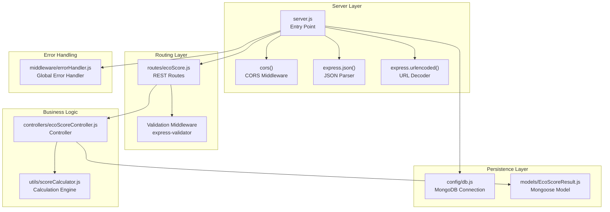
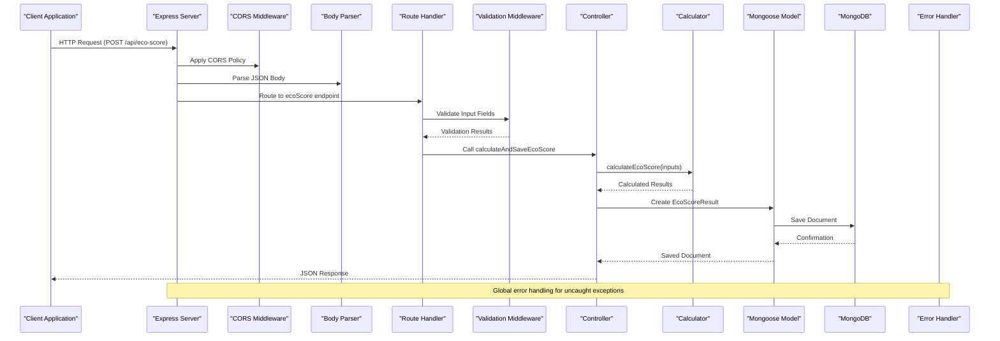
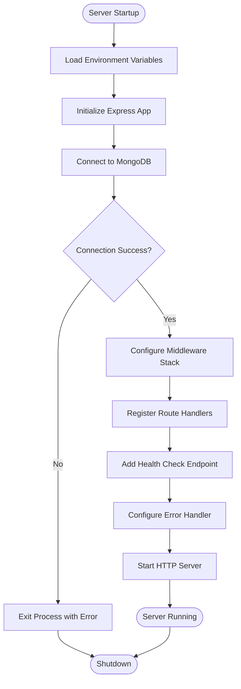
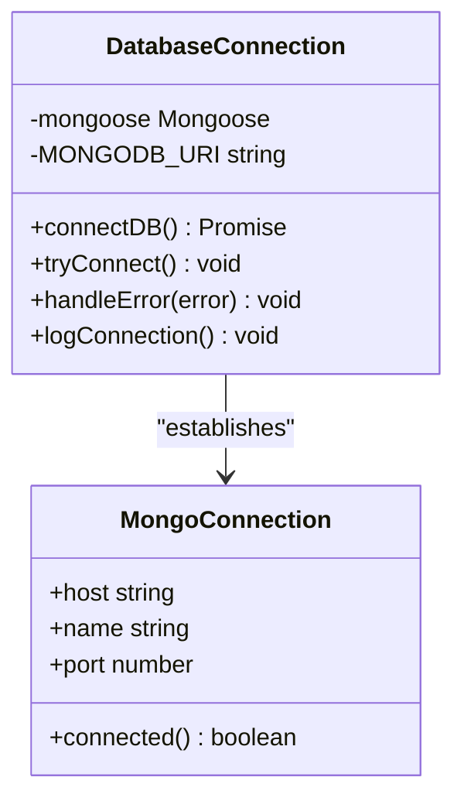
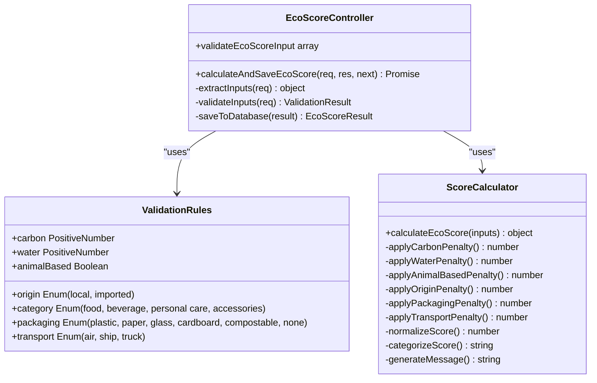
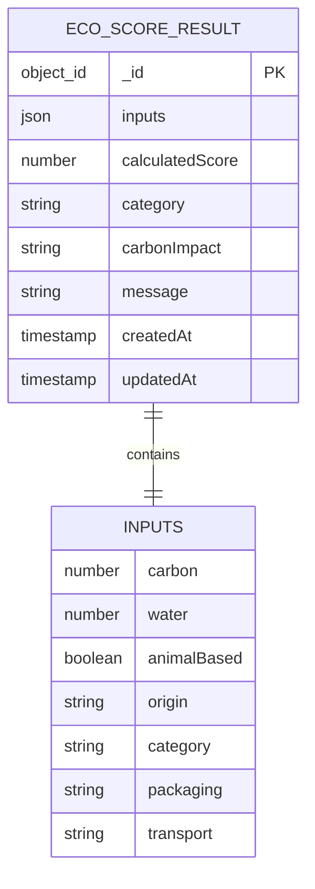
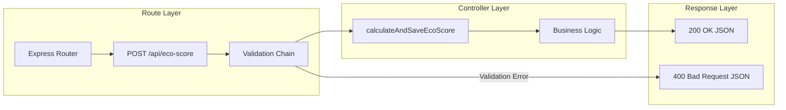
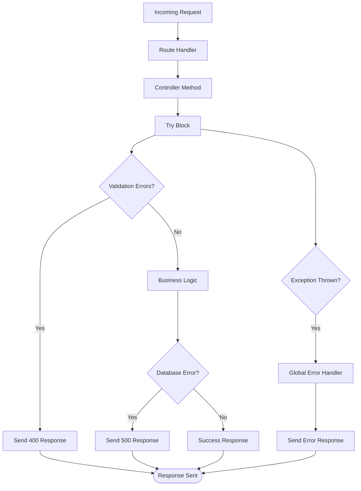
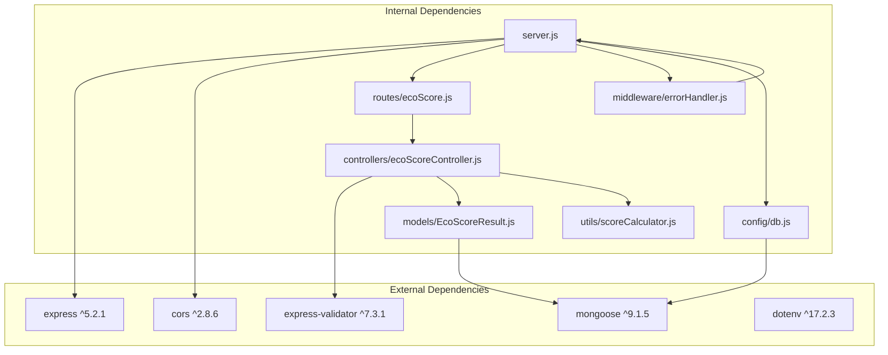

# Backend Architecture

<cite>
**Referenced Files in This Document**
- [server.js](file://server/server.js)
- [db.js](file://server/config/db.js)
- [ecoScoreController.js](file://server/controllers/ecoScoreController.js)
- [errorHandler.js](file://server/middleware/errorHandler.js)
- [EcoScoreResult.js](file://server/models/EcoScoreResult.js)
- [ecoScore.js](file://server/routes/ecoScore.js)
- [scoreCalculator.js](file://server/utils/scoreCalculator.js)
- [package.json](file://server/package.json)
- [.env.example](file://server/.env.example)
- [api.js](file://client/src/services/api.js)
- [vite.config.js](file://client/vite.config.js)
- [.env.example](file://client/.env.example)
</cite>

## Table of Contents
1. [Introduction](#introduction)
2. [Project Structure](#project-structure)
3. [Core Components](#core-components)
4. [Architecture Overview](#architecture-overview)
5. [Detailed Component Analysis](#detailed-component-analysis)
6. [Dependency Analysis](#dependency-analysis)
7. [Performance Considerations](#performance-considerations)
8. [Troubleshooting Guide](#troubleshooting-guide)
9. [Security Considerations](#security-considerations)
10. [Scalability and Deployment](#scalability-and-deployment)
11. [Conclusion](#conclusion)

## Introduction
This document provides comprehensive backend architecture documentation for the Express.js server that powers the Eco Score Predictor application. It covers server initialization, middleware configuration, routing structure, MVC pattern implementation, error handling, database connectivity, environment configuration, RESTful API design, CORS configuration, security considerations, validation strategies, performance optimization, scalability, and deployment preparation.

## Project Structure
The backend follows a modular Express.js architecture with clear separation of concerns:
- Server entry point initializes Express, loads environment variables, connects to MongoDB, configures middleware, registers routes, and starts the HTTP server
- Configuration module handles database connection with robust error handling
- Controllers encapsulate business logic and coordinate between routes and models
- Models define Mongoose schemas for persistent storage
- Routes define REST endpoints and apply validation middleware
- Utilities contain reusable calculation logic
- Middleware provides centralized error handling
- Environment configuration manages runtime settings

**Diagram sources**
- [server.js](file://server/server.js#L1-L34)
- [ecoScore.js](file://server/routes/ecoScore.js#L1-L9)
- [ecoScoreController.js](file://server/controllers/ecoScoreController.js#L1-L73)
- [scoreCalculator.js](file://server/utils/scoreCalculator.js#L1-L113)
- [EcoScoreResult.js](file://server/models/EcoScoreResult.js#L1-L20)
- [db.js](file://server/config/db.js#L1-L18)
- [errorHandler.js](file://server/middleware/errorHandler.js#L1-L14)

**Section sources**
- [server.js](file://server/server.js#L1-L34)
- [package.json](file://server/package.json#L1-L23)

## Core Components
The backend consists of several core components that work together to provide a robust API service:

### Server Initialization and Bootstrap
The server entry point performs essential bootstrap tasks:
- Loads environment configuration using dotenv
- Initializes Express application instance
- Establishes MongoDB connection
- Configures middleware stack
- Registers route handlers
- Starts HTTP server with configurable port

### Database Connection Management
The database module provides centralized connection management with:
- Async connection handling with try-catch error management
- Connection logging for monitoring
- Graceful shutdown handling via process exit on connection failure
- Configuration via environment variables

### Request Validation and Processing
The controller implements comprehensive input validation using express-validator:
- Validates numeric inputs with minimum thresholds
- Ensures boolean values for animal-based products
- Restricts categorical values to predefined enums
- Handles extraction and transformation of validated data
- Implements structured error responses for validation failures

### Calculation Engine
The score calculator implements a rule-based algorithm that:
- Applies penalties based on carbon footprint, water usage, and product characteristics
- Considers origin, packaging materials, and transportation modes
- Normalizes scores to a 0-100 scale
- Categorizes results into meaningful tiers
- Generates contextual messages based on score ranges

**Section sources**
- [server.js](file://server/server.js#L1-L34)
- [db.js](file://server/config/db.js#L1-L18)
- [ecoScoreController.js](file://server/controllers/ecoScoreController.js#L1-L73)
- [scoreCalculator.js](file://server/utils/scoreCalculator.js#L1-L113)

## Architecture Overview
The backend follows a layered architecture pattern with clear separation between presentation, business logic, and data persistence layers:

**Diagram sources**
- [server.js](file://server/server.js#L13-L27)
- [ecoScore.js](file://server/routes/ecoScore.js#L5-L6)
- [ecoScoreController.js](file://server/controllers/ecoScoreController.js#L17-L67)
- [scoreCalculator.js](file://server/utils/scoreCalculator.js#L6-L110)
- [EcoScoreResult.js](file://server/models/EcoScoreResult.js#L3-L17)
- [errorHandler.js](file://server/middleware/errorHandler.js#L1-L11)

## Detailed Component Analysis

### Server Entry Point Analysis
The server initialization process demonstrates clean separation of concerns and robust error handling:

**Diagram sources**
- [server.js](file://server/server.js#L1-L34)
- [db.js](file://server/config/db.js#L3-L15)

**Section sources**
- [server.js](file://server/server.js#L1-L34)

### Database Connection Module
The database connection module implements resilient connection management:

**Diagram sources**
- [db.js](file://server/config/db.js#L3-L15)

**Section sources**
- [db.js](file://server/config/db.js#L1-L18)

### Controller Implementation Pattern
The controller implements the MVC pattern with clear separation of concerns:

**Diagram sources**
- [ecoScoreController.js](file://server/controllers/ecoScoreController.js#L6-L14)
- [ecoScoreController.js](file://server/controllers/ecoScoreController.js#L17-L67)
- [scoreCalculator.js](file://server/utils/scoreCalculator.js#L6-L110)

**Section sources**
- [ecoScoreController.js](file://server/controllers/ecoScoreController.js#L1-L73)

### Model Schema Design
The Mongoose model defines a comprehensive schema for storing eco-score calculations:

**Diagram sources**
- [EcoScoreResult.js](file://server/models/EcoScoreResult.js#L3-L17)

**Section sources**
- [EcoScoreResult.js](file://server/models/EcoScoreResult.js#L1-L20)

### Route Definition and Validation
The route configuration demonstrates RESTful design principles:

**Diagram sources**
- [ecoScore.js](file://server/routes/ecoScore.js#L5-L6)
- [ecoScoreController.js](file://server/controllers/ecoScoreController.js#L17-L67)

**Section sources**
- [ecoScore.js](file://server/routes/ecoScore.js#L1-L9)

### Error Handling Strategy
The global error handler provides consistent error responses:

**Diagram sources**
- [errorHandler.js](file://server/middleware/errorHandler.js#L1-L11)

**Section sources**
- [errorHandler.js](file://server/middleware/errorHandler.js#L1-L14)

## Dependency Analysis
The backend maintains clean dependency relationships with minimal coupling:

**Diagram sources**
- [package.json](file://server/package.json#L15-L21)
- [server.js](file://server/server.js#L1-L6)
- [ecoScore.js](file://server/routes/ecoScore.js#L1-L3)

**Section sources**
- [package.json](file://server/package.json#L1-L23)

## Performance Considerations
Several performance optimization strategies are implemented:

### Middleware Efficiency
- Early request parsing prevents unnecessary processing
- Minimal middleware stack reduces overhead
- Efficient JSON parsing for large payloads

### Database Optimization
- Single connection established at startup
- Timestamp fields enable efficient querying
- Schema validation prevents invalid data storage

### Calculation Performance
- Pure function calculations avoid side effects
- Early termination for penalty calculations
- Efficient scoring normalization

### Scalability Enhancements
- Environment-based configuration for different deployments
- Modular architecture enables horizontal scaling
- Stateless controller design supports load balancing

## Troubleshooting Guide
Common issues and their resolution strategies:

### Database Connection Issues
- Verify MongoDB URI in environment variables
- Check network connectivity to database server
- Monitor connection logs for authentication errors

### Validation Failures
- Review input field constraints in validation rules
- Check data types match expected formats
- Validate enum values against allowed options

### API Response Issues
- Examine error handler configuration
- Verify controller response formatting
- Check CORS configuration for cross-origin requests

**Section sources**
- [db.js](file://server/config/db.js#L11-L14)
- [errorHandler.js](file://server/middleware/errorHandler.js#L1-L11)

## Security Considerations
The backend implements several security measures:

### Input Validation
- Comprehensive field validation using express-validator
- Type checking for all input parameters
- Range validation for numeric fields
- Enum restriction for categorical data

### Cross-Origin Resource Sharing
- CORS middleware enabled for flexible client-server communication
- Configurable origins for development and production environments
- Support for preflight requests

### Error Handling Security
- Generic error messages in production environment
- Stack traces only shown in development mode
- Prevents information leakage about internal system structure

### Environment Configuration
- Sensitive configuration loaded from environment variables
- Separate configuration for development and production
- Database credentials stored securely

**Section sources**
- [server.js](file://server/server.js#L14-L16)
- [ecoScoreController.js](file://server/controllers/ecoScoreController.js#L6-L14)
- [errorHandler.js](file://server/middleware/errorHandler.js#L9-L10)

## Scalability and Deployment
The architecture supports scalable deployment patterns:

### Horizontal Scaling
- Stateless controller design allows multiple instances
- Centralized database connection supports multiple workers
- Load balancer can distribute traffic across instances

### Environment Configuration
- Environment-specific settings for different deployment stages
- Database connection pooling configuration
- Logging level adjustments for production monitoring

### Monitoring and Observability
- Connection logging for database health monitoring
- Request/response logging for API monitoring
- Error tracking for application reliability

### Containerization Readiness
- Standard Node.js application structure
- Environment variable configuration
- Port configuration for container orchestration

**Section sources**
- [server.js](file://server/server.js#L29-L33)
- [.env.example](file://server/.env.example#L1-L4)

## Conclusion
The Eco Score Predictor backend demonstrates a well-architected Express.js application that effectively implements modern backend development practices. The modular structure, comprehensive validation, robust error handling, and clean separation of concerns provide a solid foundation for growth and maintenance. The implementation balances simplicity with functionality, making it suitable for both development and production environments while maintaining clear pathways for future enhancements.

Key strengths include the clear MVC separation, comprehensive input validation, centralized error handling, and thoughtful database design. The architecture supports scalability through modular components and environment-driven configuration, while security considerations are addressed through input validation and secure error handling practices.