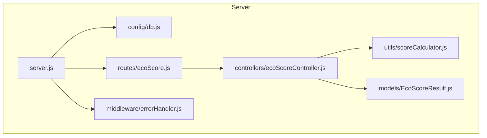
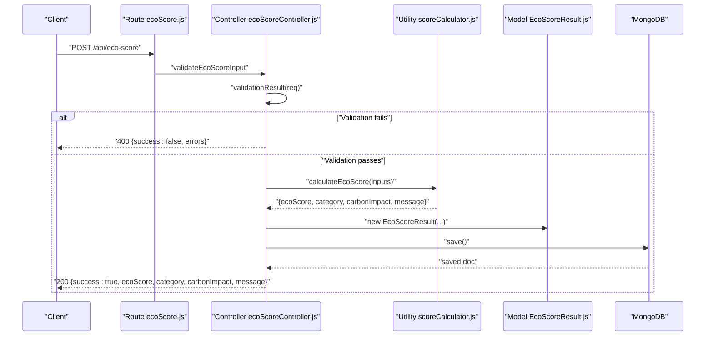
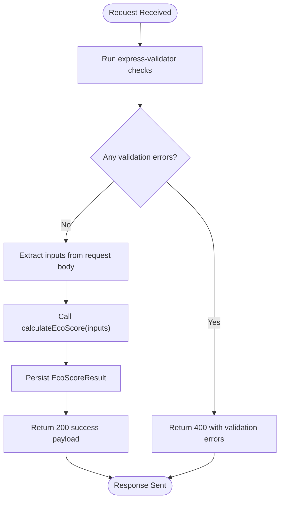
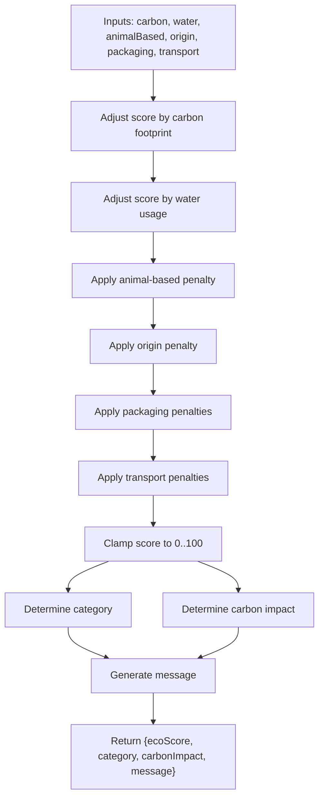
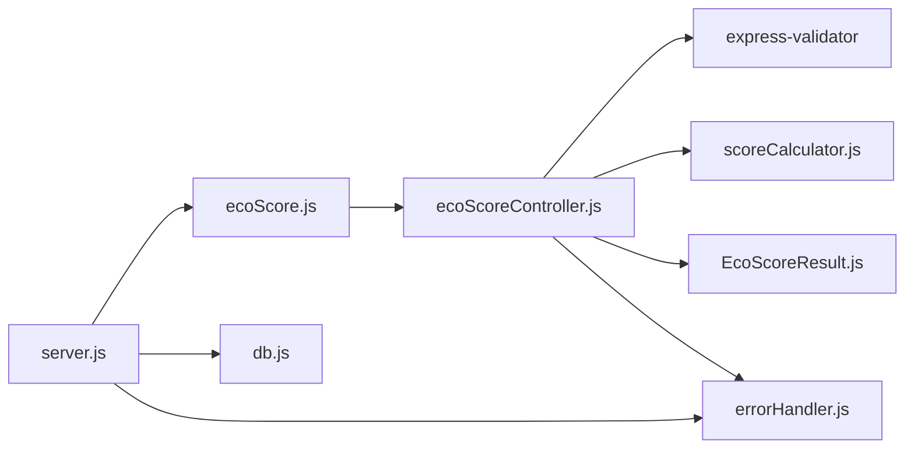

# Controller Layer

<cite>
**Referenced Files in This Document**
- [server.js](file://server/server.js)
- [db.js](file://server/config/db.js)
- [ecoScore.js](file://server/routes/ecoScore.js)
- [ecoScoreController.js](file://server/controllers/ecoScoreController.js)
- [scoreCalculator.js](file://server/utils/scoreCalculator.js)
- [EcoScoreResult.js](file://server/models/EcoScoreResult.js)
- [errorHandler.js](file://server/middleware/errorHandler.js)
</cite>

## Table of Contents
1. [Introduction](#introduction)
2. [Project Structure](#project-structure)
3. [Core Components](#core-components)
4. [Architecture Overview](#architecture-overview)
5. [Detailed Component Analysis](#detailed-component-analysis)
6. [Dependency Analysis](#dependency-analysis)
7. [Performance Considerations](#performance-considerations)
8. [Troubleshooting Guide](#troubleshooting-guide)
9. [Conclusion](#conclusion)

## Introduction
This document explains the controller layer implementation for the Eco Score Predictor API. It focuses on the business logic orchestration within the controller, input validation handling, calculation orchestration, integration with utility functions and database operations, and response formatting. It also covers error handling strategies, success response patterns, validation error management, and testing approaches while maintaining separation of concerns.

## Project Structure
The controller layer resides under server/controllers and coordinates with routes, middleware, models, and utilities. The application initializes Express, connects to MongoDB, registers routes, and applies global error handling middleware.

**Diagram sources**
- [server.js](file://server/server.js#L1-L34)
- [ecoScore.js](file://server/routes/ecoScore.js#L1-L9)
- [ecoScoreController.js](file://server/controllers/ecoScoreController.js#L1-L73)
- [scoreCalculator.js](file://server/utils/scoreCalculator.js#L1-L113)
- [EcoScoreResult.js](file://server/models/EcoScoreResult.js#L1-L20)
- [errorHandler.js](file://server/middleware/errorHandler.js#L1-L14)
- [db.js](file://server/config/db.js#L1-L18)

**Section sources**
- [server.js](file://server/server.js#L1-L34)
- [ecoScore.js](file://server/routes/ecoScore.js#L1-L9)

## Core Components
- Controller: Orchestrates validation, calculation, persistence, and response formatting.
- Utility: Implements the rule-based eco score calculation logic.
- Model: Defines the persisted result schema and fields.
- Route: Exposes the endpoint and wires validation middleware.
- Error Handler: Centralized error handling for uncaught exceptions and explicit errors.
- Database Config: Establishes connection to MongoDB.

Key responsibilities:
- Input validation: Uses express-validator to enforce field types, ranges, and allowed values.
- Calculation orchestration: Delegates scoring to the utility module and derives category/carbon impact/message.
- Persistence: Creates and saves a model instance with inputs and computed results.
- Response formatting: Returns structured JSON with success flag and computed fields.
- Error handling: Validates requests and forwards unexpected errors to the global error handler.

**Section sources**
- [ecoScoreController.js](file://server/controllers/ecoScoreController.js#L1-L73)
- [scoreCalculator.js](file://server/utils/scoreCalculator.js#L1-L113)
- [EcoScoreResult.js](file://server/models/EcoScoreResult.js#L1-L20)
- [ecoScore.js](file://server/routes/ecoScore.js#L1-L9)
- [errorHandler.js](file://server/middleware/errorHandler.js#L1-L14)
- [db.js](file://server/config/db.js#L1-L18)

## Architecture Overview
The controller sits between the route and the utility/model layers. Requests flow from the route to the controller, which validates inputs, computes the score, persists the result, and returns a standardized response. Errors are handled centrally.

**Diagram sources**
- [ecoScore.js](file://server/routes/ecoScore.js#L1-L9)
- [ecoScoreController.js](file://server/controllers/ecoScoreController.js#L1-L73)
- [scoreCalculator.js](file://server/utils/scoreCalculator.js#L1-L113)
- [EcoScoreResult.js](file://server/models/EcoScoreResult.js#L1-L20)

## Detailed Component Analysis

### Controller Responsibilities
- Input validation: Declares validation rules for numeric ranges, booleans, and enumerated values. Uses express-validator to collect and return validation errors.
- Request extraction: Reads validated fields from the request body and constructs an inputs object.
- Calculation orchestration: Calls the utility function to compute the eco score and derived attributes.
- Persistence: Instantiates the model with inputs and computed results, then saves to the database.
- Response formatting: Returns a success payload with computed fields on success; forwards errors to the global error handler otherwise.
- Error forwarding: On internal errors, delegates to the error handling middleware.

**Diagram sources**
- [ecoScoreController.js](file://server/controllers/ecoScoreController.js#L17-L67)
- [scoreCalculator.js](file://server/utils/scoreCalculator.js#L6-L110)
- [EcoScoreResult.js](file://server/models/EcoScoreResult.js#L3-L17)

**Section sources**
- [ecoScoreController.js](file://server/controllers/ecoScoreController.js#L17-L67)

### Input Validation Handling
- Numeric constraints: Carbon and water must be positive floats.
- Boolean constraint: Animal-based must be a boolean.
- Enumerated constraints: Origin, category, packaging, and transport are restricted to predefined sets.
- Error response: Validation failures return a 400 with a success flag set to false and an array of validation errors.

Validation rules are defined separately and reused by the controller.

**Section sources**
- [ecoScoreController.js](file://server/controllers/ecoScoreController.js#L6-L14)

### Calculation Orchestration
- Utility function: Receives an inputs object and computes:
  - Score adjustments based on carbon footprint, water usage, animal-based products, origin, packaging, and transport modes.
  - Category classification based on score thresholds.
  - Carbon impact classification based on carbon value thresholds.
  - A contextual message based on score thresholds.
- Controller integration: The controller invokes the utility and then persists the result.

**Diagram sources**
- [scoreCalculator.js](file://server/utils/scoreCalculator.js#L6-L110)

**Section sources**
- [scoreCalculator.js](file://server/utils/scoreCalculator.js#L6-L110)

### Database Integration
- Model schema: Defines required fields for inputs and computed results, including enums for constrained values.
- Persistence: Controller creates a new model instance with inputs and computed fields, then saves to the database.
- Timestamps: The model includes automatic timestamps.

**Section sources**
- [EcoScoreResult.js](file://server/models/EcoScoreResult.js#L3-L17)
- [ecoScoreController.js](file://server/controllers/ecoScoreController.js#L44-L53)

### Response Formatting
- Success response: Contains a success flag set to true, plus computed fields: ecoScore, category, carbonImpact, and message.
- Validation error response: Contains a success flag set to false and an errors array.
- Error response: Forwarded to the centralized error handler middleware, which returns a structured error payload.

**Section sources**
- [ecoScoreController.js](file://server/controllers/ecoScoreController.js#L22-L26)
- [ecoScoreController.js](file://server/controllers/ecoScoreController.js#L56-L62)
- [errorHandler.js](file://server/middleware/errorHandler.js#L1-L14)

### Error Handling Strategies
- Validation errors: Handled locally in the controller; returns 400 with validation errors.
- Internal errors: Caught in the controller and forwarded to the global error handler middleware.
- Global error handler: Logs the error stack, determines status code, and returns a standardized error response. In development, includes stack traces.

**Section sources**
- [ecoScoreController.js](file://server/controllers/ecoScoreController.js#L64-L66)
- [errorHandler.js](file://server/middleware/errorHandler.js#L1-L14)

### API Endpoint Definition
- Path: POST /api/eco-score
- Middleware chain: validateEcoScoreInput (express-validator) followed by calculateAndSaveEcoScore (controller).
- Purpose: Accepts product characteristics, validates inputs, calculates eco score, persists the result, and returns a standardized response.

**Section sources**
- [ecoScore.js](file://server/routes/ecoScore.js#L5-L6)

### Request Processing Workflows
- Successful flow:
  - Client sends a POST request with validated inputs.
  - Controller runs validation and extracts inputs.
  - Controller calls the utility to compute the score and derived attributes.
  - Controller saves the result to the database.
  - Controller returns a 200 success response with computed fields.
- Validation failure flow:
  - Controller detects validation errors and returns a 400 response with an errors array.
- Error flow:
  - Controller catches unexpected errors and forwards them to the error handler middleware.

**Diagram sources**
- [ecoScore.js](file://server/routes/ecoScore.js#L1-L9)
- [ecoScoreController.js](file://server/controllers/ecoScoreController.js#L17-L67)
- [scoreCalculator.js](file://server/utils/scoreCalculator.js#L6-L110)
- [EcoScoreResult.js](file://server/models/EcoScoreResult.js#L3-L17)

## Dependency Analysis
The controller depends on:
- express-validator for input validation.
- The utility module for scoring logic.
- The model for persistence.
- The error handler middleware for error propagation.

**Diagram sources**
- [ecoScoreController.js](file://server/controllers/ecoScoreController.js#L1-L3)
- [ecoScore.js](file://server/routes/ecoScore.js#L1-L6)
- [server.js](file://server/server.js#L1-L6)
- [db.js](file://server/config/db.js#L1-L18)

**Section sources**
- [ecoScoreController.js](file://server/controllers/ecoScoreController.js#L1-L3)
- [ecoScore.js](file://server/routes/ecoScore.js#L1-L6)
- [server.js](file://server/server.js#L1-L6)

## Performance Considerations
- Validation overhead: express-validator adds minimal overhead; keep validation rules concise and targeted.
- Calculation cost: The utility function performs simple arithmetic and conditionals; it is efficient for typical request loads.
- Database writes: Each request triggers a write operation; consider batching or indexing if throughput increases significantly.
- Middleware order: Ensure JSON parsing occurs before validation to avoid parsing errors.

[No sources needed since this section provides general guidance]

## Troubleshooting Guide
Common issues and resolutions:
- Validation errors:
  - Cause: Inputs violate constraints (e.g., negative numbers, invalid enums).
  - Resolution: Review the validation rules and adjust client inputs accordingly.
- Database connectivity:
  - Cause: MongoDB connection failure.
  - Resolution: Verify environment variables and network connectivity; check logs for connection errors.
- Unexpected server errors:
  - Cause: Unhandled exceptions in the controller or utility.
  - Resolution: Inspect the error handler logs and stack traces; fix the underlying issue.

**Section sources**
- [ecoScoreController.js](file://server/controllers/ecoScoreController.js#L64-L66)
- [errorHandler.js](file://server/middleware/errorHandler.js#L1-L14)
- [db.js](file://server/config/db.js#L10-L14)

## Conclusion
The controller layer implements a clean separation of concerns: validation, calculation, persistence, and response formatting are clearly delineated. The route defines the endpoint and middleware chain, the controller orchestrates the workflow, the utility encapsulates business logic, and the model persists results. Centralized error handling ensures consistent error responses. This design supports maintainability, testability, and scalability.