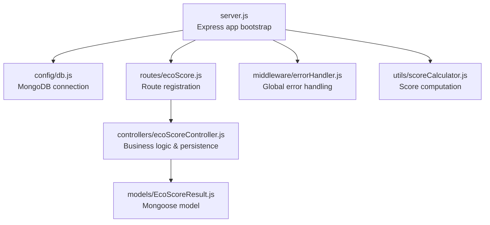
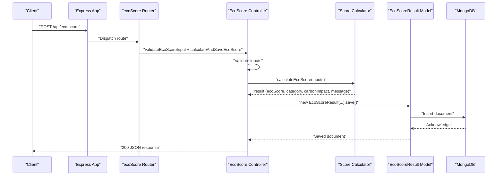
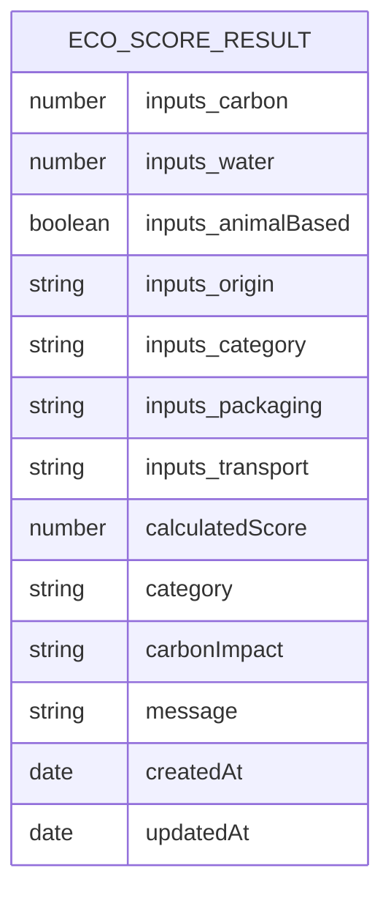
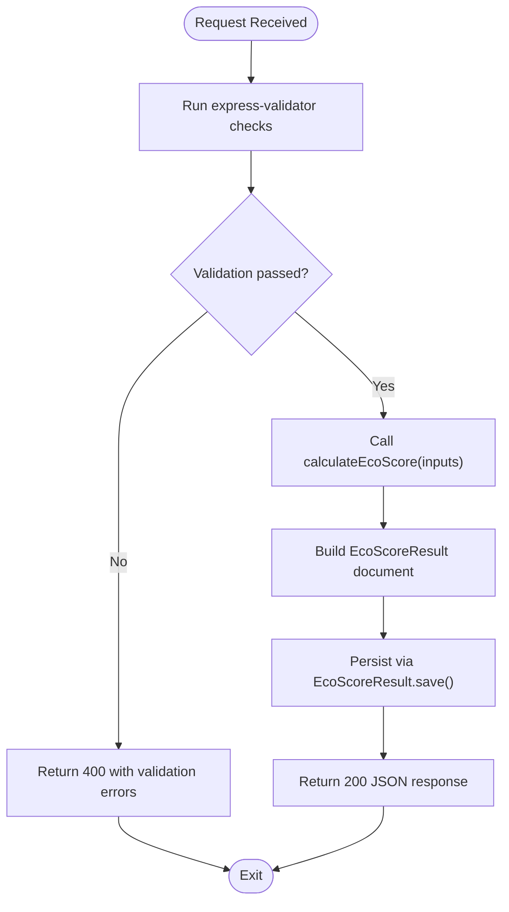
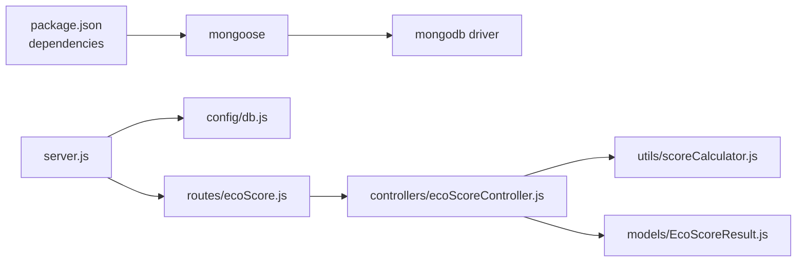

# Database Integration

<cite>
**Referenced Files in This Document**
- [server.js](file://server/server.js)
- [db.js](file://server/config/db.js)
- [EcoScoreResult.js](file://server/models/EcoScoreResult.js)
- [ecoScoreController.js](file://server/controllers/ecoScoreController.js)
- [ecoScore.js](file://server/routes/ecoScore.js)
- [errorHandler.js](file://server/middleware/errorHandler.js)
- [scoreCalculator.js](file://server/utils/scoreCalculator.js)
- [package.json](file://server/package.json)
- [.env.example](file://server/.env.example)
</cite>

## Table of Contents
1. [Introduction](#introduction)
2. [Project Structure](#project-structure)
3. [Core Components](#core-components)
4. [Architecture Overview](#architecture-overview)
5. [Detailed Component Analysis](#detailed-component-analysis)
6. [Dependency Analysis](#dependency-analysis)
7. [Performance Considerations](#performance-considerations)
8. [Troubleshooting Guide](#troubleshooting-guide)
9. [Conclusion](#conclusion)
10. [Appendices](#appendices)

## Introduction
This document explains the MongoDB and Mongoose integration for the Eco Score Predictor backend. It covers connection establishment, connection pooling behavior, error handling, the EcoScoreResult model schema and validation rules, CRUD operations and query patterns, data persistence strategies, operational examples, troubleshooting, performance optimization, and practical guidance for migrations, backups, and monitoring.

## Project Structure
The server initializes the Express application, connects to MongoDB via Mongoose, registers routes, and applies middleware. The database connection is established at startup, and the EcoScoreResult model persists calculation results.

**Diagram sources**
- [server.js](file://server/server.js#L1-L34)
- [db.js](file://server/config/db.js#L1-L18)
- [ecoScore.js](file://server/routes/ecoScore.js#L1-L9)
- [ecoScoreController.js](file://server/controllers/ecoScoreController.js#L1-L73)
- [EcoScoreResult.js](file://server/models/EcoScoreResult.js#L1-L20)
- [errorHandler.js](file://server/middleware/errorHandler.js#L1-L14)
- [scoreCalculator.js](file://server/utils/scoreCalculator.js#L1-L113)

**Section sources**
- [server.js](file://server/server.js#L1-L34)
- [db.js](file://server/config/db.js#L1-L18)
- [ecoScore.js](file://server/routes/ecoScore.js#L1-L9)
- [ecoScoreController.js](file://server/controllers/ecoScoreController.js#L1-L73)
- [EcoScoreResult.js](file://server/models/EcoScoreResult.js#L1-L20)
- [errorHandler.js](file://server/middleware/errorHandler.js#L1-L14)
- [scoreCalculator.js](file://server/utils/scoreCalculator.js#L1-L113)

## Core Components
- Database connection manager: Establishes and logs MongoDB connectivity using Mongoose.
- Model definition: EcoScoreResult schema with strict field definitions and timestamps.
- Controller: Validates inputs, computes eco score, and persists results.
- Route: Exposes a POST endpoint for eco score calculation.
- Error handler: Centralized error response formatting.

**Section sources**
- [db.js](file://server/config/db.js#L1-L18)
- [EcoScoreResult.js](file://server/models/EcoScoreResult.js#L1-L20)
- [ecoScoreController.js](file://server/controllers/ecoScoreController.js#L1-L73)
- [ecoScore.js](file://server/routes/ecoScore.js#L1-L9)
- [errorHandler.js](file://server/middleware/errorHandler.js#L1-L14)

## Architecture Overview
The system follows a layered architecture:
- Entry point initializes Express and connects to MongoDB.
- Routes define API endpoints.
- Controllers orchestrate validation, calculation, and persistence.
- Models encapsulate schema and persistence.
- Middleware handles cross-cutting concerns like error reporting.

**Diagram sources**
- [server.js](file://server/server.js#L1-L34)
- [ecoScore.js](file://server/routes/ecoScore.js#L1-L9)
- [ecoScoreController.js](file://server/controllers/ecoScoreController.js#L1-L73)
- [scoreCalculator.js](file://server/utils/scoreCalculator.js#L1-L113)
- [EcoScoreResult.js](file://server/models/EcoScoreResult.js#L1-L20)

## Detailed Component Analysis

### Database Connection Management
- Connection establishment: The connection is initiated at server startup and uses environment-driven URI configuration.
- Options: Uses legacy and unified topology flags for compatibility.
- Logging: Logs successful connection host.
- Failure handling: Logs error and exits the process.

Operational notes:
- Connection pooling: Mongoose manages a default connection pool internally. No explicit pool configuration is present in the codebase.
- Reconnection: The application does not implement retry loops; failures cause immediate termination.

**Section sources**
- [db.js](file://server/config/db.js#L1-L18)
- [server.js](file://server/server.js#L10-L11)
- [package.json](file://server/package.json#L15-L21)
- [.env.example](file://server/.env.example#L1-L4)

### EcoScoreResult Model Schema and Validation
Schema fields:
- inputs.carbon: Number, required.
- inputs.water: Number, required.
- inputs.animalBased: Boolean, required.
- inputs.origin: Enum ['local', 'imported'], required.
- inputs.category: Enum ['food', 'beverage', 'personal care', 'accessories'], required.
- inputs.packaging: Enum ['plastic', 'paper', 'glass', 'cardboard', 'compostable', 'none'], required.
- inputs.transport: Enum ['air', 'ship', 'truck'], required.
- calculatedScore: Number, required.
- category: String, required.
- carbonImpact: String, required.
- message: String, required.
- timestamps: Enabled (createdAt, updatedAt).

Validation rules:
- Field presence and types enforced by schema.
- Enum constraints enforced by schema.
- Additional runtime validation via express-validator in the controller.

**Diagram sources**
- [EcoScoreResult.js](file://server/models/EcoScoreResult.js#L3-L17)

**Section sources**
- [EcoScoreResult.js](file://server/models/EcoScoreResult.js#L1-L20)

### Controller Logic and Persistence
Responsibilities:
- Validate incoming request body against express-validator rules.
- Compute eco score using the score calculator utility.
- Persist the result using the EcoScoreResult model.
- Return structured JSON response on success.
- Delegate unhandled errors to global error middleware.

Key behaviors:
- Validation errors return 400 with collected messages.
- Successful save returns 200 with computed values.
- Errors propagate to centralized error handler.

**Diagram sources**
- [ecoScoreController.js](file://server/controllers/ecoScoreController.js#L17-L67)
- [scoreCalculator.js](file://server/utils/scoreCalculator.js#L6-L110)
- [EcoScoreResult.js](file://server/models/EcoScoreResult.js#L1-L20)

**Section sources**
- [ecoScoreController.js](file://server/controllers/ecoScoreController.js#L1-L73)
- [scoreCalculator.js](file://server/utils/scoreCalculator.js#L1-L113)

### Route Definition
- Endpoint: POST /api/eco-score
- Middleware chain: validateEcoScoreInput (express-validator) followed by calculateAndSaveEcoScore (controller).

**Section sources**
- [ecoScore.js](file://server/routes/ecoScore.js#L1-L9)

### Error Handling Strategy
- Global error middleware formats responses with success flag, message, and stack in development.
- Logs error stack traces.
- Sets status code from error object or defaults to 500.

**Section sources**
- [errorHandler.js](file://server/middleware/errorHandler.js#L1-L14)

## Dependency Analysis
External dependencies relevant to database integration:
- Mongoose: Provides ODM, connection management, and model definitions.
- MongoDB driver: Underlying driver used by Mongoose.
- dotenv: Loads environment variables including MONGODB_URI.

**Diagram sources**
- [package.json](file://server/package.json#L15-L21)
- [server.js](file://server/server.js#L1-L34)
- [db.js](file://server/config/db.js#L1-L18)
- [ecoScore.js](file://server/routes/ecoScore.js#L1-L9)
- [ecoScoreController.js](file://server/controllers/ecoScoreController.js#L1-L73)
- [scoreCalculator.js](file://server/utils/scoreCalculator.js#L1-L113)
- [EcoScoreResult.js](file://server/models/EcoScoreResult.js#L1-L20)

**Section sources**
- [package.json](file://server/package.json#L15-L21)
- [server.js](file://server/server.js#L1-L34)

## Performance Considerations
- Connection pooling: Mongoose uses an internal default pool. There is no explicit pool configuration in the codebase. For production, consider tuning pool size and timeouts via connection options if throughput demands increase.
- Indexing: No indexes are defined in the schema. For frequent queries on specific fields (e.g., timestamps, category), consider adding indexes to improve read performance.
- Write patterns: Single document insertions are used. For bulk writes, batch operations can reduce overhead.
- Validation cost: Both schema-level and runtime validations occur. Keep validation rules minimal and targeted to reduce latency.
- Environment: Development vs. production differences can affect performance; ensure production-grade deployments with adequate resources.

[No sources needed since this section provides general guidance]

## Troubleshooting Guide
Common issues and resolutions:
- Connection failures:
  - Verify MONGODB_URI in environment variables.
  - Confirm MongoDB service is reachable and credentials are correct.
  - Review connection logs and error output.
- Validation errors:
  - Ensure request payload matches schema constraints (types, enums).
  - Check that all required fields are present.
- Persistence errors:
  - Confirm model creation occurs after successful connection.
  - Inspect error middleware logs for stack traces.
- Operational checks:
  - Use health check endpoint to confirm server availability.
  - Monitor logs for connection and error events.

**Section sources**
- [db.js](file://server/config/db.js#L1-L18)
- [errorHandler.js](file://server/middleware/errorHandler.js#L1-L14)
- [server.js](file://server/server.js#L21-L24)

## Conclusion
The backend integrates MongoDB via Mongoose with a straightforward connection lifecycle, a well-defined model schema, and a focused controller that validates inputs, computes scores, and persists results. While the current setup is minimal and functional, production deployments should consider connection pool tuning, indexing strategies, and robust monitoring and backup procedures.

[No sources needed since this section summarizes without analyzing specific files]

## Appendices

### API Definition
- Method: POST
- Path: /api/eco-score
- Request body fields:
  - carbon: Number (required)
  - water: Number (required)
  - animalBased: Boolean (required)
  - origin: String enum ['local','imported'] (required)
  - category: String enum ['food','beverage','personal care','accessories'] (required)
  - packaging: String enum ['plastic','paper','glass','cardboard','compostable','none'] (required)
  - transport: String enum ['air','ship','truck'] (required)
- Success response: 200 JSON with computed fields.
- Error response: 400 for validation errors; 5xx for server errors.

**Section sources**
- [ecoScore.js](file://server/routes/ecoScore.js#L5-L6)
- [ecoScoreController.js](file://server/controllers/ecoScoreController.js#L6-L14)
- [EcoScoreResult.js](file://server/models/EcoScoreResult.js#L3-L17)

### Data Migration Strategies
- Schema changes:
  - Use Mongoose schema versioning or separate collections for backward compatibility.
  - Backfill existing documents with default values for new fields.
- Index management:
  - Add indexes for frequently queried fields before enabling heavy traffic.
- Rollback:
  - Maintain backups and keep previous schema versions available.

[No sources needed since this section provides general guidance]

### Backup Procedures
- Automated backups:
  - Schedule regular MongoDB dumps using mongodump.
  - Store backups offsite or in cloud storage.
- Point-in-time recovery:
  - Enable replica sets and oplogs for recovery windows.
- Testing:
  - Periodically restore backups to staging for validation.

[No sources needed since this section provides general guidance]

### Monitoring Approaches
- Application metrics:
  - Track request latency, error rates, and throughput.
- Database metrics:
  - Monitor connection pool usage, slow queries, and collection sizes.
- Alerts:
  - Configure alerts for connection failures, high error rates, and degraded performance.

[No sources needed since this section provides general guidance]