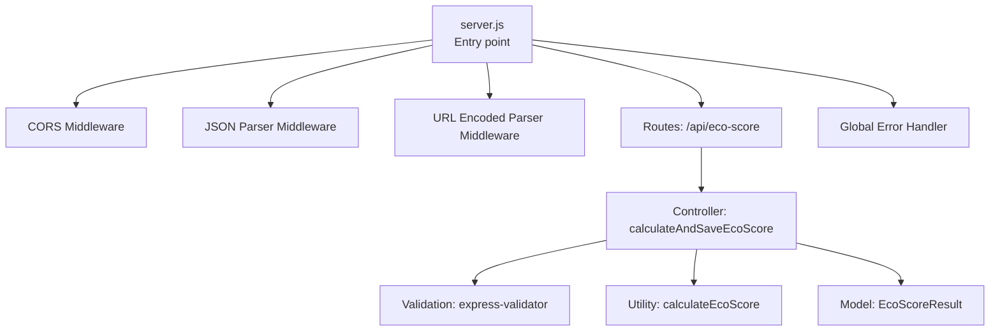
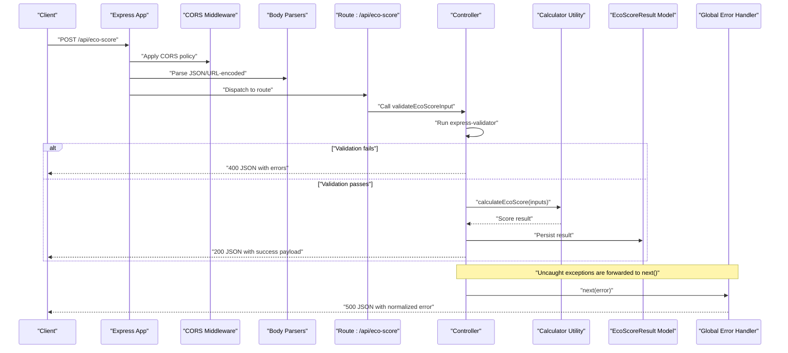
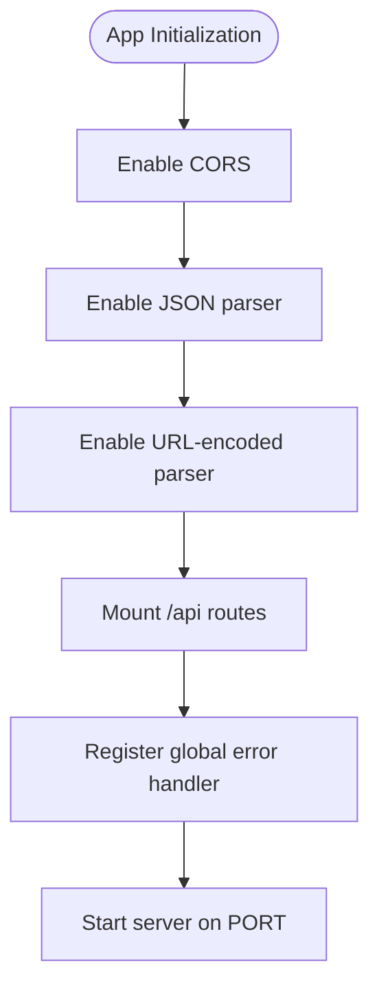
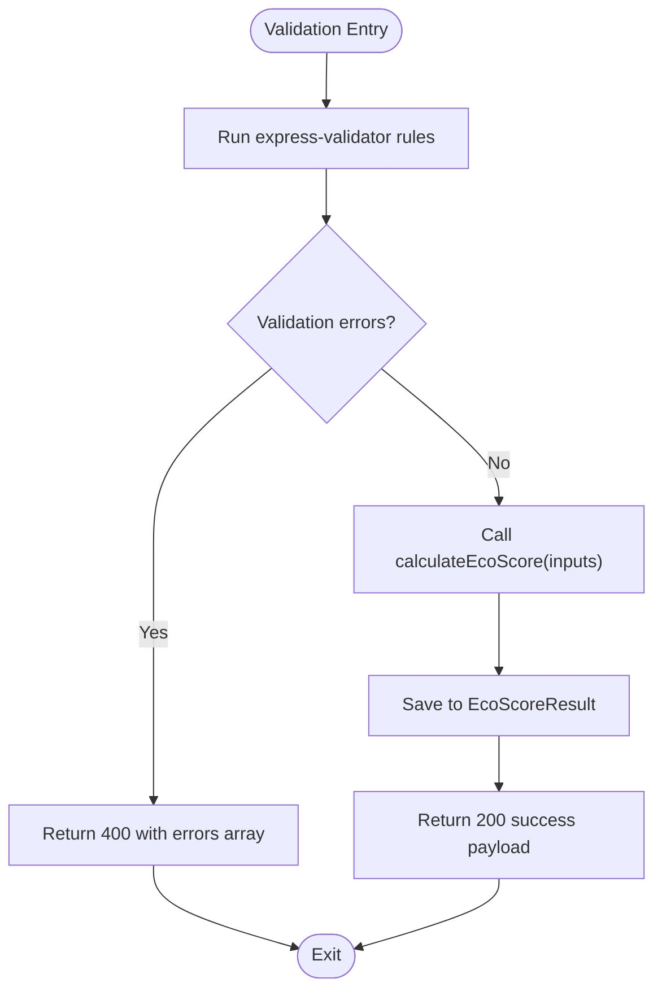
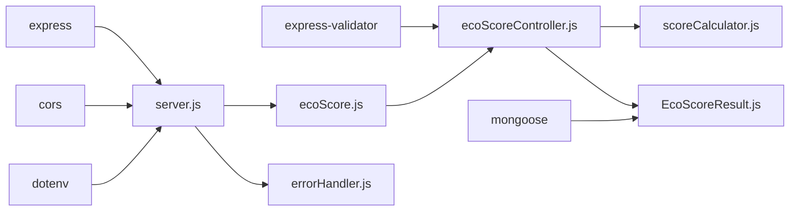

# Middleware Configuration

<cite>
**Referenced Files in This Document**
- [server.js](file://server/server.js)
- [errorHandler.js](file://server/middleware/errorHandler.js)
- [ecoScore.js](file://server/routes/ecoScore.js)
- [ecoScoreController.js](file://server/controllers/ecoScoreController.js)
- [db.js](file://server/config/db.js)
- [scoreCalculator.js](file://server/utils/scoreCalculator.js)
- [EcoScoreResult.js](file://server/models/EcoScoreResult.js)
- [package.json](file://server/package.json)
- [.env.example](file://server/.env.example)
- [api.js](file://client/src/services/api.js)
- [EcoScoreForm.jsx](file://client/src/components/EcoScoreForm.jsx)
</cite>

## Table of Contents
1. [Introduction](#introduction)
2. [Project Structure](#project-structure)
3. [Core Components](#core-components)
4. [Architecture Overview](#architecture-overview)
5. [Detailed Component Analysis](#detailed-component-analysis)
6. [Dependency Analysis](#dependency-analysis)
7. [Performance Considerations](#performance-considerations)
8. [Troubleshooting Guide](#troubleshooting-guide)
9. [Conclusion](#conclusion)

## Introduction
This document explains the middleware configuration and error handling system for the Eco Score Predictor backend. It covers middleware execution order, custom error handling patterns, global error management, error object structure, status code assignment, response formatting, and practical guidance for debugging, performance, and extending the system with custom middleware. It also documents CORS configuration and security middleware integration points.

## Project Structure
The server follows a layered architecture:
- Entry point initializes Express, loads environment variables, connects to the database, registers middleware, mounts routes, and starts the server.
- Routes define endpoint handlers and delegate to controller functions.
- Controllers encapsulate business logic, validation, and persistence.
- Middleware provides cross-cutting concerns like CORS, JSON parsing, and error handling.
- Utilities and models support calculations and persistence.

**Diagram sources**
- [server.js](file://server/server.js#L1-L34)
- [ecoScore.js](file://server/routes/ecoScore.js#L1-L9)
- [ecoScoreController.js](file://server/controllers/ecoScoreController.js#L1-L73)
- [scoreCalculator.js](file://server/utils/scoreCalculator.js#L1-L113)
- [EcoScoreResult.js](file://server/models/EcoScoreResult.js#L1-L20)
- [errorHandler.js](file://server/middleware/errorHandler.js#L1-L14)

**Section sources**
- [server.js](file://server/server.js#L1-L34)
- [package.json](file://server/package.json#L1-L23)

## Core Components
- Global error handler middleware: centralized error processing with structured JSON responses and conditional stack traces in development.
- Route and controller: validation pipeline using express-validator and a dedicated controller for calculation and persistence.
- Middleware stack: CORS, JSON, URL-encoded parsing, and global error handler registered in order.
- Database connection: asynchronous connection with graceful failure handling.

Key responsibilities:
- Middleware: parse requests, enable cross-origin requests, and handle uncaught errors.
- Controller: validate inputs, compute scores, persist results, and propagate errors.
- Error handler: normalize error responses and log stack traces in development.

**Section sources**
- [errorHandler.js](file://server/middleware/errorHandler.js#L1-L14)
- [ecoScore.js](file://server/routes/ecoScore.js#L1-L9)
- [ecoScoreController.js](file://server/controllers/ecoScoreController.js#L1-L73)
- [db.js](file://server/config/db.js#L1-L18)

## Architecture Overview
The middleware execution order and error handling flow:

**Diagram sources**
- [server.js](file://server/server.js#L13-L27)
- [ecoScore.js](file://server/routes/ecoScore.js#L1-L9)
- [ecoScoreController.js](file://server/controllers/ecoScoreController.js#L17-L67)
- [errorHandler.js](file://server/middleware/errorHandler.js#L1-L14)

## Detailed Component Analysis

### Middleware Execution Order
- CORS is enabled globally to allow cross-origin requests.
- Body parsers (JSON and URL-encoded) are registered to parse incoming request bodies.
- Routes are mounted under the /api prefix.
- A global error handler is registered last to catch unhandled errors and unexpected exceptions.

**Diagram sources**
- [server.js](file://server/server.js#L13-L27)

**Section sources**
- [server.js](file://server/server.js#L13-L27)

### Global Error Handler
Behavior:
- Logs the error stack to the console.
- Assigns status code from the error object if present; otherwise defaults to 500.
- Responds with a standardized JSON envelope containing success flag, message, and stack in development.
- Ensures consistent error responses across the API.

Response shape:
- Fields: success (boolean), message (string), stack (optional in development), and any additional fields injected by upstream code.
- Status code: derived from err.statusCode or 500 fallback.

Development vs production:
- Stack traces are included only when NODE_ENV is set to development.

**Section sources**
- [errorHandler.js](file://server/middleware/errorHandler.js#L1-L14)
- [.env.example](file://server/.env.example#L3-L4)

### Validation Pipeline and Controller Behavior
Validation:
- Uses express-validator to define rules for numeric bounds, booleans, and enumerated values.
- On validation failure, the controller returns a 400 response with a structured errors array.

Controller logic:
- Extracts validated inputs and computes the eco score via the utility.
- Persists the result to the database using the model.
- Returns a 200 success payload on successful computation and persistence.
- Catches unexpected exceptions and forwards them to the global error handler via next(error).

**Diagram sources**
- [ecoScoreController.js](file://server/controllers/ecoScoreController.js#L6-L26)
- [scoreCalculator.js](file://server/utils/scoreCalculator.js#L6-L110)
- [EcoScoreResult.js](file://server/models/EcoScoreResult.js#L3-L17)

**Section sources**
- [ecoScoreController.js](file://server/controllers/ecoScoreController.js#L17-L67)

### Database Connection and Persistence
- Asynchronous connection to MongoDB with error logging and process termination on failure.
- The controller saves the computed result to the EcoScoreResult collection.

**Section sources**
- [db.js](file://server/config/db.js#L3-L14)
- [EcoScoreResult.js](file://server/models/EcoScoreResult.js#L3-L17)
- [ecoScoreController.js](file://server/controllers/ecoScoreController.js#L44-L53)

### CORS Configuration
- Enabled globally via the cors package without explicit options, allowing default browser behavior.
- Suitable for development; consider tightening origins and credentials in production.

**Section sources**
- [server.js](file://server/server.js#L14-L14)
- [package.json](file://server/package.json#L15-L20)

### Security Middleware Integration
- Basic security posture provided by CORS and body parsing.
- Additional security middleware (e.g., helmet, rate limiting, compression) can be integrated by adding them before the error handler in the middleware stack.

[No sources needed since this section provides general guidance]

### Client-Side Error Handling
- The client catches API errors and displays user-friendly messages.
- Network errors are normalized to a data object with a message field.

**Section sources**
- [api.js](file://client/src/services/api.js#L5-L12)
- [EcoScoreForm.jsx](file://client/src/components/EcoScoreForm.jsx#L31-L47)

## Dependency Analysis
External dependencies and their roles:
- Express: Web framework and routing.
- cors: Cross-origin resource sharing.
- dotenv: Environment variable loading.
- express-validator: Request validation.
- mongoose: MongoDB ODM.

**Diagram sources**
- [package.json](file://server/package.json#L15-L21)
- [server.js](file://server/server.js#L1-L6)
- [ecoScore.js](file://server/routes/ecoScore.js#L1-L9)
- [ecoScoreController.js](file://server/controllers/ecoScoreController.js#L1-L73)
- [scoreCalculator.js](file://server/utils/scoreCalculator.js#L1-L113)
- [EcoScoreResult.js](file://server/models/EcoScoreResult.js#L1-L20)
- [errorHandler.js](file://server/middleware/errorHandler.js#L1-L14)

**Section sources**
- [package.json](file://server/package.json#L15-L21)

## Performance Considerations
- Middleware ordering: Place lightweight middlewares earlier; heavy operations later to minimize overhead for healthy requests.
- Error handling cost: The global error handler performs console logging and JSON serialization; keep logs concise and avoid expensive operations inside error paths.
- Validation cost: express-validator adds minimal overhead; ensure rules are efficient and avoid redundant checks.
- Database writes: Persisting results is synchronous; consider batching or background jobs for high-throughput scenarios.
- Body parsing: Limit request sizes and enable compression to reduce bandwidth and CPU usage.

[No sources needed since this section provides general guidance]

## Troubleshooting Guide
Common issues and resolutions:
- Validation failures:
  - Symptom: 400 response with an errors array.
  - Action: Inspect the errors array and adjust client inputs to match validation rules.
- Unexpected server errors:
  - Symptom: 500 response with a normalized error envelope.
  - Action: Check server logs for stack traces (development mode) and verify controller logic and database connectivity.
- CORS errors:
  - Symptom: Browser blocks cross-origin requests.
  - Action: Confirm CORS is enabled and consider configuring allowed origins and credentials for production.
- Database connection failures:
  - Symptom: Application exits during startup with an error message.
  - Action: Verify MONGODB_URI and network connectivity; ensure MongoDB is running.

Debugging tips:
- Enable development mode to include stack traces in error responses.
- Add targeted console logs around validation and persistence steps.
- Use a REST client to test endpoints independently of the frontend.

**Section sources**
- [errorHandler.js](file://server/middleware/errorHandler.js#L1-L14)
- [.env.example](file://server/.env.example#L3-L4)
- [db.js](file://server/config/db.js#L11-L14)

## Conclusion
The middleware configuration establishes a clean separation of concerns: parsing, validation, business logic, persistence, and error handling. The global error handler ensures consistent error responses and supports development debugging. The validation pipeline provides immediate feedback for malformed requests. With minor enhancements—such as stricter CORS configuration, optional security middleware, and improved logging—the system can be hardened for production while maintaining simplicity and clarity.