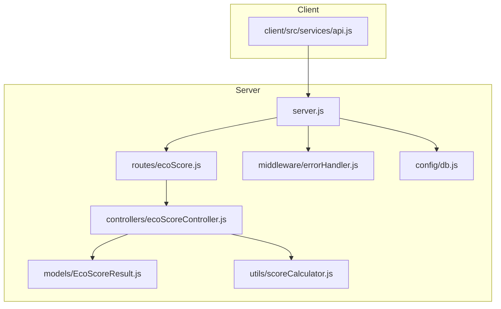
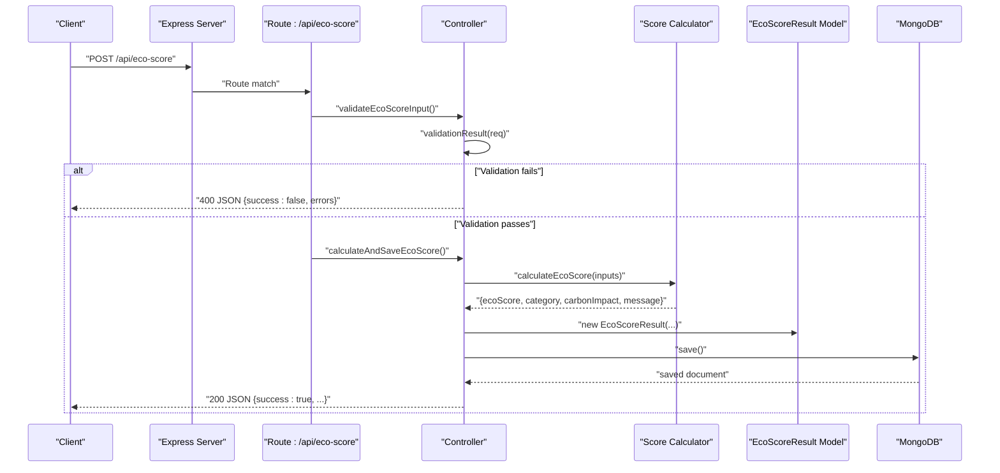
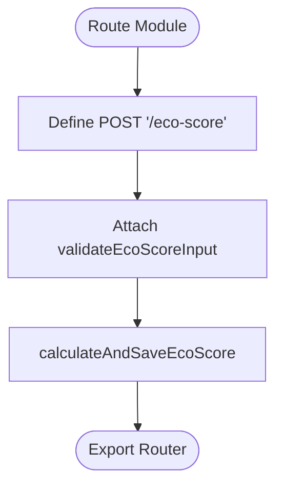
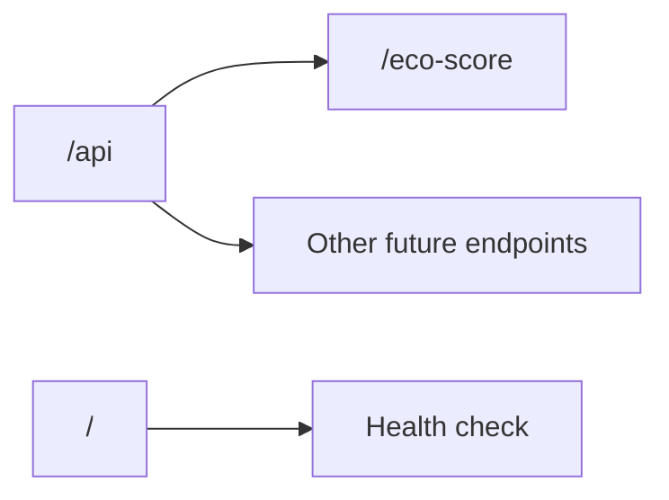
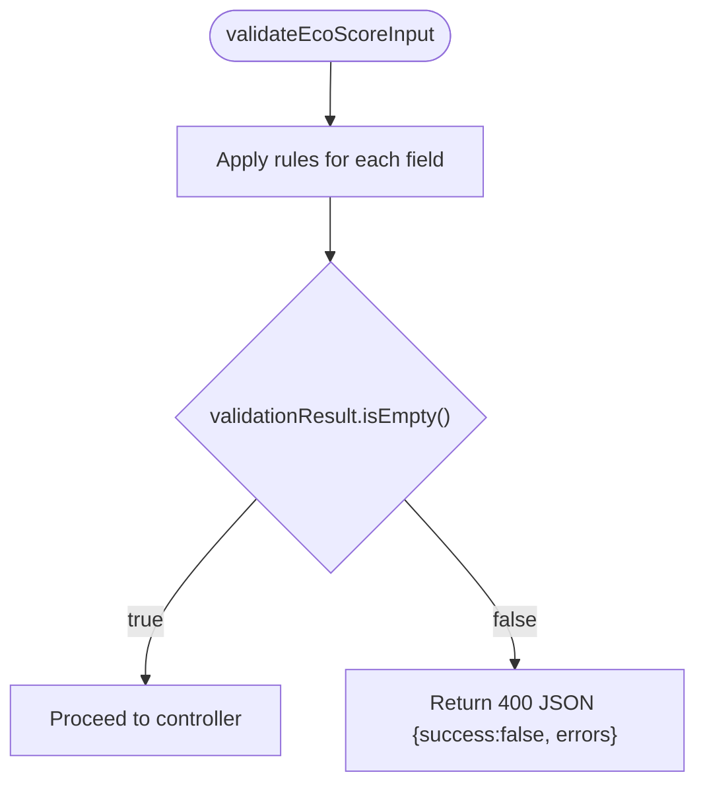
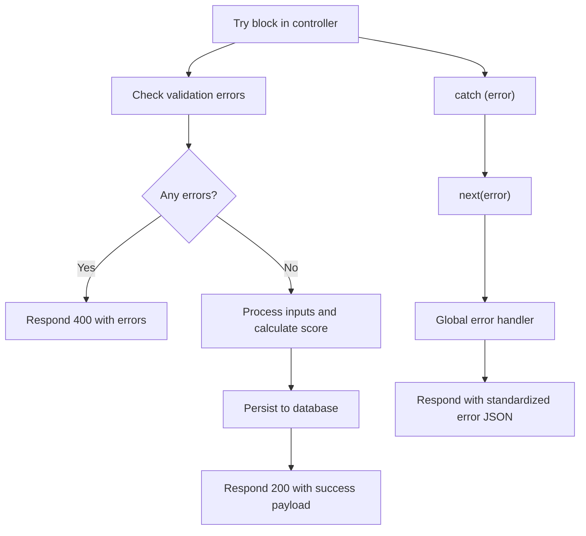
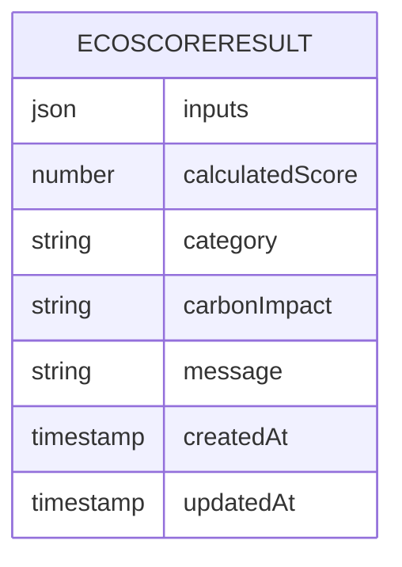
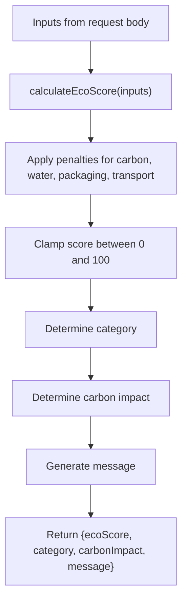
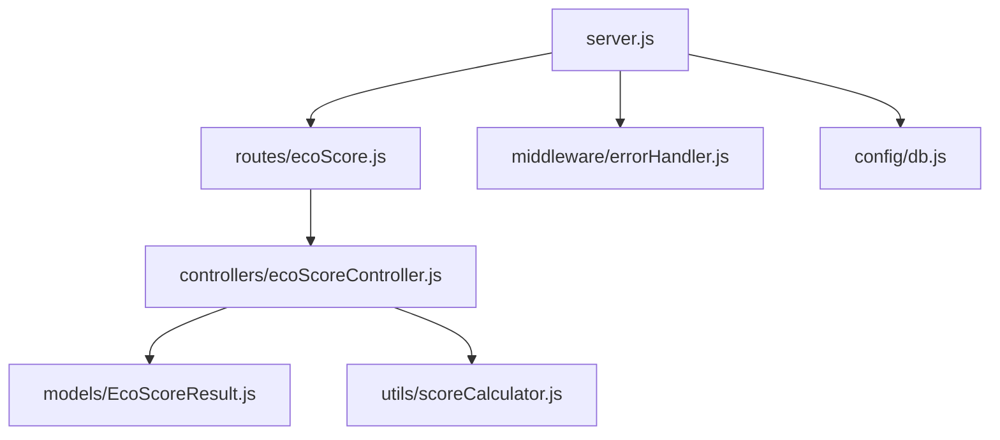

# Routing System

<cite>
**Referenced Files in This Document**
- [server.js](file://server/server.js)
- [ecoScore.js](file://server/routes/ecoScore.js)
- [ecoScoreController.js](file://server/controllers/ecoScoreController.js)
- [errorHandler.js](file://server/middleware/errorHandler.js)
- [EcoScoreResult.js](file://server/models/EcoScoreResult.js)
- [scoreCalculator.js](file://server/utils/scoreCalculator.js)
- [db.js](file://server/config/db.js)
- [api.js](file://client/src/services/api.js)
- [package.json](file://server/package.json)
- [README.md](file://README.md)
</cite>

## Table of Contents
1. [Introduction](#introduction)
2. [Project Structure](#project-structure)
3. [Core Components](#core-components)
4. [Architecture Overview](#architecture-overview)
5. [Detailed Component Analysis](#detailed-component-analysis)
6. [Dependency Analysis](#dependency-analysis)
7. [Performance Considerations](#performance-considerations)
8. [Troubleshooting Guide](#troubleshooting-guide)
9. [Conclusion](#conclusion)
10. [Appendices](#appendices)

## Introduction
This document provides comprehensive documentation for the Express.js routing system powering the Eco Score Predictor API. It explains route definition patterns, HTTP method handlers, URL parameter extraction, the '/api' base path structure, endpoint organization, request validation middleware integration, route-specific error handling, and response formatting patterns. It also includes examples of GET, POST, PUT, and DELETE operations, along with testing strategies, documentation generation approaches, and API versioning considerations.

## Project Structure
The routing system follows a layered architecture:
- Server bootstrap initializes middleware and mounts routes under the '/api' base path.
- Routes define endpoint patterns and chain middleware.
- Controllers encapsulate business logic and coordinate with models and utilities.
- Models define data schemas persisted to MongoDB.
- Utilities implement rule-based scoring logic.
- Client-side service consumes the API endpoints.

**Diagram sources**
- [server.js](file://server/server.js#L1-L34)
- [ecoScore.js](file://server/routes/ecoScore.js#L1-L9)
- [ecoScoreController.js](file://server/controllers/ecoScoreController.js#L1-L73)
- [errorHandler.js](file://server/middleware/errorHandler.js#L1-L14)
- [EcoScoreResult.js](file://server/models/EcoScoreResult.js#L1-L20)
- [scoreCalculator.js](file://server/utils/scoreCalculator.js#L1-L113)
- [db.js](file://server/config/db.js#L1-L18)
- [api.js](file://client/src/services/api.js#L1-L13)

**Section sources**
- [server.js](file://server/server.js#L1-L34)
- [README.md](file://README.md#L50-L74)

## Core Components
- Server bootstrap: Initializes Express, connects to MongoDB, registers middleware, mounts routes, defines health check, and installs global error handler.
- Route module: Defines the POST endpoint for eco score calculation under '/api/eco-score'.
- Controller: Implements validation, orchestrates calculation, persists results, and formats responses.
- Error handler: Provides standardized error responses with optional stack traces in development.
- Model: Defines the EcoScoreResult schema persisted to MongoDB.
- Utility: Implements rule-based scoring logic.
- Client service: Demonstrates consuming the POST endpoint.

Key implementation patterns:
- Route definition uses Express Router with a base path prefix applied at the server level.
- Request validation is integrated as middleware before controller logic.
- Response formatting follows a consistent success flag and structured payload.
- Global error handling ensures consistent error responses across endpoints.

**Section sources**
- [server.js](file://server/server.js#L1-L34)
- [ecoScore.js](file://server/routes/ecoScore.js#L1-L9)
- [ecoScoreController.js](file://server/controllers/ecoScoreController.js#L1-L73)
- [errorHandler.js](file://server/middleware/errorHandler.js#L1-L14)
- [EcoScoreResult.js](file://server/models/EcoScoreResult.js#L1-L20)
- [scoreCalculator.js](file://server/utils/scoreCalculator.js#L1-L113)
- [api.js](file://client/src/services/api.js#L1-L13)

## Architecture Overview
The routing system adheres to RESTful conventions with a single primary endpoint. The server composes middleware, routes, and error handling to provide a cohesive API surface.

**Diagram sources**
- [server.js](file://server/server.js#L18-L27)
- [ecoScore.js](file://server/routes/ecoScore.js#L5-L6)
- [ecoScoreController.js](file://server/controllers/ecoScoreController.js#L17-L67)
- [scoreCalculator.js](file://server/utils/scoreCalculator.js#L6-L110)
- [EcoScoreResult.js](file://server/models/EcoScoreResult.js#L3-L17)

## Detailed Component Analysis

### Route Definition Pattern
- Base path: '/api' is mounted at the server level.
- Endpoint: POST '/eco-score' is defined within the route module.
- Middleware chaining: The route attaches validation middleware before the controller action.

**Diagram sources**
- [ecoScore.js](file://server/routes/ecoScore.js#L5-L6)

**Section sources**
- [ecoScore.js](file://server/routes/ecoScore.js#L1-L9)

### HTTP Method Handlers and URL Parameter Extraction
- HTTP method: POST is used for creating and calculating eco scores.
- URL parameter extraction: The route does not use path parameters; all inputs are extracted from the request body.
- Body parsing: The server enables JSON and URL-encoded bodies, enabling robust request parsing.

Practical implications:
- Path parameters are not used; therefore, URL parameter extraction is not applicable here.
- All inputs are validated and processed from the request body.

**Section sources**
- [server.js](file://server/server.js#L14-L16)
- [ecoScore.js](file://server/routes/ecoScore.js#L5-L6)
- [ecoScoreController.js](file://server/controllers/ecoScoreController.js#L28-L39)

### '/api' Base Path Structure and Endpoint Organization
- Base path: '/api' is registered at the server level.
- Endpoint organization: Single endpoint POST '/api/eco-score' for eco score calculation.
- Health check: Root GET '/' endpoint provides a simple health check response.

**Diagram sources**
- [server.js](file://server/server.js#L19-L24)

**Section sources**
- [server.js](file://server/server.js#L18-L24)

### Request Validation Middleware Integration
- Validation library: express-validator is used to define validation rules.
- Validation rules: Enforce numeric constraints, boolean types, and enumerated values.
- Validation execution: The controller checks validation results and returns structured 400 responses on failure.

Validation coverage:
- carbon: positive number
- water: positive number
- animalBased: boolean
- origin: 'local' or 'imported'
- category: one of food, beverage, personal care, accessories
- packaging: one of plastic, paper, glass, cardboard, compostable, none
- transport: one of air, ship, truck

**Diagram sources**
- [ecoScoreController.js](file://server/controllers/ecoScoreController.js#L6-L14)
- [ecoScoreController.js](file://server/controllers/ecoScoreController.js#L20-L26)

**Section sources**
- [ecoScoreController.js](file://server/controllers/ecoScoreController.js#L1-L73)

### Route-Specific Error Handling and Response Formatting
- Route-specific error handling: The controller wraps logic in try/catch and forwards errors to the global error handler.
- Response formatting: Consistent success flag and structured payload for successful responses; standardized error payload for failures.
- Global error handling: Centralized error handler logs stack traces in development and returns consistent JSON responses.

**Diagram sources**
- [ecoScoreController.js](file://server/controllers/ecoScoreController.js#L17-L67)
- [errorHandler.js](file://server/middleware/errorHandler.js#L1-L14)

**Section sources**
- [ecoScoreController.js](file://server/controllers/ecoScoreController.js#L17-L67)
- [errorHandler.js](file://server/middleware/errorHandler.js#L1-L14)

### Data Persistence and Schema
- Model: EcoScoreResult schema captures inputs, calculated score, category, carbon impact, and message.
- Persistence: After calculation, a new document is saved to MongoDB.

**Diagram sources**
- [EcoScoreResult.js](file://server/models/EcoScoreResult.js#L3-L17)

**Section sources**
- [EcoScoreResult.js](file://server/models/EcoScoreResult.js#L1-L20)

### Scoring Logic and Calculation
- Utility: calculateEcoScore applies rule-based penalties and determines category and messages.
- Inputs: derived from request body and passed to the utility function.

**Diagram sources**
- [scoreCalculator.js](file://server/utils/scoreCalculator.js#L6-L110)

**Section sources**
- [scoreCalculator.js](file://server/utils/scoreCalculator.js#L1-L113)

### Client Integration Example
- Client service demonstrates consuming the POST endpoint with Axios.
- Environment configuration sets the API base URL.

**Section sources**
- [api.js](file://client/src/services/api.js#L1-L13)

### Additional HTTP Methods: GET, PUT, DELETE
- Current implementation: Only POST '/api/eco-score' is defined.
- Extending the system: Future endpoints can be added under '/api' with appropriate HTTP methods and validation.

Example patterns for future endpoints:
- GET '/api/eco-score/:id' for retrieving a specific result by ID.
- PUT '/api/eco-score/:id' for updating an existing result.
- DELETE '/api/eco-score/:id' for removing a result.

Note: These are conceptual extensions and not present in the current codebase.

## Dependency Analysis
The routing system exhibits clear separation of concerns with explicit dependencies:
- server.js depends on route modules, middleware, and database configuration.
- route modules depend on controller functions.
- controllers depend on models and utilities.
- error handler is globally applied.

**Diagram sources**
- [server.js](file://server/server.js#L1-L34)
- [ecoScore.js](file://server/routes/ecoScore.js#L1-L9)
- [ecoScoreController.js](file://server/controllers/ecoScoreController.js#L1-L73)
- [errorHandler.js](file://server/middleware/errorHandler.js#L1-L14)
- [EcoScoreResult.js](file://server/models/EcoScoreResult.js#L1-L20)
- [scoreCalculator.js](file://server/utils/scoreCalculator.js#L1-L113)
- [db.js](file://server/config/db.js#L1-L18)

**Section sources**
- [package.json](file://server/package.json#L15-L21)
- [server.js](file://server/server.js#L1-L34)

## Performance Considerations
- Validation overhead: express-validator adds minimal overhead during request processing; ensure validation rules remain efficient.
- Database writes: Each calculation triggers a write operation; consider batching or caching strategies if throughput increases.
- Middleware order: JSON parsing occurs before route handling, minimizing parsing costs.
- Error handling: Centralized error handler prevents redundant error formatting logic across routes.

## Troubleshooting Guide
Common issues and resolutions:
- Validation errors: When inputs fail validation, the controller responds with a 400 status and an errors array. Verify input types and enumerations align with validation rules.
- Database connectivity: Ensure MongoDB connection is established before requests arrive. Check environment variables and connection logs.
- CORS issues: Verify CORS middleware is enabled to allow cross-origin requests from the frontend.
- Global error logging: The error handler logs stack traces in development mode; inspect logs for unhandled exceptions.

**Section sources**
- [ecoScoreController.js](file://server/controllers/ecoScoreController.js#L20-L26)
- [db.js](file://server/config/db.js#L3-L15)
- [server.js](file://server/server.js#L14-L16)
- [errorHandler.js](file://server/middleware/errorHandler.js#L1-L14)

## Conclusion
The routing system demonstrates a clean, modular architecture with explicit validation, consistent response formatting, and centralized error handling. The '/api' base path organizes endpoints cleanly, while the controller-layer encapsulates business logic and integrates with models and utilities. The system is ready for extension with additional endpoints and can be enhanced with comprehensive testing and documentation generation strategies.

## Appendices

### API Reference
- Base URL: /api
- Endpoint: POST /eco-score
- Purpose: Calculate eco score for a product based on input parameters.
- Request body fields: carbon, water, animalBased, origin, category, packaging, transport.
- Response: success flag, ecoScore, category, carbonImpact, message.
- Validation: Positive numbers for carbon and water, boolean for animalBased, enumerated values for origin, category, packaging, transport.

**Section sources**
- [README.md](file://README.md#L144-L182)
- [ecoScoreController.js](file://server/controllers/ecoScoreController.js#L6-L14)
- [ecoScoreController.js](file://server/controllers/ecoScoreController.js#L56-L62)

### Route Testing Strategies
Recommended testing approaches:
- Unit tests for validation rules to ensure correct error responses for invalid inputs.
- Integration tests for the controller to verify calculation and persistence behavior.
- End-to-end tests simulating client requests to confirm response formatting and error handling.
- Load tests to evaluate performance under concurrent requests.

### Documentation Generation
Approaches for automated documentation:
- OpenAPI/Swagger: Define API specifications and generate interactive docs.
- JSDoc: Annotate routes, controllers, and utilities for automatic documentation generation.
- Postman collections: Maintain API collections with examples and environment configurations.

### API Versioning Considerations
- Path-based versioning: /api/v1/eco-score for initial version.
- Header-based versioning: X-API-Version header for future flexibility.
- Deprecation policy: Maintain backward compatibility and announce breaking changes with migration guides.