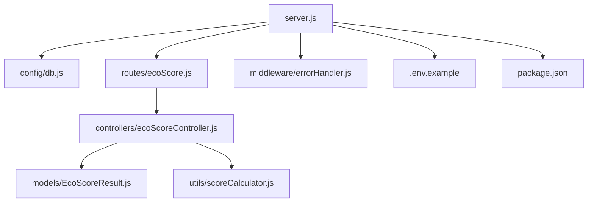
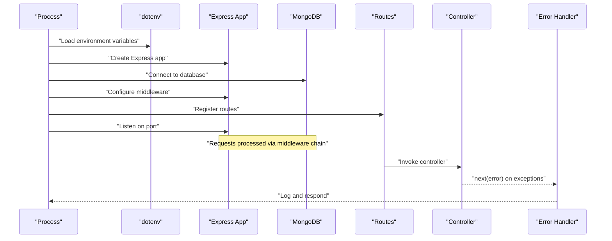
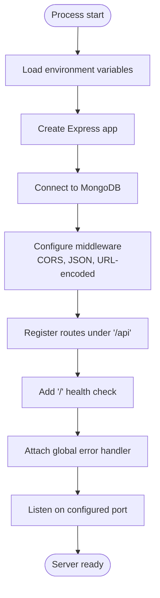
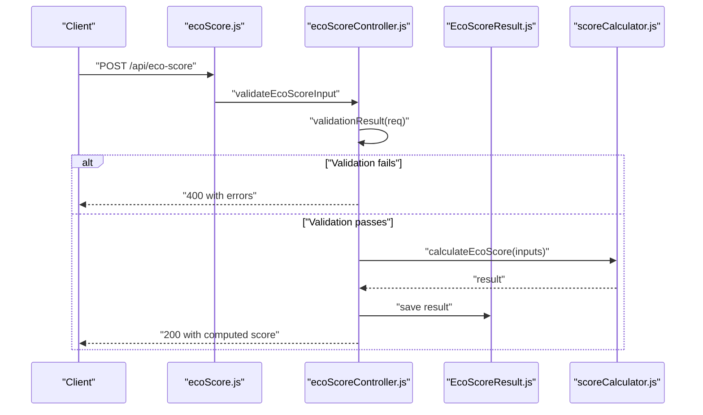
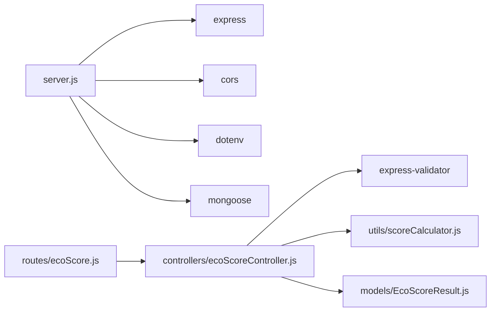

# Server Setup and Initialization

<cite>
**Referenced Files in This Document**
- [server.js](file://server/server.js)
- [package.json](file://server/package.json)
- [.env.example](file://server/.env.example)
- [db.js](file://server/config/db.js)
- [errorHandler.js](file://server/middleware/errorHandler.js)
- [ecoScore.js](file://server/routes/ecoScore.js)
- [ecoScoreController.js](file://server/controllers/ecoScoreController.js)
- [EcoScoreResult.js](file://server/models/EcoScoreResult.js)
- [scoreCalculator.js](file://server/utils/scoreCalculator.js)
- [README.md](file://README.md)
</cite>

## Table of Contents
1. [Introduction](#introduction)
2. [Project Structure](#project-structure)
3. [Core Components](#core-components)
4. [Architecture Overview](#architecture-overview)
5. [Detailed Component Analysis](#detailed-component-analysis)
6. [Dependency Analysis](#dependency-analysis)
7. [Performance Considerations](#performance-considerations)
8. [Troubleshooting Guide](#troubleshooting-guide)
9. [Conclusion](#conclusion)
10. [Appendices](#appendices)

## Introduction
This document explains how the Express.js server is set up and initialized, including environment variable loading, middleware configuration order, CORS setup, JSON and URL-encoded parsing, port configuration, and server startup. It also covers security considerations for development versus production, logging strategies, performance monitoring, and common configuration issues with debugging techniques.

## Project Structure
The server module is organized around a small but complete Express application with modularized concerns:
- Environment configuration via dotenv
- Database connection via Mongoose
- Middleware for CORS, JSON, and URL-encoded bodies
- Routes and controllers for the API
- Error handling middleware
- A health check endpoint

**Diagram sources**
- [server.js](file://server/server.js#L1-L34)
- [db.js](file://server/config/db.js#L1-L18)
- [ecoScore.js](file://server/routes/ecoScore.js#L1-L9)
- [errorHandler.js](file://server/middleware/errorHandler.js#L1-L14)
- [ecoScoreController.js](file://server/controllers/ecoScoreController.js#L1-L73)
- [EcoScoreResult.js](file://server/models/EcoScoreResult.js#L1-L20)
- [scoreCalculator.js](file://server/utils/scoreCalculator.js#L1-L113)
- [.env.example](file://server/.env.example#L1-L4)
- [package.json](file://server/package.json#L1-L23)

**Section sources**
- [server.js](file://server/server.js#L1-L34)
- [package.json](file://server/package.json#L1-L23)
- [.env.example](file://server/.env.example#L1-L4)

## Core Components
- Express application creation and environment loading
- Middleware pipeline: CORS, JSON parser, URL-encoded parser
- Route registration under a base path
- Health check endpoint
- Global error handler
- Port configuration and server listen

Key behaviors:
- Environment variables are loaded early to configure database and runtime mode.
- Middleware order is critical: CORS first, then parsers, then routes, then error handler.
- A health check route confirms the server is running.
- Error handler logs stack traces in development and omits them in production.

**Section sources**
- [server.js](file://server/server.js#L1-L34)
- [errorHandler.js](file://server/middleware/errorHandler.js#L1-L14)

## Architecture Overview
The server bootstraps by loading environment variables, connecting to MongoDB, configuring middleware, registering routes, and starting the HTTP listener. Requests flow through middleware, then to routes and controllers, and finally to the error handler if uncaught.

**Diagram sources**
- [server.js](file://server/server.js#L1-L34)
- [db.js](file://server/config/db.js#L1-L18)
- [ecoScore.js](file://server/routes/ecoScore.js#L1-L9)
- [ecoScoreController.js](file://server/controllers/ecoScoreController.js#L1-L73)
- [errorHandler.js](file://server/middleware/errorHandler.js#L1-L14)

## Detailed Component Analysis

### Server Bootstrap and Initialization
- Loads environment variables from a .env file.
- Creates an Express application instance.
- Establishes a database connection.
- Registers middleware and routes.
- Starts listening on a configured port with a console log.

**Diagram sources**
- [server.js](file://server/server.js#L1-L34)
- [db.js](file://server/config/db.js#L1-L18)

**Section sources**
- [server.js](file://server/server.js#L1-L34)

### Environment Variable Loading
- dotenv loads variables from a .env file into process.env.
- The example file defines defaults for port, MongoDB URI, and NODE_ENV.
- Scripts define how to run in production and development modes.

Practical implications:
- Ensure a .env file exists with required keys in the server directory.
- NODE_ENV controls whether stack traces are included in error responses.

**Section sources**
- [server.js](file://server/server.js#L1-L1)
- [.env.example](file://server/.env.example#L1-L4)
- [package.json](file://server/package.json#L6-L10)

### Middleware Configuration Order
- CORS middleware is registered first to handle preflight and cross-origin requests.
- JSON body parser is registered next to parse incoming JSON payloads.
- URL-encoded parser is registered to parse form submissions.
- Routes are mounted after parsers.
- Global error handler is attached last to catch unhandled errors.

Security note:
- The current CORS configuration uses defaults. For production, restrict origins and credentials carefully.

**Section sources**
- [server.js](file://server/server.js#L14-L16)
- [errorHandler.js](file://server/middleware/errorHandler.js#L1-L14)

### CORS Configuration
- The server enables CORS globally with default settings.
- For production, configure allowed origins, methods, headers, and credentials explicitly.

Operational guidance:
- Align client-side API base URL with allowed server origins.
- Avoid wildcard origins in production; enumerate trusted domains.

**Section sources**
- [server.js](file://server/server.js#L14-L14)

### JSON Parsing and URL-Encoded Data Handling
- JSON payloads are parsed automatically.
- URL-encoded form data is supported with extended option enabled.

Validation:
- Input validation is performed in the controller using express-validator.

**Section sources**
- [server.js](file://server/server.js#L15-L16)
- [ecoScoreController.js](file://server/controllers/ecoScoreController.js#L6-L14)

### Route Registration and Controller Flow
- Routes are mounted under a base path and delegate to controllers.
- Controllers validate inputs, compute results, persist data, and return structured responses.
- Validation errors are returned as 400 with an errors array.

**Diagram sources**
- [ecoScore.js](file://server/routes/ecoScore.js#L1-L9)
- [ecoScoreController.js](file://server/controllers/ecoScoreController.js#L1-L73)
- [EcoScoreResult.js](file://server/models/EcoScoreResult.js#L1-L20)
- [scoreCalculator.js](file://server/utils/scoreCalculator.js#L1-L113)

**Section sources**
- [ecoScore.js](file://server/routes/ecoScore.js#L1-L9)
- [ecoScoreController.js](file://server/controllers/ecoScoreController.js#L1-L73)

### Error Handling Middleware
- Logs the error stack to stderr.
- Responds with a JSON payload indicating failure.
- In development mode, includes the stack; in production, it is omitted.

Best practices:
- Ensure all asynchronous errors are passed to next().
- Centralize error responses for consistent client handling.

**Section sources**
- [errorHandler.js](file://server/middleware/errorHandler.js#L1-L14)

### Port Configuration and Server Startup
- The server listens on a configurable port, defaulting to 5000.
- A console log confirms the server is running.

Operational tips:
- Use environment variables to change ports in different environments.
- Ensure the port is open and not blocked by firewalls.

**Section sources**
- [server.js](file://server/server.js#L29-L33)

### Database Connection
- The server connects to MongoDB using Mongoose with unified topology and legacy URL parser flags.
- On successful connection, the host is logged; on failure, the process exits.

**Section sources**
- [db.js](file://server/config/db.js#L1-L18)

### Security Considerations: Development vs Production
- Development mode:
  - Stack traces are included in error responses for easier debugging.
  - Default CORS allows broad access for local development.
- Production mode:
  - Set NODE_ENV to production to suppress stack traces.
  - Restrict CORS to specific origins and credentials.
  - Use HTTPS and secure cookies if applicable.
  - Validate and sanitize all inputs rigorously.

**Section sources**
- [errorHandler.js](file://server/middleware/errorHandler.js#L9-L10)
- [server.js](file://server/server.js#L14-L16)

### Logging Strategies
- Console logs indicate successful database connection and server startup.
- Error handler logs stack traces to stderr.
- Recommendation: Integrate a structured logger (e.g., Winston or Pino) for production-grade logging with levels, formatting, and transports.

**Section sources**
- [db.js](file://server/config/db.js#L10-L12)
- [server.js](file://server/server.js#L32-L32)
- [errorHandler.js](file://server/middleware/errorHandler.js#L2-L2)

### Performance Monitoring Setup
- No built-in metrics are present in the current implementation.
- Recommendations:
  - Add middleware to track request duration and response codes.
  - Instrument database operations and controller timings.
  - Export metrics to Prometheus or similar systems.
  - Monitor memory and CPU usage via OS-level tools or Node.js profiling.

[No sources needed since this section provides general guidance]

## Dependency Analysis
The server depends on Express, CORS, dotenv, Mongoose, and express-validator. Dependencies are declared in the server’s package manifest.

**Diagram sources**
- [server.js](file://server/server.js#L1-L6)
- [ecoScore.js](file://server/routes/ecoScore.js#L1-L3)
- [ecoScoreController.js](file://server/controllers/ecoScoreController.js#L1-L3)
- [package.json](file://server/package.json#L15-L21)

**Section sources**
- [package.json](file://server/package.json#L15-L21)

## Performance Considerations
- Keep middleware minimal and ordered efficiently.
- Use compression for large responses.
- Implement rate limiting for public endpoints.
- Optimize database queries and consider indexing.
- Monitor garbage collection and memory usage in production.

[No sources needed since this section provides general guidance]

## Troubleshooting Guide
Common issues and resolutions:
- Database connection failures:
  - Verify MONGODB_URI and network connectivity.
  - Confirm MongoDB is running and accessible.
- Port conflicts:
  - Change PORT or stop the process using the port.
- CORS errors:
  - Ensure client origin is allowed by CORS configuration.
  - Align client API base URL with allowed origins.
- Validation errors:
  - Review input shapes and constraints defined in the controller.
- Unhandled exceptions:
  - Ensure all async errors are passed to next() so the error handler can process them.

**Section sources**
- [db.js](file://server/config/db.js#L11-L13)
- [server.js](file://server/server.js#L29-L33)
- [errorHandler.js](file://server/middleware/errorHandler.js#L1-L14)
- [ecoScoreController.js](file://server/controllers/ecoScoreController.js#L20-L26)

## Conclusion
The server initializes cleanly with environment-driven configuration, a straightforward middleware pipeline, and a focused routing and controller structure. By tightening CORS, adding robust logging and metrics, and hardening error handling, the server can be safely deployed to production while maintaining strong developer ergonomics in development.

## Appendices

### Environment Variables Reference
- PORT: Server port (default 5000)
- MONGODB_URI: MongoDB connection string
- NODE_ENV: Environment mode (development or production)

**Section sources**
- [.env.example](file://server/.env.example#L1-L4)

### Installation and Setup Notes
- Install dependencies in the server directory.
- Start MongoDB locally or use a hosted service.
- Run the server in development mode with auto-reload or production mode without it.

**Section sources**
- [README.md](file://README.md#L89-L122)
- [package.json](file://server/package.json#L6-L10)