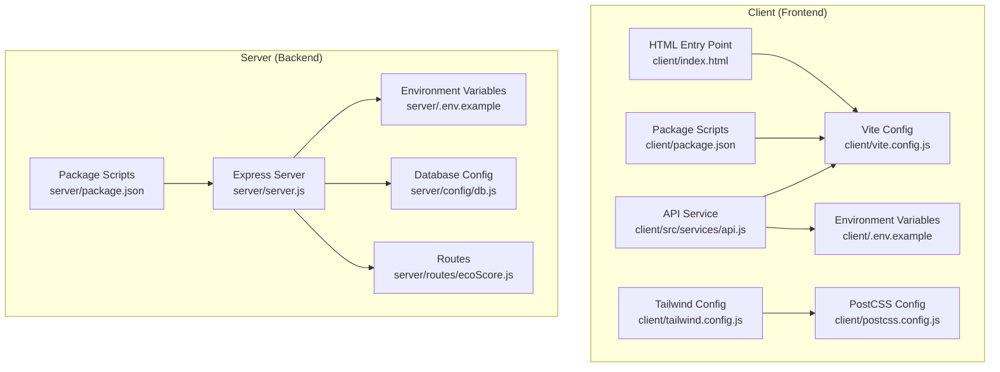
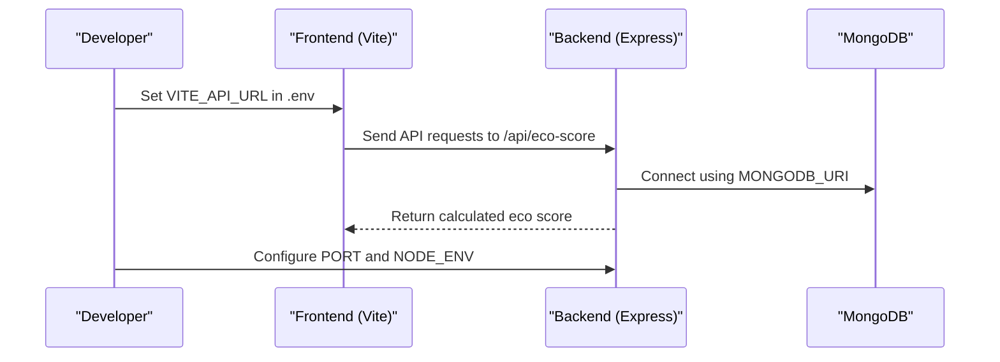
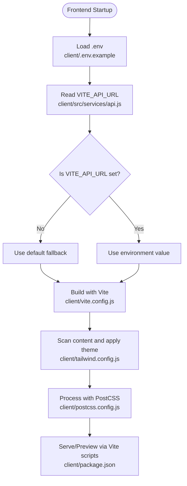
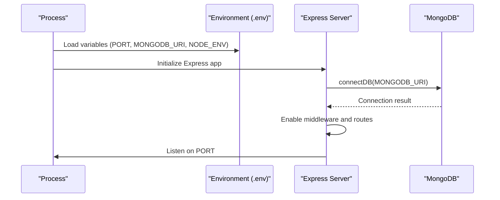
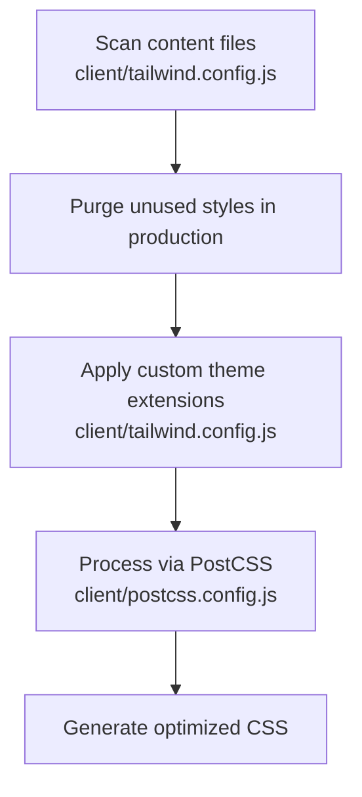
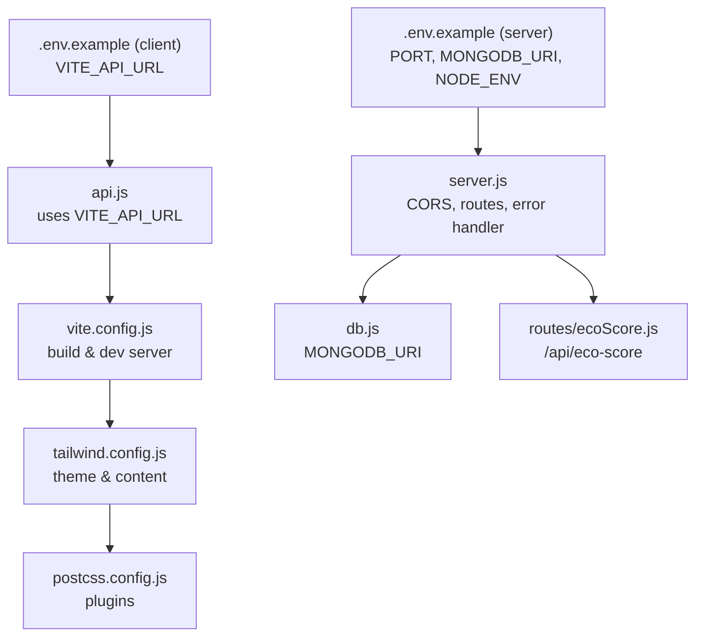

# Configuration and Environment Management

<cite>
**Referenced Files in This Document**
- [client/.env.example](file://client/.env.example)
- [client/vite.config.js](file://client/vite.config.js)
- [client/tailwind.config.js](file://client/tailwind.config.js)
- [client/postcss.config.js](file://client/postcss.config.js)
- [client/package.json](file://client/package.json)
- [client/src/services/api.js](file://client/src/services/api.js)
- [client/index.html](file://client/index.html)
- [server/.env.example](file://server/.env.example)
- [server/package.json](file://server/package.json)
- [server/server.js](file://server/server.js)
- [server/config/db.js](file://server/config/db.js)
- [server/routes/ecoScore.js](file://server/routes/ecoScore.js)
</cite>

## Table of Contents
1. [Introduction](#introduction)
2. [Project Structure](#project-structure)
3. [Core Components](#core-components)
4. [Architecture Overview](#architecture-overview)
5. [Detailed Component Analysis](#detailed-component-analysis)
6. [Dependency Analysis](#dependency-analysis)
7. [Performance Considerations](#performance-considerations)
8. [Troubleshooting Guide](#troubleshooting-guide)
9. [Conclusion](#conclusion)

## Introduction
This document provides comprehensive configuration and environment management guidance for the Eco Score Predictor application. It covers frontend environment variables and Vite build settings, backend environment variables and database connectivity, Tailwind CSS configuration for responsive design and custom styling, deployment considerations, and security best practices for managing sensitive configuration data. It also highlights development versus production differences, build optimization strategies, and performance tuning parameters.

## Project Structure
The project consists of two primary modules:
- Frontend (React + Vite): Handles user interface, API communication, and styling via Tailwind CSS.
- Backend (Express + MongoDB): Provides REST API endpoints, connects to MongoDB, and exposes health checks and error handling.

**Diagram sources**
- [client/vite.config.js](file://client/vite.config.js#L1-L8)
- [client/.env.example](file://client/.env.example#L1-L2)
- [client/tailwind.config.js](file://client/tailwind.config.js#L1-L28)
- [client/postcss.config.js](file://client/postcss.config.js#L1-L7)
- [client/package.json](file://client/package.json#L1-L32)
- [client/src/services/api.js](file://client/src/services/api.js#L1-L13)
- [client/index.html](file://client/index.html#L1-L14)
- [server/.env.example](file://server/.env.example#L1-L4)
- [server/package.json](file://server/package.json#L1-L23)
- [server/server.js](file://server/server.js#L1-L34)
- [server/config/db.js](file://server/config/db.js#L1-L18)
- [server/routes/ecoScore.js](file://server/routes/ecoScore.js#L1-L9)

**Section sources**
- [client/package.json](file://client/package.json#L1-L32)
- [server/package.json](file://server/package.json#L1-L23)

## Core Components
This section documents the environment variables and build settings for both frontend and backend, along with their roles in development and production contexts.

- Frontend Environment Variables
  - VITE_API_URL: Defines the base URL for API requests. The frontend service reads this variable at runtime to construct API endpoints.
  - Example template: client/.env.example
  - Runtime usage: client/src/services/api.js

- Frontend Build and Development Settings
  - Vite configuration: client/vite.config.js
  - Scripts: Development, build, preview, and lint commands are defined in client/package.json.
  - Content scanning for Tailwind: client/tailwind.config.js specifies which files are scanned for class usage.
  - PostCSS pipeline: client/postcss.config.js integrates Tailwind CSS and Autoprefixer.
  - HTML entry point: client/index.html sets viewport and script module entry.

- Backend Environment Variables
  - PORT: TCP port for the Express server.
  - MONGODB_URI: Connection string for MongoDB.
  - NODE_ENV: Environment mode (development).
  - Example template: server/.env.example
  - Runtime usage: server/server.js and server/config/db.js.

- Backend Build and Runtime Scripts
  - Scripts: Start and dev commands are defined in server/package.json.
  - dotenv loading: server/server.js loads environment variables from .env.
  - Database connection: server/config/db.js uses MONGODB_URI to connect to MongoDB.

**Section sources**
- [client/.env.example](file://client/.env.example#L1-L2)
- [client/src/services/api.js](file://client/src/services/api.js#L1-L13)
- [client/vite.config.js](file://client/vite.config.js#L1-L8)
- [client/package.json](file://client/package.json#L1-L32)
- [client/tailwind.config.js](file://client/tailwind.config.js#L1-L28)
- [client/postcss.config.js](file://client/postcss.config.js#L1-L7)
- [client/index.html](file://client/index.html#L1-L14)
- [server/.env.example](file://server/.env.example#L1-L4)
- [server/server.js](file://server/server.js#L1-L34)
- [server/config/db.js](file://server/config/db.js#L1-L18)
- [server/package.json](file://server/package.json#L1-L23)

## Architecture Overview
The configuration architecture ties together environment variables, build tools, and runtime behavior across the frontend and backend.

**Diagram sources**
- [client/.env.example](file://client/.env.example#L1-L2)
- [client/src/services/api.js](file://client/src/services/api.js#L1-L13)
- [server/.env.example](file://server/.env.example#L1-L4)
- [server/config/db.js](file://server/config/db.js#L1-L18)
- [server/server.js](file://server/server.js#L1-L34)

## Detailed Component Analysis

### Frontend Environment Configuration and Vite Build Settings
- Environment variables
  - VITE_API_URL controls the base API endpoint used by the frontend service.
  - The frontend service conditionally falls back to a default value if the variable is missing.
- Vite configuration
  - Minimal configuration enables React plugin; no additional build-time transforms are configured.
- Build scripts
  - Development server, production build, preview, and lint commands are exposed via package.json scripts.
- Tailwind CSS integration
  - Content paths specify scanning for class usage across HTML and JSX/TSX files.
  - Custom color palette extends the default theme for primary shades.
- PostCSS pipeline
  - Tailwind CSS and Autoprefixer are enabled to process styles during build.
- HTML entry point
  - Sets viewport meta tag and mounts the React application.

**Diagram sources**
- [client/.env.example](file://client/.env.example#L1-L2)
- [client/src/services/api.js](file://client/src/services/api.js#L1-L13)
- [client/vite.config.js](file://client/vite.config.js#L1-L8)
- [client/tailwind.config.js](file://client/tailwind.config.js#L1-L28)
- [client/postcss.config.js](file://client/postcss.config.js#L1-L7)
- [client/package.json](file://client/package.json#L1-L32)

**Section sources**
- [client/.env.example](file://client/.env.example#L1-L2)
- [client/src/services/api.js](file://client/src/services/api.js#L1-L13)
- [client/vite.config.js](file://client/vite.config.js#L1-L8)
- [client/package.json](file://client/package.json#L1-L32)
- [client/tailwind.config.js](file://client/tailwind.config.js#L1-L28)
- [client/postcss.config.js](file://client/postcss.config.js#L1-L7)
- [client/index.html](file://client/index.html#L1-L14)

### Backend Environment Variables and Database Connectivity
- Environment variables
  - PORT defines the listening port for the Express server.
  - MONGODB_URI provides the MongoDB connection string.
  - NODE_ENV indicates the environment mode.
- Express server initialization
  - dotenv loads environment variables from .env.
  - CORS and JSON parsing middleware are enabled.
  - Routes under /api are mounted.
  - Health check endpoint responds with a status message.
  - Error handling middleware is registered.
- Database connectivity
  - The database connection function uses MONGODB_URI with legacy options enabled.
  - On successful connection, the host is logged; on failure, the error is logged and the process exits.

**Diagram sources**
- [server/.env.example](file://server/.env.example#L1-L4)
- [server/server.js](file://server/server.js#L1-L34)
- [server/config/db.js](file://server/config/db.js#L1-L18)

**Section sources**
- [server/.env.example](file://server/.env.example#L1-L4)
- [server/server.js](file://server/server.js#L1-L34)
- [server/config/db.js](file://server/config/db.js#L1-L18)

### Tailwind CSS Configuration for Responsive Design and Custom Styling
- Content scanning
  - Tailwind scans index.html and all files under src for class usage to enable purging in production builds.
- Theme customization
  - Extends the default theme with a custom primary color scale for consistent branding.
- Plugins
  - No additional plugins are enabled; the configuration relies on built-in utilities.

**Diagram sources**
- [client/tailwind.config.js](file://client/tailwind.config.js#L1-L28)
- [client/postcss.config.js](file://client/postcss.config.js#L1-L7)

**Section sources**
- [client/tailwind.config.js](file://client/tailwind.config.js#L1-L28)
- [client/postcss.config.js](file://client/postcss.config.js#L1-L7)

### Deployment Configuration Considerations
- Environment-specific settings
  - Development: NODE_ENV=development; local database and ports.
  - Production: Set NODE_ENV to production; configure secure MONGODB_URI and appropriate PORT.
- Secrets management
  - Store sensitive values (e.g., MONGODB_URI) in environment variables; avoid committing secrets to version control.
- Static asset serving
  - After building the frontend with Vite, serve the dist folder via a static server or integrate with the backend for production deployments.
- Health checks
  - The backend exposes a root GET endpoint for basic health verification.

**Section sources**
- [server/.env.example](file://server/.env.example#L1-L4)
- [server/server.js](file://server/server.js#L22-L24)

### Security Best Practices for Sensitive Configuration Data
- Never commit .env files or secrets to version control.
- Use environment variables for all secrets (database URIs, tokens, keys).
- Restrict access to environment files and CI/CD secrets.
- Validate and sanitize environment variables at startup.
- Use HTTPS in production and secure headers where applicable.

[No sources needed since this section provides general guidance]

### Development vs Production Differences
- Development
  - Frontend: Vite dev server with hot reload and fast iteration.
  - Backend: Nodemon auto-restarts on file changes; NODE_ENV=development.
- Production
  - Frontend: Vite build generates optimized assets; serve via a static server or backend.
  - Backend: Express server listens on configured PORT; NODE_ENV=production recommended.

**Section sources**
- [client/package.json](file://client/package.json#L6-L10)
- [server/package.json](file://server/package.json#L6-L10)
- [server/.env.example](file://server/.env.example#L3-L3)

### Build Optimization Strategies and Performance Tuning
- Frontend
  - Leverage Vite’s built-in optimizations; keep plugins minimal for faster builds.
  - Tailwind purging reduces CSS bundle size by removing unused styles.
  - Use production builds for performance testing and benchmarking.
- Backend
  - Ensure database connection options are tuned for production (e.g., connection pooling).
  - Monitor resource usage and scale horizontally as needed.
  - Enable compression and caching where appropriate.

**Section sources**
- [client/vite.config.js](file://client/vite.config.js#L1-L8)
- [client/tailwind.config.js](file://client/tailwind.config.js#L1-L28)
- [server/config/db.js](file://server/config/db.js#L1-L18)

## Dependency Analysis
This section maps how configuration files depend on each other and influence runtime behavior.

**Diagram sources**
- [client/.env.example](file://client/.env.example#L1-L2)
- [client/src/services/api.js](file://client/src/services/api.js#L1-L13)
- [client/vite.config.js](file://client/vite.config.js#L1-L8)
- [client/tailwind.config.js](file://client/tailwind.config.js#L1-L28)
- [client/postcss.config.js](file://client/postcss.config.js#L1-L7)
- [server/.env.example](file://server/.env.example#L1-L4)
- [server/server.js](file://server/server.js#L1-L34)
- [server/config/db.js](file://server/config/db.js#L1-L18)
- [server/routes/ecoScore.js](file://server/routes/ecoScore.js#L1-L9)

**Section sources**
- [client/.env.example](file://client/.env.example#L1-L2)
- [client/src/services/api.js](file://client/src/services/api.js#L1-L13)
- [client/vite.config.js](file://client/vite.config.js#L1-L8)
- [client/tailwind.config.js](file://client/tailwind.config.js#L1-L28)
- [client/postcss.config.js](file://client/postcss.config.js#L1-L7)
- [server/.env.example](file://server/.env.example#L1-L4)
- [server/server.js](file://server/server.js#L1-L34)
- [server/config/db.js](file://server/config/db.js#L1-L18)
- [server/routes/ecoScore.js](file://server/routes/ecoScore.js#L1-L9)

## Performance Considerations
- Frontend
  - Keep Vite configuration minimal to reduce build overhead.
  - Tailwind purging removes unused CSS; ensure content globs cover all relevant files.
  - Use production builds for accurate performance metrics.
- Backend
  - Optimize database queries and connection settings.
  - Monitor memory and CPU usage; adjust cluster settings if scaling horizontally.

[No sources needed since this section provides general guidance]

## Troubleshooting Guide
- Frontend
  - If API calls fail, verify VITE_API_URL is set correctly in the client environment file and matches the backend deployment address.
  - Confirm the backend is reachable at the configured port and that CORS is enabled.
- Backend
  - If the database connection fails, check MONGODB_URI correctness and network accessibility.
  - Verify that environment variables are loaded by ensuring dotenv is invoked before requiring dependent modules.
  - Use the root GET endpoint to confirm the server is running.

**Section sources**
- [client/.env.example](file://client/.env.example#L1-L2)
- [client/src/services/api.js](file://client/src/services/api.js#L1-L13)
- [server/.env.example](file://server/.env.example#L1-L4)
- [server/server.js](file://server/server.js#L1-L34)
- [server/config/db.js](file://server/config/db.js#L1-L18)

## Conclusion
This guide outlines how environment variables and build settings are configured and used across the frontend and backend of the Eco Score Predictor. By following the documented practices—using environment variables for secrets, leveraging Vite and Tailwind for efficient builds, and applying production-ready configurations—you can maintain a secure, scalable, and performant application across development and production environments.