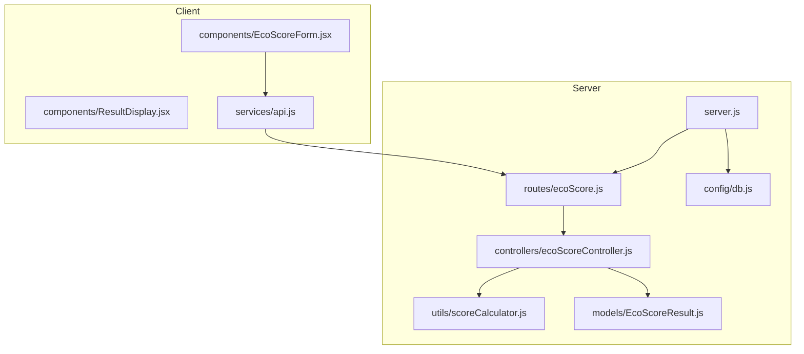
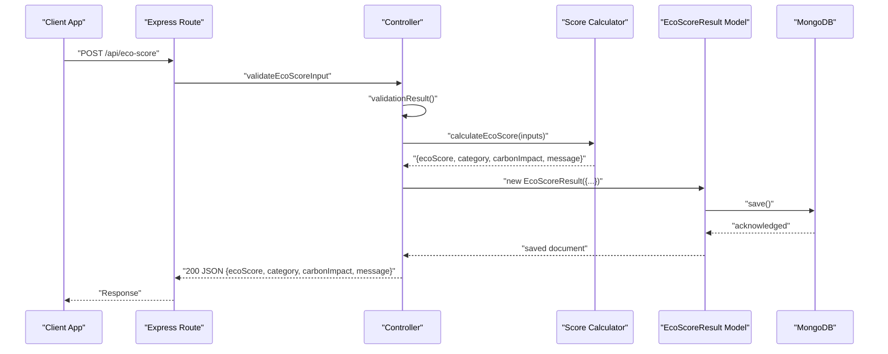
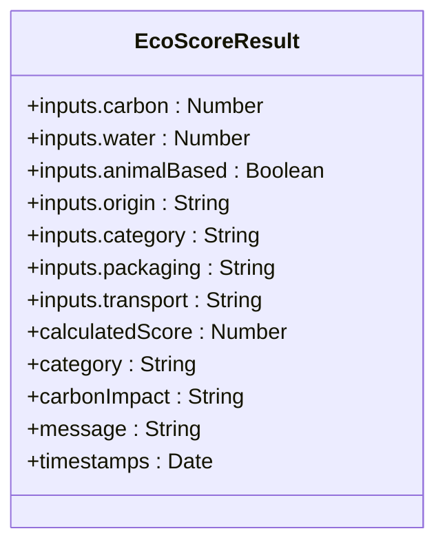
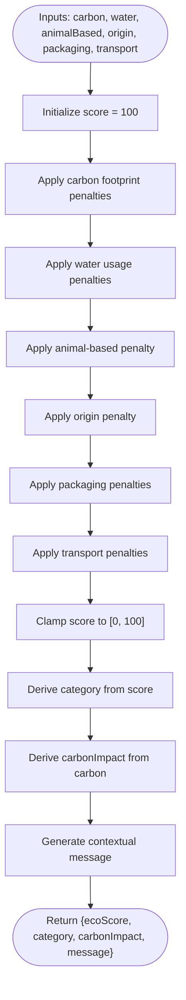
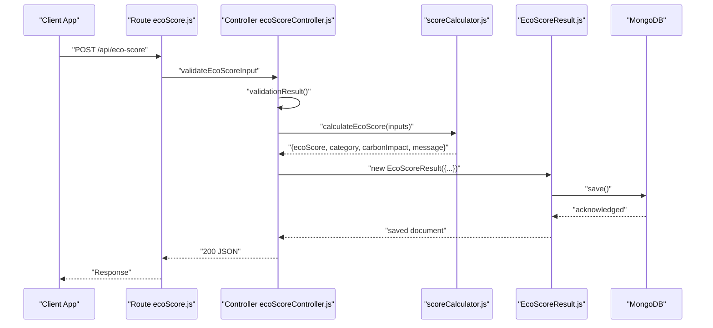
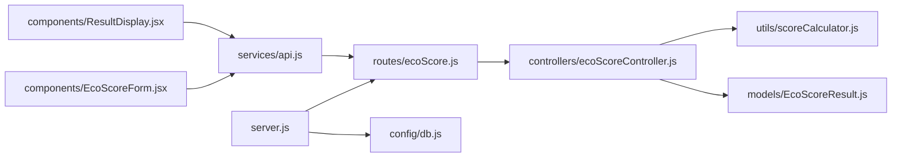

# Data Models and Database

<cite>
**Referenced Files in This Document**
- [EcoScoreResult.js](file://server/models/EcoScoreResult.js)
- [scoreCalculator.js](file://server/utils/scoreCalculator.js)
- [db.js](file://server/config/db.js)
- [ecoScoreController.js](file://server/controllers/ecoScoreController.js)
- [ecoScore.js](file://server/routes/ecoScore.js)
- [server.js](file://server/server.js)
- [.env.example](file://server/.env.example)
- [api.js](file://client/src/services/api.js)
- [EcoScoreForm.jsx](file://client/src/components/EcoScoreForm.jsx)
- [ResultDisplay.jsx](file://client/src/components/ResultDisplay.jsx)
</cite>

## Table of Contents
1. [Introduction](#introduction)
2. [Project Structure](#project-structure)
3. [Core Components](#core-components)
4. [Architecture Overview](#architecture-overview)
5. [Detailed Component Analysis](#detailed-component-analysis)
6. [Dependency Analysis](#dependency-analysis)
7. [Performance Considerations](#performance-considerations)
8. [Troubleshooting Guide](#troubleshooting-guide)
9. [Conclusion](#conclusion)
10. [Appendices](#appendices)

## Introduction
This document provides comprehensive data model documentation for the MongoDB schema design used by the Eco Score Predictor application. It details the EcoScoreResult model structure, validation rules, and constraints enforced by Mongoose and Express validators. It also explains the scoring algorithm implemented in scoreCalculator.js, including penalty calculations, category assignments, and carbon impact assessments. The document covers database connection configuration, environment-based setup, and data persistence strategies. Sample data structures, query patterns, and indexing considerations are included, along with validation rules, business logic constraints, data integrity measures, data lifecycle, retention policies, and future schema evolution plans.

## Project Structure
The backend is organized into modular components:
- Models define the MongoDB schema for EcoScoreResult.
- Controllers handle request validation, orchestrate scoring, and persist results.
- Routes expose the API endpoint for eco score calculation.
- Config manages database connection using environment variables.
- Utils encapsulate the scoring algorithm.
- Server initializes the Express app, loads environment variables, connects to the database, registers routes, and applies middleware.

**Diagram sources**
- [server.js](file://server/server.js#L1-L34)
- [ecoScore.js](file://server/routes/ecoScore.js#L1-L9)
- [ecoScoreController.js](file://server/controllers/ecoScoreController.js#L1-L73)
- [scoreCalculator.js](file://server/utils/scoreCalculator.js#L1-L113)
- [EcoScoreResult.js](file://server/models/EcoScoreResult.js#L1-L20)
- [db.js](file://server/config/db.js#L1-L18)
- [api.js](file://client/src/services/api.js#L1-L13)
- [EcoScoreForm.jsx](file://client/src/components/EcoScoreForm.jsx#L1-L225)
- [ResultDisplay.jsx](file://client/src/components/ResultDisplay.jsx#L1-L82)

**Section sources**
- [server.js](file://server/server.js#L1-L34)
- [ecoScore.js](file://server/routes/ecoScore.js#L1-L9)
- [ecoScoreController.js](file://server/controllers/ecoScoreController.js#L1-L73)
- [scoreCalculator.js](file://server/utils/scoreCalculator.js#L1-L113)
- [EcoScoreResult.js](file://server/models/EcoScoreResult.js#L1-L20)
- [db.js](file://server/config/db.js#L1-L18)
- [api.js](file://client/src/services/api.js#L1-L13)
- [EcoScoreForm.jsx](file://client/src/components/EcoScoreForm.jsx#L1-L225)
- [ResultDisplay.jsx](file://client/src/components/ResultDisplay.jsx#L1-L82)

## Core Components
This section documents the data model and scoring logic that form the core of the application’s data layer.

- EcoScoreResult Model
  - Purpose: Persist product inputs, calculated score, category, carbon impact assessment, and explanatory message.
  - Schema fields and constraints:
    - inputs.carbon: Number, required, validated to be non-negative.
    - inputs.water: Number, required, validated to be non-negative.
    - inputs.animalBased: Boolean, required.
    - inputs.origin: Enum ['local', 'imported'], required.
    - inputs.category: Enum ['food', 'beverage', 'personal care', 'accessories'], required.
    - inputs.packaging: Enum ['plastic', 'paper', 'glass', 'cardboard', 'compostable', 'none'], required.
    - inputs.transport: Enum ['air', 'ship', 'truck'], required.
    - calculatedScore: Number, required, clamped between 0 and 100.
    - category: String, required, derived from score thresholds.
    - carbonImpact: String, required, derived from carbon footprint thresholds.
    - message: String, required, contextual feedback based on score.
    - timestamps: Automatic createdAt and updatedAt fields enabled via Mongoose options.
  - Validation rules:
    - Mongoose schema enforces presence and types for all fields.
    - Express validators enforce numeric ranges and enumerated values at the API boundary.
  - Data integrity measures:
    - Strict enums prevent invalid values.
    - Numeric validation prevents negative values.
    - Clamping ensures calculatedScore remains within [0, 100].
  - Persistence strategy:
    - New documents are inserted upon successful calculation and validation.

- Scoring Algorithm (scoreCalculator.js)
  - Inputs: carbon footprint (kg CO₂), water usage (liters), animal-based flag, origin, packaging material, and transport mode.
  - Penalty logic:
    - Carbon footprint: higher footprint reduces score.
    - Water usage: high water usage reduces score.
    - Animal-based products: reduce score.
    - Origin: imported origin reduces score.
    - Packaging: plastic has the highest penalty; paper/cardboard moderate; glass slight; compostable none; none slightly increases score.
    - Transport: air has the highest penalty; ship moderate; truck least.
  - Output:
    - ecoScore: integer in [0, 100], clamped after applying penalties.
    - category: derived from score thresholds (Excellent, Good, Fair, Needs Improvement).
    - carbonImpact: derived from carbon footprint thresholds (Low, Medium, High).
    - message: contextual feedback based on score band.

- Database Connection and Environment Setup
  - Environment variables:
    - MONGODB_URI: MongoDB connection string.
    - PORT: Server port.
    - NODE_ENV: Environment mode.
  - Connection behavior:
    - The application attempts to connect to MongoDB using Mongoose with unified topology and URL parser options.
    - On failure, logs the error and exits the process.
  - Data persistence:
    - After validation and scoring, a new EcoScoreResult document is saved to the collection.

- API Workflow and Data Flow
  - Client sends product inputs to POST /api/eco-score.
  - Server validates inputs using express-validator.
  - Server calculates the eco score using scoreCalculator.js.
  - Server persists the result to MongoDB via Mongoose.
  - Server responds with the computed score, category, carbon impact, and message.

**Section sources**
- [EcoScoreResult.js](file://server/models/EcoScoreResult.js#L3-L17)
- [scoreCalculator.js](file://server/utils/scoreCalculator.js#L6-L110)
- [db.js](file://server/config/db.js#L3-L15)
- [.env.example](file://server/.env.example#L1-L4)
- [ecoScoreController.js](file://server/controllers/ecoScoreController.js#L6-L14)
- [ecoScoreController.js](file://server/controllers/ecoScoreController.js#L17-L67)
- [ecoScore.js](file://server/routes/ecoScore.js#L5-L6)
- [api.js](file://client/src/services/api.js#L5-L12)
- [EcoScoreForm.jsx](file://client/src/components/EcoScoreForm.jsx#L32-L47)

## Architecture Overview
The system follows a layered architecture:
- Presentation Layer (Client): React components collect inputs and display results.
- Application Layer (Server): Express routes, controllers, and middleware handle requests.
- Domain Layer (Utils): Scoring logic encapsulated in a pure function.
- Persistence Layer (MongoDB): Mongoose model defines schema and persists results.

**Diagram sources**
- [ecoScore.js](file://server/routes/ecoScore.js#L5-L6)
- [ecoScoreController.js](file://server/controllers/ecoScoreController.js#L17-L67)
- [scoreCalculator.js](file://server/utils/scoreCalculator.js#L6-L110)
- [EcoScoreResult.js](file://server/models/EcoScoreResult.js#L3-L17)
- [api.js](file://client/src/services/api.js#L5-L12)

## Detailed Component Analysis

### EcoScoreResult Model
The model defines the shape of persisted documents and enforces field-level constraints.

- Field-level constraints:
  - Numeric fields (carbon, water) are validated to be non-negative at the API boundary and enforced by Mongoose schema.
  - Enumerated fields restrict values to predefined sets.
  - Boolean flag animalBased is validated to be a boolean.
  - Timestamps are automatically managed by Mongoose.

- Business logic constraints:
  - calculatedScore is derived from inputs and clamped to [0, 100].
  - category and carbonImpact are derived from score and carbon thresholds respectively.

- Data integrity measures:
  - Mongoose schema validation prevents insertion of documents with missing or invalid fields.
  - Express validator rejects malformed requests before reaching the model.

**Diagram sources**
- [EcoScoreResult.js](file://server/models/EcoScoreResult.js#L3-L17)
- [ecoScoreController.js](file://server/controllers/ecoScoreController.js#L6-L14)

**Section sources**
- [EcoScoreResult.js](file://server/models/EcoScoreResult.js#L3-L17)
- [ecoScoreController.js](file://server/controllers/ecoScoreController.js#L6-L14)

### Scoring Algorithm Implementation
The scoring algorithm applies a series of penalties based on product characteristics and derives categorical outcomes.

- Penalty rules:
  - Carbon footprint: higher footprint reduces score.
  - Water usage: high usage reduces score.
  - Animal-based products: reduce score.
  - Origin: imported origin reduces score.
  - Packaging: penalties vary by material type.
  - Transport: penalties vary by mode.

- Derived outputs:
  - category: Excellent (>= 80), Good (>= 60), Fair (>= 40), Needs Improvement (< 40).
  - carbonImpact: Low (< 2), Medium (<= 5), High (> 5).
  - message: contextual feedback aligned with score bands.

**Diagram sources**
- [scoreCalculator.js](file://server/utils/scoreCalculator.js#L6-L110)

**Section sources**
- [scoreCalculator.js](file://server/utils/scoreCalculator.js#L6-L110)

### Database Connection and Environment Configuration
- Environment variables:
  - MONGODB_URI: MongoDB connection string.
  - PORT: Server port.
  - NODE_ENV: Environment mode.
- Connection behavior:
  - The application connects to MongoDB using Mongoose with unified topology and URL parser options.
  - On connection failure, the process exits after logging the error.

- Data persistence:
  - After successful validation and scoring, a new EcoScoreResult document is created and saved.

**Section sources**
- [db.js](file://server/config/db.js#L3-L15)
- [.env.example](file://server/.env.example#L1-L4)
- [server.js](file://server/server.js#L10-L11)
- [ecoScoreController.js](file://server/controllers/ecoScoreController.js#L44-L53)

### API Workflow and Data Flow
- Endpoint: POST /api/eco-score
- Request validation:
  - Uses express-validator to ensure numeric inputs, booleans, and enumerated values.
- Calculation:
  - Delegates to scoreCalculator.js to compute ecoScore, category, carbonImpact, and message.
- Persistence:
  - Creates and saves an EcoScoreResult document.
- Response:
  - Returns success flag and computed fields.

**Diagram sources**
- [ecoScore.js](file://server/routes/ecoScore.js#L5-L6)
- [ecoScoreController.js](file://server/controllers/ecoScoreController.js#L17-L67)
- [scoreCalculator.js](file://server/utils/scoreCalculator.js#L6-L110)
- [EcoScoreResult.js](file://server/models/EcoScoreResult.js#L3-L17)
- [api.js](file://client/src/services/api.js#L5-L12)

**Section sources**
- [ecoScore.js](file://server/routes/ecoScore.js#L5-L6)
- [ecoScoreController.js](file://server/controllers/ecoScoreController.js#L17-L67)
- [scoreCalculator.js](file://server/utils/scoreCalculator.js#L6-L110)
- [EcoScoreResult.js](file://server/models/EcoScoreResult.js#L3-L17)
- [api.js](file://client/src/services/api.js#L5-L12)

## Dependency Analysis
The following diagram shows module-level dependencies among core components.

- Coupling:
  - Controller depends on calculator and model.
  - Route depends on controller.
  - Server depends on route and database config.
  - Client depends on API service.

- Cohesion:
  - Scoring logic is cohesive within scoreCalculator.js.
  - Persistence logic is cohesive within EcoScoreResult.js.
  - Validation logic is cohesive within controller.

- External dependencies:
  - Mongoose for MongoDB ODM.
  - Express for HTTP routing and middleware.
  - express-validator for input validation.
  - dotenv for environment variables.

**Diagram sources**
- [ecoScore.js](file://server/routes/ecoScore.js#L1-L9)
- [ecoScoreController.js](file://server/controllers/ecoScoreController.js#L1-L73)
- [scoreCalculator.js](file://server/utils/scoreCalculator.js#L1-L113)
- [EcoScoreResult.js](file://server/models/EcoScoreResult.js#L1-L20)
- [db.js](file://server/config/db.js#L1-L18)
- [server.js](file://server/server.js#L1-L34)
- [api.js](file://client/src/services/api.js#L1-L13)
- [EcoScoreForm.jsx](file://client/src/components/EcoScoreForm.jsx#L1-L225)
- [ResultDisplay.jsx](file://client/src/components/ResultDisplay.jsx#L1-L82)

**Section sources**
- [ecoScore.js](file://server/routes/ecoScore.js#L1-L9)
- [ecoScoreController.js](file://server/controllers/ecoScoreController.js#L1-L73)
- [scoreCalculator.js](file://server/utils/scoreCalculator.js#L1-L113)
- [EcoScoreResult.js](file://server/models/EcoScoreResult.js#L1-L20)
- [db.js](file://server/config/db.js#L1-L18)
- [server.js](file://server/server.js#L1-L34)
- [api.js](file://client/src/services/api.js#L1-L13)
- [EcoScoreForm.jsx](file://client/src/components/EcoScoreForm.jsx#L1-L225)
- [ResultDisplay.jsx](file://client/src/components/ResultDisplay.jsx#L1-L82)

## Performance Considerations
- Indexing considerations:
  - Add compound indexes on frequently queried fields (e.g., inputs.origin, inputs.category, calculatedScore) to optimize filtering and sorting.
  - Consider adding an index on timestamps for time-based analytics and cleanup jobs.
- Query patterns:
  - Typical queries include filtering by category and origin, sorting by score, and paginating results.
  - Aggregation pipelines can be used to compute statistics (e.g., average score by category).
- Data lifecycle:
  - Implement TTL collections for temporary or transient results if applicable.
  - Use capped collections for audit trails if needed.
- Retention policies:
  - Define retention windows (e.g., keep results for 1 year) and schedule periodic cleanup jobs.
- Scalability:
  - Sharding by date or category can distribute load.
  - Use read replicas for reporting queries.

[No sources needed since this section provides general guidance]

## Troubleshooting Guide
- Common validation errors:
  - Non-numeric carbon or water values.
  - Invalid enum values for origin, category, packaging, or transport.
  - Non-boolean animalBased.
  - Resolution: Ensure client-side numeric conversion and radio/select choices match allowed values.
- Database connectivity:
  - Verify MONGODB_URI and network access.
  - Confirm MongoDB instance availability and credentials.
- Response handling:
  - Client should handle network errors and display user-friendly messages.
  - Ensure VITE_API_URL is configured correctly for the frontend.

**Section sources**
- [ecoScoreController.js](file://server/controllers/ecoScoreController.js#L6-L14)
- [EcoScoreForm.jsx](file://client/src/components/EcoScoreForm.jsx#L32-L47)
- [api.js](file://client/src/services/api.js#L5-L12)
- [db.js](file://server/config/db.js#L3-L15)

## Conclusion
The Eco Score Predictor employs a clean separation of concerns with a robust data model and deterministic scoring algorithm. The Mongoose schema enforces strict validation, while express-validator ensures API-level integrity. The scoring algorithm is transparent and configurable, enabling easy adjustments to penalty weights and thresholds. The environment-driven configuration and centralized connection logic simplify deployment across environments. Future enhancements can focus on indexing strategies, aggregation analytics, and retention policies to support scalable operations.

[No sources needed since this section summarizes without analyzing specific files]

## Appendices

### Data Model Reference
- EcoScoreResult fields:
  - inputs.carbon: Number, required, non-negative.
  - inputs.water: Number, required, non-negative.
  - inputs.animalBased: Boolean, required.
  - inputs.origin: Enum ['local', 'imported'], required.
  - inputs.category: Enum ['food', 'beverage', 'personal care', 'accessories'], required.
  - inputs.packaging: Enum ['plastic', 'paper', 'glass', 'cardboard', 'compostable', 'none'], required.
  - inputs.transport: Enum ['air', 'ship', 'truck'], required.
  - calculatedScore: Number, required, clamped to [0, 100].
  - category: String, required, derived from score thresholds.
  - carbonImpact: String, required, derived from carbon thresholds.
  - message: String, required, contextual feedback.
  - timestamps: createdAt, updatedAt.

**Section sources**
- [EcoScoreResult.js](file://server/models/EcoScoreResult.js#L3-L17)

### Sample Data Structures
- Input payload (sent by client):
  - carbon: number (non-negative)
  - water: number (non-negative)
  - animalBased: boolean
  - origin: 'local' | 'imported'
  - category: 'food' | 'beverage' | 'personal care' | 'accessories'
  - packaging: 'plastic' | 'paper' | 'glass' | 'cardboard' | 'compostable' | 'none'
  - transport: 'air' | 'ship' | 'truck'

- Response payload (returned by server):
  - ecoScore: number in [0, 100]
  - category: 'Excellent' | 'Good' | 'Fair' | 'Needs Improvement'
  - carbonImpact: 'Low' | 'Medium' | 'High'
  - message: string

**Section sources**
- [EcoScoreForm.jsx](file://client/src/components/EcoScoreForm.jsx#L5-L13)
- [api.js](file://client/src/services/api.js#L5-L12)
- [scoreCalculator.js](file://server/utils/scoreCalculator.js#L104-L109)

### Query Patterns and Indexing
- Query patterns:
  - Filter by category and origin: { 'inputs.category': 'food', 'inputs.origin': 'local' }
  - Sort by score descending: { calculatedScore: -1 }
  - Paginate results: limit and skip
- Recommended indexes:
  - Compound: { 'inputs.origin': 1, 'inputs.category': 1, 'calculatedScore': -1 }
  - Single: { 'createdAt': 1 } for time-series analytics
  - Text: optional, if textual messages are searched

**Section sources**
- [EcoScoreResult.js](file://server/models/EcoScoreResult.js#L3-L17)

### Data Lifecycle and Retention
- Lifecycle stages:
  - Input capture (client).
  - Validation (server).
  - Scoring (algorithm).
  - Persistence (MongoDB).
  - Retrieval and presentation (client).
- Retention policy suggestions:
  - Keep results for 1 year; archive older entries.
  - Implement scheduled cleanup jobs to remove expired records.
  - Use TTL collections for ephemeral data if applicable.

[No sources needed since this section provides general guidance]

### Future Schema Evolution Plans
- Versioning:
  - Introduce a version field to track schema changes.
- Enrichment:
  - Add optional metadata (e.g., product name, brand, UPC).
  - Include confidence intervals or uncertainty metrics.
- Analytics:
  - Add denormalized aggregations for dashboard queries.
- Compliance:
  - Add audit trail fields for regulatory reporting.
- Migration:
  - Provide migration scripts for backward-compatible schema updates.

[No sources needed since this section provides general guidance]