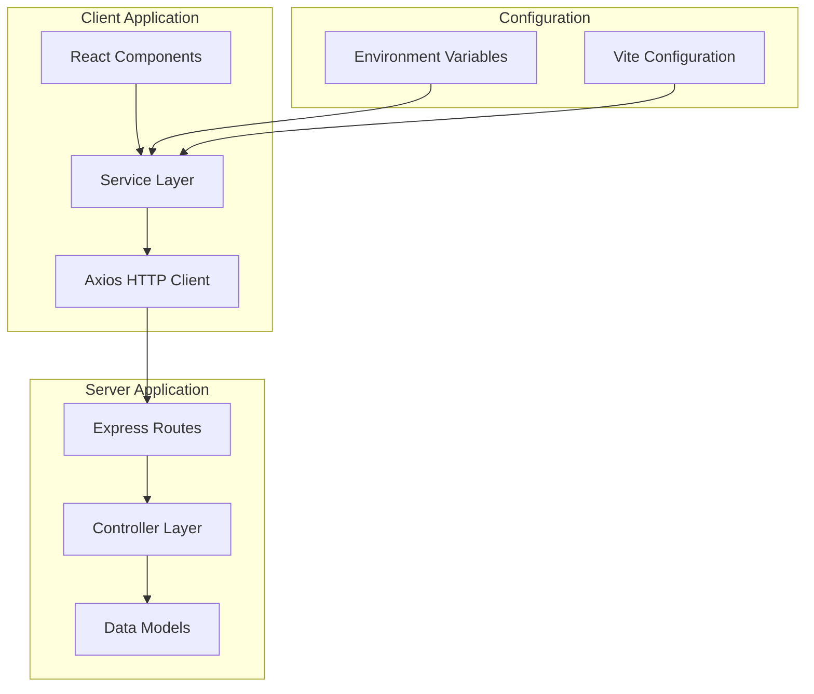
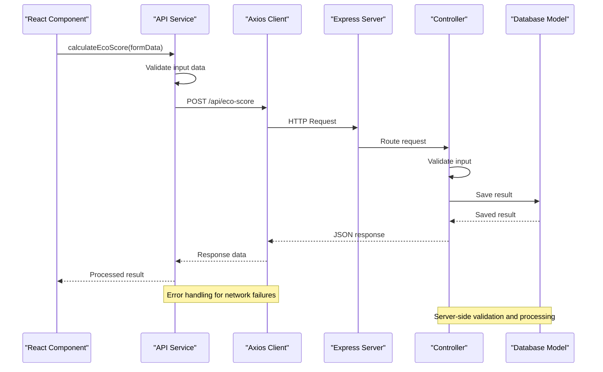
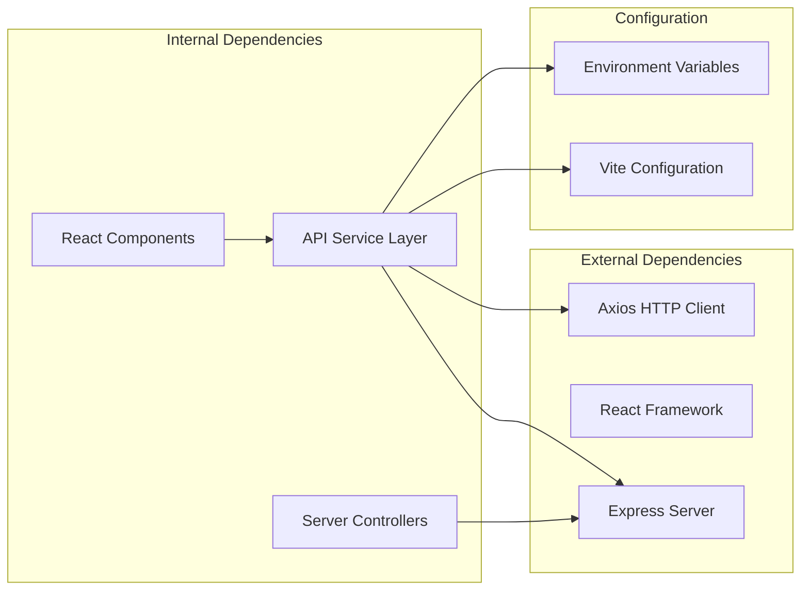

# API Integration Layer

<cite>
**Referenced Files in This Document**
- [api.js](file://client/src/services/api.js)
- [package.json](file://client/package.json)
- [.env.example](file://client/.env.example)
- [vite.config.js](file://client/vite.config.js)
- [EcoScoreForm.jsx](file://client/src/components/EcoScoreForm.jsx)
- [ResultDisplay.jsx](file://client/src/components/ResultDisplay.jsx)
- [App.jsx](file://client/src/App.jsx)
- [ecoScore.js](file://server/routes/ecoScore.js)
- [ecoScoreController.js](file://server/controllers/ecoScoreController.js)
- [errorHandler.js](file://server/middleware/errorHandler.js)
</cite>

## Table of Contents
1. [Introduction](#introduction)
2. [Project Structure](#project-structure)
3. [Core Components](#core-components)
4. [Architecture Overview](#architecture-overview)
5. [Detailed Component Analysis](#detailed-component-analysis)
6. [Dependency Analysis](#dependency-analysis)
7. [Performance Considerations](#performance-considerations)
8. [Troubleshooting Guide](#troubleshooting-guide)
9. [Conclusion](#conclusion)

## Introduction
This document provides comprehensive documentation for the frontend API integration layer implemented in the client application. The API integration layer serves as the primary communication bridge between the React frontend and the Node.js backend server. It handles HTTP requests, manages error states, and provides a clean interface for UI components to interact with backend services.

The integration layer is built around Axios HTTP client and follows modern React patterns for asynchronous data fetching. It includes environment-based configuration, centralized error handling, and structured request/response processing that ensures robust communication between frontend and backend systems.

## Project Structure
The API integration layer is organized within the client application's service architecture, following a modular approach that separates concerns between UI components, service layer, and HTTP communication.

**Diagram sources**
- [api.js](file://client/src/services/api.js#L1-L13)
- [package.json](file://client/package.json#L1-L32)
- [.env.example](file://client/.env.example#L1-L2)

**Section sources**
- [api.js](file://client/src/services/api.js#L1-L13)
- [package.json](file://client/package.json#L1-L32)
- [.env.example](file://client/.env.example#L1-L2)

## Core Components
The API integration layer consists of several key components that work together to provide seamless communication between the frontend and backend systems.

### HTTP Client Configuration
The integration layer uses Axios as the primary HTTP client, configured with environment-based base URLs and centralized error handling. The client is initialized with a dynamic base URL that adapts to different deployment environments.

### Request/Response Handling Patterns
The service layer implements standardized patterns for handling HTTP requests and responses. All API calls follow a consistent structure that includes input validation, request processing, and error management.

### Error Management Strategies
Comprehensive error handling is implemented at multiple levels, from network connectivity issues to server-side validation errors. The system provides meaningful error messages while maintaining security by not exposing sensitive internal details.

**Section sources**
- [api.js](file://client/src/services/api.js#L1-L13)
- [package.json](file://client/package.json#L12-L16)

## Architecture Overview
The API integration layer follows a layered architecture pattern that separates concerns between presentation, service, and data access layers.

**Diagram sources**
- [api.js](file://client/src/services/api.js#L5-L12)
- [ecoScore.js](file://server/routes/ecoScore.js#L5-L6)
- [ecoScoreController.js](file://server/controllers/ecoScoreController.js#L17-L66)

## Detailed Component Analysis

### API Service Implementation
The core API service is implemented in a single module that provides a clean interface for making HTTP requests to the backend server.

#### Base URL Configuration
The service dynamically determines the API base URL using Vite's environment variable system, allowing for easy configuration across different deployment environments.

#### Request Method Implementation
The service exposes a single method for calculating eco scores, which handles the complete request lifecycle from data preparation to response processing.

#### Error Handling Mechanism
The service implements comprehensive error handling that preserves server-provided error messages while providing fallbacks for network-related failures.

**Section sources**
- [api.js](file://client/src/services/api.js#L1-L13)

### Environment Configuration
The application uses Vite's environment variable system to configure API endpoints for different deployment scenarios.

#### Environment Variable Setup
The `.env.example` file demonstrates the expected environment variable configuration for the API base URL.

#### Build-Time Configuration
Vite processes environment variables during the build process, making them available at runtime through the `import.meta.env` interface.

**Section sources**
- [.env.example](file://client/.env.example#L1-L2)
- [api.js](file://client/src/services/api.js#L3-L3)

### Frontend Integration Pattern
The API service integrates seamlessly with React components through a straightforward interface that handles loading states, error display, and result processing.

#### Form Submission Flow
Components that need to communicate with the backend follow a consistent pattern for handling user input, making API calls, and displaying results.

#### Loading State Management
The integration pattern includes proper loading state management to provide user feedback during API operations.

#### Error State Handling
Components receive structured error objects that can be displayed to users in a meaningful way.

**Section sources**
- [EcoScoreForm.jsx](file://client/src/components/EcoScoreForm.jsx#L26-L47)
- [ResultDisplay.jsx](file://client/src/components/ResultDisplay.jsx#L1-L82)

### Backend API Endpoint
The server-side implementation provides a RESTful endpoint that handles eco score calculations and validation.

#### Route Definition
The Express route defines the endpoint structure and associates it with the appropriate controller method.

#### Input Validation
The server implements comprehensive input validation using express-validator to ensure data integrity before processing.

#### Response Structure
The server returns standardized JSON responses that include calculation results and metadata about the processed data.

**Section sources**
- [ecoScore.js](file://server/routes/ecoScore.js#L5-L6)
- [ecoScoreController.js](file://server/controllers/ecoScoreController.js#L17-L66)

## Dependency Analysis
The API integration layer has minimal external dependencies focused on HTTP communication and environment configuration.

**Diagram sources**
- [package.json](file://client/package.json#L12-L16)
- [api.js](file://client/src/services/api.js#L1-L1)
- [ecoScoreController.js](file://server/controllers/ecoScoreController.js#L1-L4)

### Dependency Relationships
The integration layer maintains loose coupling between frontend and backend components through well-defined HTTP interfaces. This separation allows for independent development and deployment of frontend and backend systems.

### Circular Dependency Prevention
The architecture avoids circular dependencies by maintaining clear boundaries between client-side service logic and server-side business logic.

**Section sources**
- [package.json](file://client/package.json#L12-L16)

## Performance Considerations
The current implementation prioritizes simplicity and maintainability over advanced performance optimizations. However, several considerations should be noted for potential improvements.

### Network Efficiency
The single-purpose API endpoint reduces network overhead and simplifies caching strategies. Future enhancements could include request batching for multiple calculations.

### Memory Management
The current implementation creates new request objects for each API call, which is memory-efficient for typical usage patterns. No significant memory leaks are present in the current code.

### Caching Opportunities
There are opportunities to implement client-side caching for frequently accessed data or repeated calculations, though this would require additional complexity in the service layer.

## Troubleshooting Guide

### Common Issues and Solutions

#### Network Connectivity Problems
- **Symptom**: API calls fail with network error messages
- **Cause**: Server unavailable or network connectivity issues
- **Solution**: Verify server status, check firewall settings, and ensure proper CORS configuration

#### Environment Configuration Errors
- **Symptom**: API calls target incorrect endpoints
- **Cause**: Missing or incorrect VITE_API_URL environment variable
- **Solution**: Verify environment variable is set in `.env` file and properly loaded by Vite

#### Input Validation Failures
- **Symptom**: Server returns validation error responses
- **Cause**: Invalid input data types or values
- **Solution**: Ensure form data matches expected types and ranges before submission

#### Authentication Issues
- **Note**: The current implementation does not include authentication mechanisms
- **Consideration**: Future enhancements may require JWT tokens or session-based authentication

**Section sources**
- [api.js](file://client/src/services/api.js#L9-L11)
- [ecoScoreController.js](file://server/controllers/ecoScoreController.js#L20-L26)

### Debugging Strategies
For debugging API integration issues, developers should:

1. Check browser developer tools network tab for failed requests
2. Verify environment variable loading in the browser console
3. Test server endpoints independently using curl or Postman
4. Monitor server logs for error messages and stack traces

## Conclusion
The API integration layer provides a clean, maintainable foundation for frontend-backend communication in the Eco Score Predictor application. The implementation follows modern React patterns and leverages Axios for reliable HTTP communication. While currently focused on simplicity and functionality, the architecture provides clear pathways for future enhancements such as authentication, caching, and advanced error handling.

The modular design ensures that the service layer remains decoupled from UI components, facilitating testing and maintenance. The environment-based configuration system supports flexible deployment across different environments without code changes.

Key strengths of the current implementation include:
- Clean separation of concerns between UI and service layers
- Comprehensive error handling with meaningful user feedback
- Environment-driven configuration for flexible deployments
- Standardized request/response patterns for predictable behavior

Future enhancements could include request/response interceptors, retry logic, authentication support, and advanced caching strategies to improve performance and user experience.