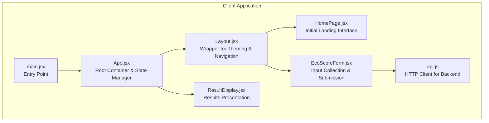
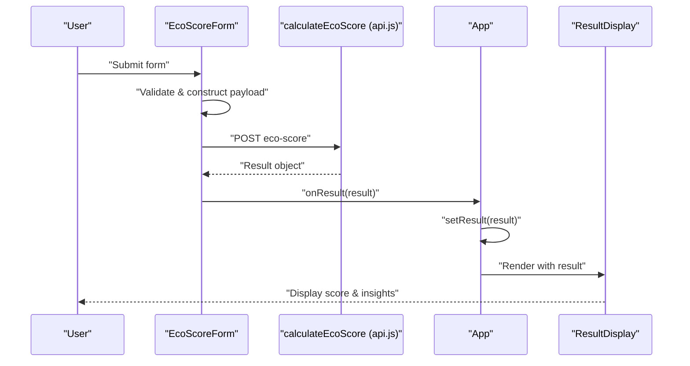
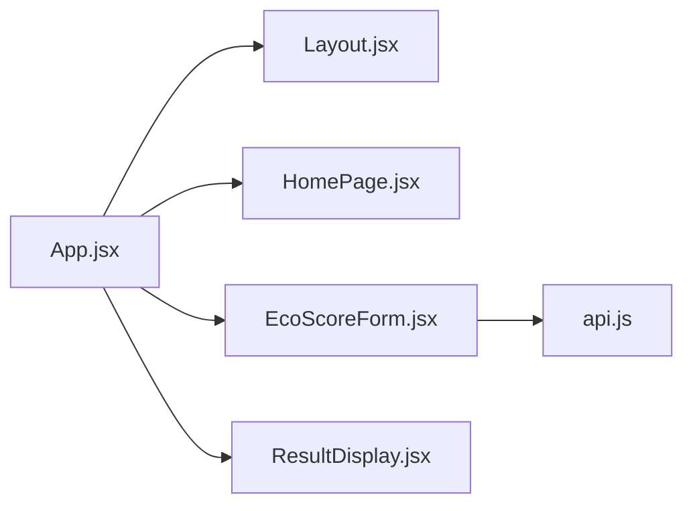

# Component Hierarchy

<cite>
**Referenced Files in This Document**
- [App.jsx](file://client/src/App.jsx)
- [main.jsx](file://client/src/main.jsx)
- [Layout.jsx](file://client/src/components/Layout.jsx)
- [HomePage.jsx](file://client/src/components/HomePage.jsx)
- [EcoScoreForm.jsx](file://client/src/components/EcoScoreForm.jsx)
- [ResultDisplay.jsx](file://client/src/components/ResultDisplay.jsx)
- [api.js](file://client/src/services/api.js)
- [package.json](file://client/package.json)
- [index.css](file://client/src/index.css)
- [tailwind.config.js](file://client/tailwind.config.js)
</cite>

## Table of Contents
1. [Introduction](#introduction)
2. [Project Structure](#project-structure)
3. [Core Components](#core-components)
4. [Architecture Overview](#architecture-overview)
5. [Detailed Component Analysis](#detailed-component-analysis)
6. [Dependency Analysis](#dependency-analysis)
7. [Performance Considerations](#performance-considerations)
8. [Troubleshooting Guide](#troubleshooting-guide)
9. [Conclusion](#conclusion)

## Introduction
This document explains the React component hierarchy for the Eco Score Predictor application. It focuses on how the main App component acts as the root container and state manager, orchestrating Layout, HomePage, EcoScoreForm, and ResultDisplay components. The documentation covers component tree flow, prop passing patterns, state management through the component chain, lifecycle management, rendering order, parent-child relationships, and composition patterns that support the application's user flow.

## Project Structure
The client-side React application is organized around a small set of components and a minimal service layer. The entry point initializes the app and mounts the root component. Styling is handled via Tailwind CSS with a custom theme configuration.

**Diagram sources**
- [main.jsx](file://client/src/main.jsx#L1-L11)
- [App.jsx](file://client/src/App.jsx#L1-L37)
- [Layout.jsx](file://client/src/components/Layout.jsx#L1-L12)
- [HomePage.jsx](file://client/src/components/HomePage.jsx#L1-L19)
- [EcoScoreForm.jsx](file://client/src/components/EcoScoreForm.jsx#L1-L225)
- [ResultDisplay.jsx](file://client/src/components/ResultDisplay.jsx#L1-L82)
- [api.js](file://client/src/services/api.js#L1-L13)

**Section sources**
- [main.jsx](file://client/src/main.jsx#L1-L11)
- [package.json](file://client/package.json#L1-L32)
- [index.css](file://client/src/index.css#L1-L11)
- [tailwind.config.js](file://client/tailwind.config.js#L1-L28)

## Core Components
- App.jsx: Root container and state manager. Holds the shared result state and passes callbacks down to child components. Orchestrates navigation-like transitions by scrolling to results after calculation.
- Layout.jsx: Presentational wrapper that applies consistent theming and spacing across pages.
- HomePage.jsx: Initial landing interface that introduces the application’s purpose.
- EcoScoreForm.jsx: Form component that collects product attributes, manages local form state, and triggers asynchronous calculations via the API service.
- ResultDisplay.jsx: Renders the calculated eco score and related metrics, conditionally rendering only when data is available.

Key responsibilities:
- App manages state and coordinates data flow between form submission and result display.
- Layout provides a consistent visual foundation.
- HomePage sets expectations for the user.
- EcoScoreForm handles user input and delegates calculation to the backend.
- ResultDisplay presents outcomes with dynamic styling based on score thresholds.

**Section sources**
- [App.jsx](file://client/src/App.jsx#L1-L37)
- [Layout.jsx](file://client/src/components/Layout.jsx#L1-L12)
- [HomePage.jsx](file://client/src/components/HomePage.jsx#L1-L19)
- [EcoScoreForm.jsx](file://client/src/components/EcoScoreForm.jsx#L1-L225)
- [ResultDisplay.jsx](file://client/src/components/ResultDisplay.jsx#L1-L82)

## Architecture Overview
The component hierarchy follows a unidirectional data flow:
- App holds the result state and exposes an onResult callback to EcoScoreForm.
- EcoScoreForm performs validation, constructs a payload, and calls calculateEcoScore from the API service.
- On successful calculation, the API service returns a result object that App stores and passes down to ResultDisplay.
- Layout wraps HomePage and the form/results area to provide consistent theming and spacing.

**Diagram sources**
- [EcoScoreForm.jsx](file://client/src/components/EcoScoreForm.jsx#L26-L47)
- [api.js](file://client/src/services/api.js#L5-L12)
- [App.jsx](file://client/src/App.jsx#L10-L19)
- [ResultDisplay.jsx](file://client/src/components/ResultDisplay.jsx#L1-L82)

## Detailed Component Analysis

### App Component
- Role: Root container and state manager. Maintains result state and provides smooth scrolling to results upon calculation completion.
- State management: Uses useState to store the latest result. The handleResult callback updates state and triggers a scroll to the results section.
- Composition: Wraps children in Layout, placing HomePage above the form and results below the form.
- Lifecycle: Stateless functional component; renders on mount and re-renders when result state changes.

Prop and event patterns:
- Receives onResult from EcoScoreForm via props.
- Passes result prop to ResultDisplay.

Rendering order:
1. HomePage
2. EcoScoreForm
3. ResultDisplay (conditionally rendered when result exists)

**Section sources**
- [App.jsx](file://client/src/App.jsx#L1-L37)

### Layout Component
- Role: Wrapper that provides consistent theming and spacing across pages.
- Implementation: Accepts children and renders them inside a container with gradient background and padding.
- Purpose: Centralizes visual consistency and ensures responsive layout boundaries.

Composition:
- Used by App to wrap HomePage, EcoScoreForm, and ResultDisplay.

**Section sources**
- [Layout.jsx](file://client/src/components/Layout.jsx#L1-L12)

### HomePage Component
- Role: Initial landing interface that communicates the application’s purpose.
- Implementation: Renders a centered hero section with headline and descriptive text.
- Lifecycle: Stateless functional component; renders once on mount.

**Section sources**
- [HomePage.jsx](file://client/src/components/HomePage.jsx#L1-L19)

### EcoScoreForm Component
- Role: Collects product attributes and submits them to the backend for scoring.
- State management: Manages local form state for numeric fields, booleans, and selections. Tracks loading and error states.
- Event handling: Handles input changes and form submission. Converts string values to numbers for numeric fields.
- API integration: Calls calculateEcoScore from the API service and forwards the result to App via onResult.
- Error handling: Catches errors during submission and displays user-friendly messages.

Rendering order:
1. Numeric inputs for carbon footprint and water usage
2. Radio buttons for animal-based product
3. Radio buttons for product origin
4. Grid of category options
5. Select for packaging material
6. Radio buttons for transportation mode
7. Conditional error display
8. Submit button

**Section sources**
- [EcoScoreForm.jsx](file://client/src/components/EcoScoreForm.jsx#L1-L225)

### ResultDisplay Component
- Role: Presents the calculated eco score and related metrics.
- Conditional rendering: Only renders when a result is provided.
- Dynamic styling: Applies color gradients and badges based on score thresholds.
- Information display: Shows score circle, category badge, carbon impact indicator, and explanatory message.

Rendering order:
1. Score circle with gradient background
2. Category badge with color-coded background
3. Carbon impact section with colored text
4. Message box with explanatory text
5. Score breakdown legend

**Section sources**
- [ResultDisplay.jsx](file://client/src/components/ResultDisplay.jsx#L1-L82)

### API Service
- Role: Encapsulates HTTP communication with the backend endpoint.
- Implementation: Exposes calculateEcoScore that posts form data to the configured API URL and returns the response.
- Environment configuration: Reads VITE_API_URL from environment variables.

**Section sources**
- [api.js](file://client/src/services/api.js#L1-L13)

## Dependency Analysis
The component hierarchy exhibits clear parent-child relationships and unidirectional data flow. Dependencies are primarily import-based and driven by props/events.

**Diagram sources**
- [App.jsx](file://client/src/App.jsx#L1-L37)
- [Layout.jsx](file://client/src/components/Layout.jsx#L1-L12)
- [HomePage.jsx](file://client/src/components/HomePage.jsx#L1-L19)
- [EcoScoreForm.jsx](file://client/src/components/EcoScoreForm.jsx#L1-L225)
- [ResultDisplay.jsx](file://client/src/components/ResultDisplay.jsx#L1-L82)
- [api.js](file://client/src/services/api.js#L1-L13)

Additional runtime dependencies:
- Axios for HTTP requests
- React and React DOM for rendering
- Tailwind CSS for styling

**Section sources**
- [package.json](file://client/package.json#L1-L32)

## Performance Considerations
- State updates: App uses a single state variable for results, minimizing unnecessary re-renders. The result is passed down to ResultDisplay, which conditionally renders only when data is present.
- Form state: EcoScoreForm maintains local state for inputs, avoiding unnecessary re-renders of parent components.
- Rendering order: Components render in a predictable order, reducing layout thrashing.
- Styling: Tailwind utility classes are efficient for rapid styling without heavy CSS overhead.

## Troubleshooting Guide
Common issues and resolutions:
- No results displayed: Ensure the form is submitted successfully and the API returns a result object. Verify that App receives the result via onResult and that ResultDisplay is receiving the result prop.
- API errors: Check network connectivity and confirm that VITE_API_URL is set correctly. Review error handling in EcoScoreForm and API service for meaningful error messages.
- Styling inconsistencies: Confirm Tailwind is properly configured and that the build process includes the content paths defined in tailwind.config.js.
- Scroll behavior: If results do not scroll into view, verify the element ID "results" exists and that the scrollIntoView call executes after state update.

**Section sources**
- [EcoScoreForm.jsx](file://client/src/components/EcoScoreForm.jsx#L41-L46)
- [App.jsx](file://client/src/App.jsx#L13-L18)
- [api.js](file://client/src/services/api.js#L3-L12)
- [tailwind.config.js](file://client/tailwind.config.js#L1-L28)

## Conclusion
The component hierarchy centers on App as the root container and state manager, orchestrating Layout, HomePage, EcoScoreForm, and ResultDisplay. The design emphasizes clear separation of concerns, unidirectional data flow, and consistent theming through Layout. EcoScoreForm encapsulates user input and API communication, while ResultDisplay provides immediate feedback. This structure supports a straightforward user flow: learn about the application, submit product details, receive results, and explore insights.