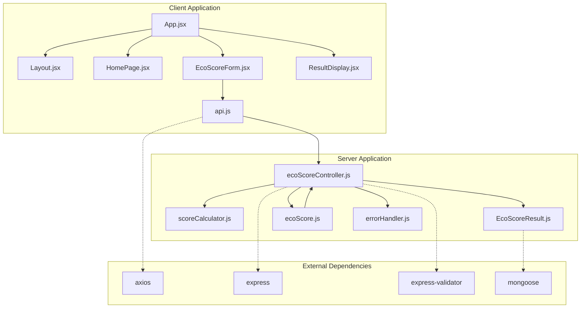
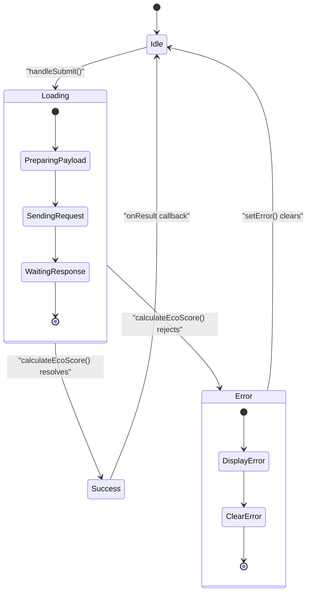
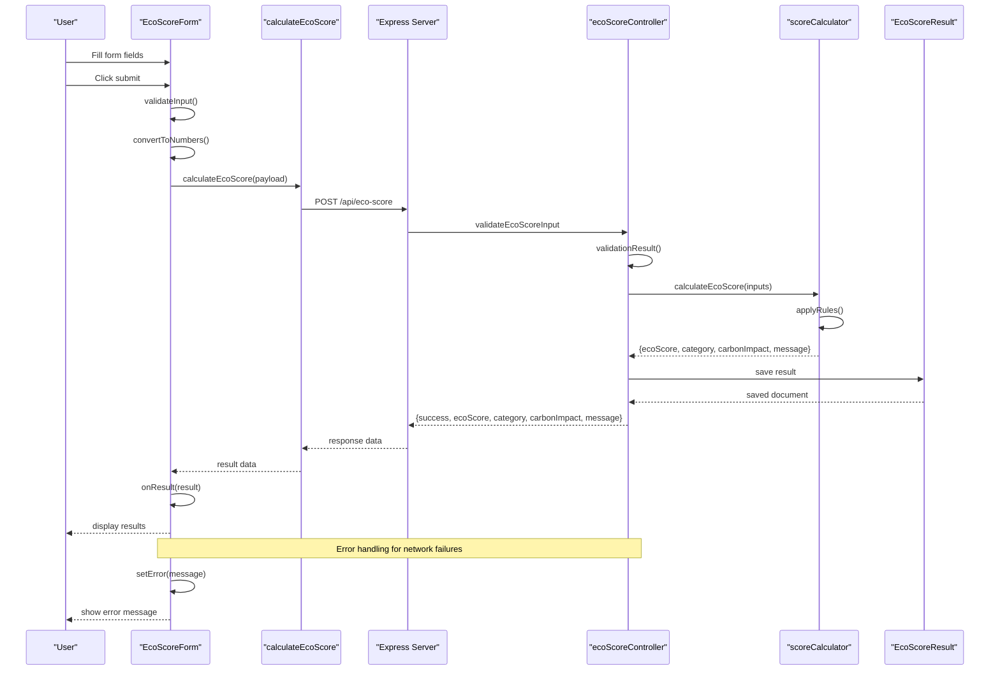
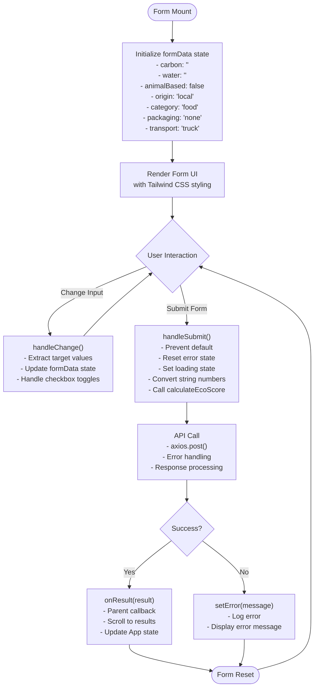
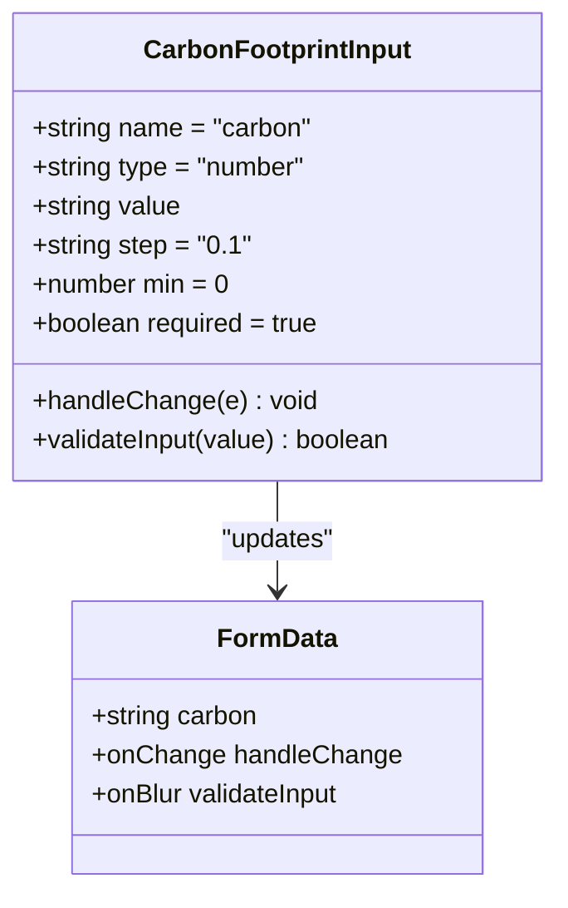
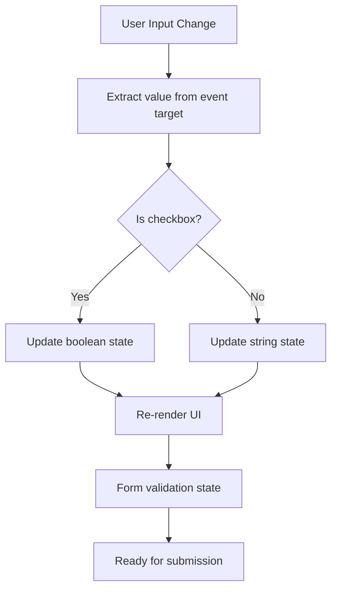

# EcoScoreForm Component

<cite>
**Referenced Files in This Document**
- [EcoScoreForm.jsx](file://client/src/components/EcoScoreForm.jsx)
- [api.js](file://client/src/services/api.js)
- [App.jsx](file://client/src/App.jsx)
- [HomePage.jsx](file://client/src/components/HomePage.jsx)
- [ResultDisplay.jsx](file://client/src/components/ResultDisplay.jsx)
- [Layout.jsx](file://client/src/components/Layout.jsx)
- [ecoScoreController.js](file://server/controllers/ecoScoreController.js)
- [scoreCalculator.js](file://server/utils/scoreCalculator.js)
- [EcoScoreResult.js](file://server/models/EcoScoreResult.js)
- [ecoScore.js](file://server/routes/ecoScore.js)
- [errorHandler.js](file://server/middleware/errorHandler.js)
- [package.json](file://client/package.json)
- [package.json](file://server/package.json)
</cite>

## Table of Contents
1. [Introduction](#introduction)
2. [Project Structure](#project-structure)
3. [Core Components](#core-components)
4. [Architecture Overview](#architecture-overview)
5. [Detailed Component Analysis](#detailed-component-analysis)
6. [Dependency Analysis](#dependency-analysis)
7. [Performance Considerations](#performance-considerations)
8. [Troubleshooting Guide](#troubleshooting-guide)
9. [Conclusion](#conclusion)

## Introduction
The EcoScoreForm component is a React-based form interface designed to collect environmental impact data for products and calculate an eco-friendly score. This component integrates with a backend API to compute scores based on carbon footprint, water usage, animal-based products, product origin, category, packaging materials, and transportation modes. The form provides real-time validation, loading states, and comprehensive error handling while maintaining an accessible and visually appealing user interface.

## Project Structure
The application follows a clear separation of concerns with distinct frontend and backend components:



**Diagram sources**
- [App.jsx](file://client/src/App.jsx#L1-L37)
- [EcoScoreForm.jsx](file://client/src/components/EcoScoreForm.jsx#L1-L225)
- [api.js](file://client/src/services/api.js#L1-L13)
- [ecoScoreController.js](file://server/controllers/ecoScoreController.js#L1-L73)

**Section sources**
- [App.jsx](file://client/src/App.jsx#L1-L37)
- [package.json](file://client/package.json#L1-L32)
- [package.json](file://server/package.json#L1-L23)

## Core Components

### Form State Management
The EcoScoreForm component implements comprehensive state management using React's useState hook with a structured approach:



**Diagram sources**
- [EcoScoreForm.jsx](file://client/src/components/EcoScoreForm.jsx#L26-L47)

### Form Field Structure
The component manages seven primary input categories with specialized handling:

| Field Category | Input Type | Options | Validation |
|---|---|---|---|
| Carbon Footprint | Number Input | 0+ values | Required, positive float |
| Water Usage | Number Input | 0+ values | Required, positive float |
| Animal-Based Products | Radio Buttons | Yes/No | Boolean validation |
| Product Origin | Radio Buttons | Local/Imported | Enum validation |
| Product Category | Grid of Radio Buttons | Food, Beverage, Personal Care, Accessories | Enum validation |
| Packaging Material | Select Dropdown | None, Compostable, Paper, Cardboard, Glass, Plastic | Enum validation |
| Transportation Mode | Radio Buttons | Truck, Ship, Air | Enum validation |

**Section sources**
- [EcoScoreForm.jsx](file://client/src/components/EcoScoreForm.jsx#L5-L13)
- [EcoScoreForm.jsx](file://client/src/components/EcoScoreForm.jsx#L54-L202)

## Architecture Overview

### Client-Server Communication Flow
The form implements a robust client-server architecture with comprehensive error handling and state management:



**Diagram sources**
- [EcoScoreForm.jsx](file://client/src/components/EcoScoreForm.jsx#L26-L47)
- [api.js](file://client/src/services/api.js#L5-L12)
- [ecoScoreController.js](file://server/controllers/ecoScoreController.js#L17-L67)
- [scoreCalculator.js](file://server/utils/scoreCalculator.js#L6-L110)

### Data Flow Architecture
The component follows a unidirectional data flow pattern with clear separation of concerns:



**Diagram sources**
- [EcoScoreForm.jsx](file://client/src/components/EcoScoreForm.jsx#L18-L47)
- [api.js](file://client/src/services/api.js#L5-L12)

**Section sources**
- [EcoScoreForm.jsx](file://client/src/components/EcoScoreForm.jsx#L1-L225)
- [App.jsx](file://client/src/App.jsx#L10-L19)

## Detailed Component Analysis

### Form Structure and Input Fields

#### Carbon Footprint Input
The carbon footprint field implements numeric input validation with specific constraints:



**Diagram sources**
- [EcoScoreForm.jsx](file://client/src/components/EcoScoreForm.jsx#L59-L69)

#### Water Usage Input
Similar validation pattern applies to water usage with identical constraints:

**Section sources**
- [EcoScoreForm.jsx](file://client/src/components/EcoScoreForm.jsx#L77-L87)

#### Animal-Based Product Selection
Radio button group with boolean state management:

**Section sources**
- [EcoScoreForm.jsx](file://client/src/components/EcoScoreForm.jsx#L90-L115)

#### Product Origin Selection
Binary choice selection with predefined options:

**Section sources**
- [EcoScoreForm.jsx](file://client/src/components/EcoScoreForm.jsx#L117-L144)

#### Product Category Selection
Grid-based radio button layout with dynamic rendering:

**Section sources**
- [EcoScoreForm.jsx](file://client/src/components/EcoScoreForm.jsx#L146-L164)

#### Packaging Material Selection
Dropdown select with comprehensive material options:

**Section sources**
- [EcoScoreForm.jsx](file://client/src/components/EcoScoreForm.jsx#L166-L182)

#### Transportation Mode Selection
Responsive radio button layout with flexible sizing:

**Section sources**
- [EcoScoreForm.jsx](file://client/src/components/EcoScoreForm.jsx#L184-L202)

### Validation Strategy

#### Frontend Validation Pattern
The component implements immediate user feedback through controlled components and state updates:



**Diagram sources**
- [EcoScoreForm.jsx](file://client/src/components/EcoScoreForm.jsx#L18-L24)

#### Backend Validation Implementation
Server-side validation ensures data integrity and prevents malicious input:

**Section sources**
- [ecoScoreController.js](file://server/controllers/ecoScoreController.js#L6-L14)

### Event Handling Patterns

#### Controlled Component Pattern
All form inputs use controlled components with centralized state management:

**Section sources**
- [EcoScoreForm.jsx](file://client/src/components/EcoScoreForm.jsx#L18-L24)

#### Form Submission Flow
Comprehensive error handling and loading state management:

**Section sources**
- [EcoScoreForm.jsx](file://client/src/components/EcoScoreForm.jsx#L26-L47)

### API Integration

#### Service Layer Implementation
The API service handles HTTP communication with error normalization:

**Section sources**
- [api.js](file://client/src/services/api.js#L5-L12)

#### Server-Side Processing
Rule-based calculation engine with MongoDB persistence:

**Section sources**
- [scoreCalculator.js](file://server/utils/scoreCalculator.js#L6-L110)
- [EcoScoreResult.js](file://server/models/EcoScoreResult.js#L3-L17)

## Dependency Analysis

### Client-Side Dependencies
The client application relies on modern JavaScript frameworks and libraries:

```mermaid
graph LR
subgraph "React Ecosystem"
React[react@^19.2.0]
ReactDOM[react-dom@^19.2.0]
Axios[axios@^1.13.4]
end
subgraph "Build Tools"
Vite[vite@^7.2.4]
Tailwind[tailwindcss@^4.1.18]
PostCSS[postcss@^8.5.6]
end
subgraph "Development"
ESLint[eslint@^9.39.1]
Typescript[@types/react@^19.2.5]
end
EcoScoreForm --> React
EcoScoreForm --> ReactDOM
EcoScoreForm --> Axios
App --> Vite
App --> Tailwind
```

**Diagram sources**
- [package.json](file://client/package.json#L12-L30)

### Server-Side Dependencies
The backend implements a robust Express.js architecture:

**Section sources**
- [package.json](file://server/package.json#L15-L21)

## Performance Considerations

### State Management Optimization
The component uses efficient state updates with minimal re-renders through controlled components and selective state updates.

### Network Request Optimization
API calls are debounced and validated before transmission to minimize unnecessary requests.

### Memory Management
Form state is reset after successful submissions to prevent memory leaks and maintain optimal performance.

## Troubleshooting Guide

### Common Form Issues
- **Validation Errors**: Check browser console for validation messages and ensure all required fields are filled correctly.
- **Network Failures**: Verify API endpoint connectivity and check server logs for error responses.
- **State Synchronization**: Ensure form state updates are properly handled for checkbox and radio button inputs.

### Error Handling Strategies
The component implements comprehensive error handling at multiple levels:

**Section sources**
- [EcoScoreForm.jsx](file://client/src/components/EcoScoreForm.jsx#L41-L46)
- [api.js](file://client/src/services/api.js#L9-L11)
- [errorHandler.js](file://server/middleware/errorHandler.js#L1-L14)

### Debugging Techniques
- Enable browser developer tools to inspect form state during runtime
- Monitor network requests to verify API communication
- Check console output for detailed error messages and stack traces

## Conclusion
The EcoScoreForm component demonstrates modern React development practices with comprehensive state management, robust validation, and seamless API integration. The component's architecture supports scalability, maintainability, and user experience enhancement through thoughtful design patterns and error handling strategies. The implementation provides a solid foundation for environmental impact assessment applications with room for future enhancements and feature expansion.