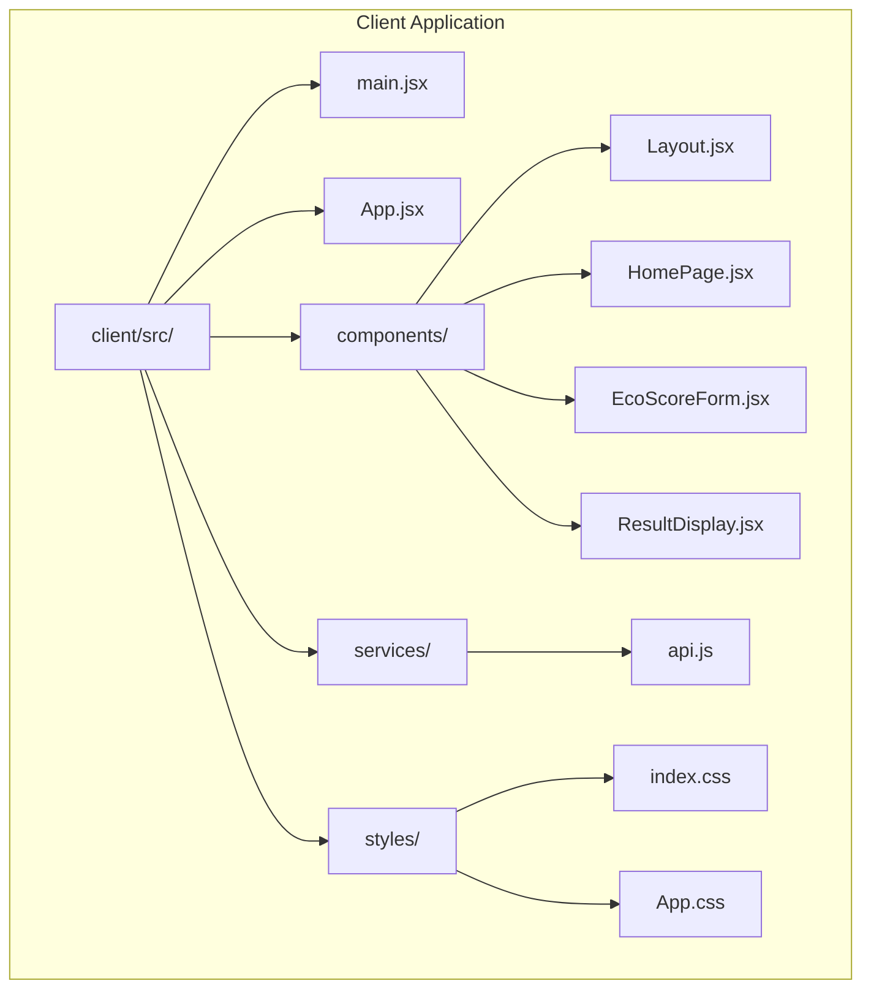
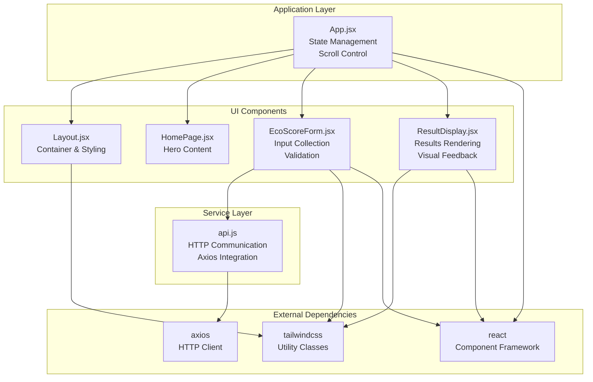
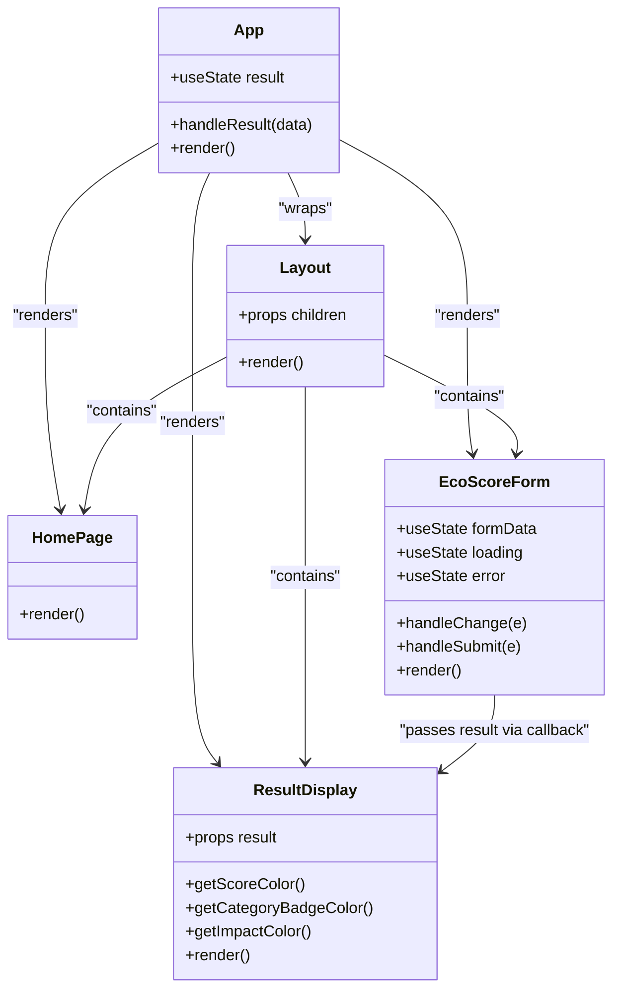
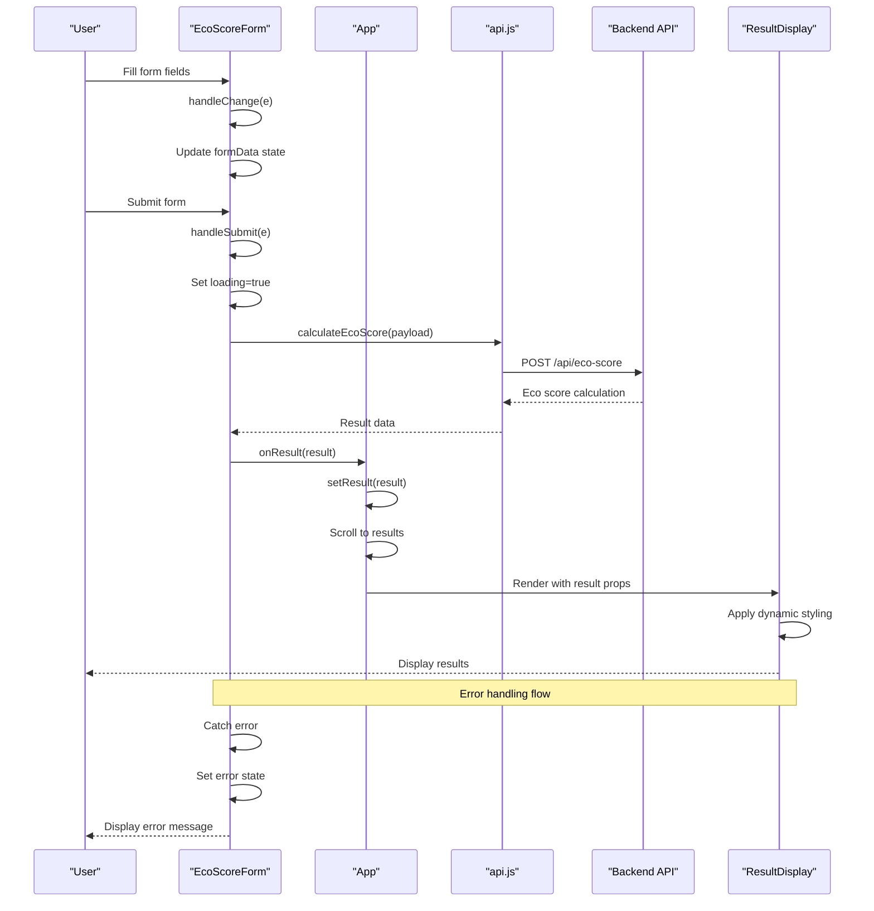
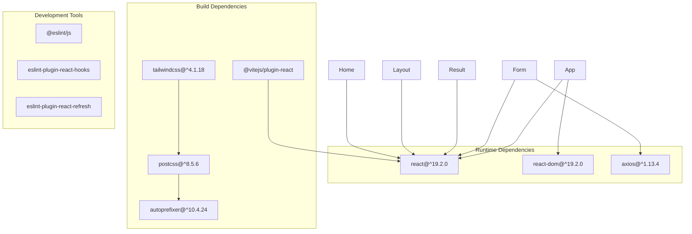

# Frontend Architecture

<cite>
**Referenced Files in This Document**
- [App.jsx](file://client/src/App.jsx)
- [main.jsx](file://client/src/main.jsx)
- [Layout.jsx](file://client/src/components/Layout.jsx)
- [HomePage.jsx](file://client/src/components/HomePage.jsx)
- [EcoScoreForm.jsx](file://client/src/components/EcoScoreForm.jsx)
- [ResultDisplay.jsx](file://client/src/components/ResultDisplay.jsx)
- [api.js](file://client/src/services/api.js)
- [package.json](file://client/package.json)
- [tailwind.config.js](file://client/tailwind.config.js)
- [index.css](file://client/src/index.css)
- [App.css](file://client/src/App.css)
- [vite.config.js](file://client/vite.config.js)
- [README.md](file://README.md)
</cite>

## Table of Contents
1. [Introduction](#introduction)
2. [Project Structure](#project-structure)
3. [Core Components](#core-components)
4. [Architecture Overview](#architecture-overview)
5. [Detailed Component Analysis](#detailed-component-analysis)
6. [Dependency Analysis](#dependency-analysis)
7. [Performance Considerations](#performance-considerations)
8. [Troubleshooting Guide](#troubleshooting-guide)
9. [Conclusion](#conclusion)

## Introduction
This document provides comprehensive frontend architecture documentation for the React-based Eco Score Predictor application. The frontend follows a component-driven architecture with clear separation of concerns, leveraging Tailwind CSS for styling and Axios for HTTP communication. The application enables users to input product sustainability metrics and receive real-time eco scores based on rule-based calculations.

## Project Structure
The frontend is organized around a clear component hierarchy with dedicated folders for components, services, and styling. The structure emphasizes modularity and maintainability:

**Diagram sources**
- [main.jsx](file://client/src/main.jsx#L1-L11)
- [App.jsx](file://client/src/App.jsx#L1-L37)
- [Layout.jsx](file://client/src/components/Layout.jsx#L1-L12)
- [EcoScoreForm.jsx](file://client/src/components/EcoScoreForm.jsx#L1-L225)
- [ResultDisplay.jsx](file://client/src/components/ResultDisplay.jsx#L1-L82)
- [api.js](file://client/src/services/api.js#L1-L13)

**Section sources**
- [main.jsx](file://client/src/main.jsx#L1-L11)
- [package.json](file://client/package.json#L1-L32)

## Core Components
The application consists of four primary components that form the user interface:

### App Component
The root component manages global state and coordinates the overall application flow. It maintains the result state and handles smooth scrolling to results upon calculation completion.

### Layout Component
Provides the foundational layout structure with gradient backgrounds and responsive container sizing. Acts as a wrapper for all page content.

### HomePage Component
Displays the main landing content with branding and introductory text about the eco scoring system.

### EcoScoreForm Component
Handles user input collection through a comprehensive form with validation and error handling. Manages loading states and integrates with the API service.

### ResultDisplay Component
Renders calculated results with visual indicators, color-coded categories, and detailed breakdown information.

**Section sources**
- [App.jsx](file://client/src/App.jsx#L7-L34)
- [Layout.jsx](file://client/src/components/Layout.jsx#L1-L12)
- [HomePage.jsx](file://client/src/components/HomePage.jsx#L1-L19)
- [EcoScoreForm.jsx](file://client/src/components/EcoScoreForm.jsx#L1-L225)
- [ResultDisplay.jsx](file://client/src/components/ResultDisplay.jsx#L1-L82)

## Architecture Overview
The application follows a unidirectional data flow pattern with clear component responsibilities and service layer integration:

**Diagram sources**
- [App.jsx](file://client/src/App.jsx#L1-L37)
- [Layout.jsx](file://client/src/components/Layout.jsx#L1-L12)
- [EcoScoreForm.jsx](file://client/src/components/EcoScoreForm.jsx#L1-L225)
- [ResultDisplay.jsx](file://client/src/components/ResultDisplay.jsx#L1-L82)
- [api.js](file://client/src/services/api.js#L1-L13)

## Detailed Component Analysis

### Component Hierarchy and Relationships
The component hierarchy demonstrates a clear parent-child relationship with App as the root container:

**Diagram sources**
- [App.jsx](file://client/src/App.jsx#L7-L34)
- [Layout.jsx](file://client/src/components/Layout.jsx#L1-L12)
- [HomePage.jsx](file://client/src/components/HomePage.jsx#L1-L19)
- [EcoScoreForm.jsx](file://client/src/components/EcoScoreForm.jsx#L1-L225)
- [ResultDisplay.jsx](file://client/src/components/ResultDisplay.jsx#L1-L82)

### State Management Patterns
The application employs React's built-in state management with a centralized approach:

#### Global State in App Component
- **Result State**: Maintains calculation results and triggers re-rendering
- **Scroll Management**: Implements smooth scrolling to results section
- **Callback Propagation**: Passes results upward through the component tree

#### Local State in Form Component
- **Form Data**: Manages structured form inputs with controlled components
- **Loading States**: Handles asynchronous operation feedback
- **Error Handling**: Captures and displays API errors

#### Result State Management
- **Conditional Rendering**: Prevents rendering until data is available
- **Dynamic Styling**: Applies color schemes based on score thresholds
- **Information Display**: Presents categorized results with contextual messaging

**Section sources**
- [App.jsx](file://client/src/App.jsx#L8-L19)
- [EcoScoreForm.jsx](file://client/src/components/EcoScoreForm.jsx#L5-L47)
- [ResultDisplay.jsx](file://client/src/components/ResultDisplay.jsx#L4-L25)

### Event Handling and User Interaction Flows
The application implements comprehensive event handling patterns:

**Diagram sources**
- [EcoScoreForm.jsx](file://client/src/components/EcoScoreForm.jsx#L26-L47)
- [App.jsx](file://client/src/App.jsx#L10-L19)
- [api.js](file://client/src/services/api.js#L5-L12)
- [ResultDisplay.jsx](file://client/src/components/ResultDisplay.jsx#L1-L82)

### Service Layer Architecture
The service layer provides a clean abstraction for HTTP communication:

#### API Service Implementation
- **Axios Integration**: Utilizes axios for robust HTTP client functionality
- **Environment Configuration**: Supports configurable API URLs via environment variables
- **Error Handling**: Provides meaningful error messages and response data
- **Promise-based**: Returns promises for asynchronous operation handling

#### HTTP Communication Pattern
- **POST Requests**: Submits form data to backend endpoint
- **Response Processing**: Extracts calculated eco scores from API responses
- **Error Propagation**: Maintains error context for UI display

**Section sources**
- [api.js](file://client/src/services/api.js#L1-L13)
- [package.json](file://client/package.json#L12-L16)

### Styling Approach and Responsive Design
The application implements a comprehensive styling strategy using Tailwind CSS:

#### Tailwind CSS Configuration
- **Content Scanning**: Configured to scan all JSX/TSX files for utility classes
- **Custom Color Palette**: Extends default palette with primary green variants
- **Mobile-first Design**: Responsive breakpoints for optimal mobile experience

#### Component Styling Patterns
- **Consistent Spacing**: Standardized padding and margin utilities
- **Color Theming**: Dark theme with sustainable green accents
- **Interactive Elements**: Hover states and transitions for enhanced UX
- **Responsive Grids**: Flexible layouts adapting to screen sizes

#### Visual Design Elements
- **Gradient Backgrounds**: Subtle gradients for depth perception
- **Backdrop Effects**: Frosted glass effect for form containers
- **Circular Progress Indicators**: Visual score representation
- **Color-coded Categories**: Immediate score interpretation

**Section sources**
- [tailwind.config.js](file://client/tailwind.config.js#L1-L28)
- [index.css](file://client/src/index.css#L1-L11)
- [EcoScoreForm.jsx](file://client/src/components/EcoScoreForm.jsx#L50-L221)
- [ResultDisplay.jsx](file://client/src/components/ResultDisplay.jsx#L28-L78)

### Component Composition Patterns
The application demonstrates several composition patterns:

#### Higher-order Component Pattern
- **Layout Wrapper**: Provides consistent container and styling
- **Prop Drilling**: Efficient data flow through component hierarchy

#### Controlled Component Pattern
- **Form State Management**: Two-way data binding with React state
- **Validation Integration**: Real-time input validation feedback

#### Render Props Pattern
- **Callback Propagation**: Result data passed via function props
- **Conditional Rendering**: Dynamic content based on state conditions

**Section sources**
- [Layout.jsx](file://client/src/components/Layout.jsx#L1-L12)
- [EcoScoreForm.jsx](file://client/src/components/EcoScoreForm.jsx#L4-L47)
- [App.jsx](file://client/src/App.jsx#L10-L19)

## Dependency Analysis
The frontend architecture demonstrates clear dependency relationships:

**Diagram sources**
- [package.json](file://client/package.json#L12-L30)

**Section sources**
- [package.json](file://client/package.json#L1-L32)

## Performance Considerations
The application implements several performance optimization strategies:

### Component Optimization
- **Conditional Rendering**: Results only render when data is available
- **State Minimization**: Local state management prevents unnecessary re-renders
- **Event Delegation**: Efficient form handling with controlled components

### Styling Performance
- **Utility-first Approach**: Tailwind's atomic CSS reduces bundle size
- **Critical Path Optimization**: Essential styles loaded via CSS-in-JS
- **Responsive Utilities**: Media queries optimized for modern browsers

### Network Optimization
- **Async/Await Pattern**: Non-blocking API calls prevent UI freezing
- **Loading States**: User feedback during network operations
- **Error Caching**: Prevents repeated failed requests

### Bundle Optimization
- **Tree Shaking**: Modern bundler configuration removes unused code
- **Code Splitting**: Component-level lazy loading potential
- **Minification**: Production builds optimize file sizes

## Troubleshooting Guide
Common issues and their solutions:

### API Communication Issues
- **Network Errors**: Verify API URL configuration in environment variables
- **CORS Problems**: Ensure backend CORS configuration allows frontend origin
- **Timeout Handling**: Implement retry logic for transient failures

### Form Validation Issues
- **Input Type Mismatches**: Ensure numeric inputs convert correctly
- **Required Field Validation**: Implement proper form validation states
- **State Synchronization**: Verify controlled component state updates

### Styling Problems
- **Tailwind Classes Not Applied**: Check content configuration in tailwind.config.js
- **Responsive Breakpoints**: Verify viewport meta tag configuration
- **Animation Issues**: Ensure CSS animations are properly scoped

### Performance Issues
- **Slow Re-renders**: Implement React.memo for expensive components
- **Memory Leaks**: Proper cleanup of event listeners and timers
- **Bundle Size**: Analyze bundle composition with webpack-bundle-analyzer

**Section sources**
- [api.js](file://client/src/services/api.js#L3-L12)
- [EcoScoreForm.jsx](file://client/src/components/EcoScoreForm.jsx#L32-L47)
- [tailwind.config.js](file://client/tailwind.config.js#L3-L6)

## Conclusion
The Eco Score Predictor frontend demonstrates a well-architected React application with clear component boundaries, efficient state management, and comprehensive styling. The architecture effectively separates concerns while maintaining simplicity and scalability. Key strengths include:

- **Clean Component Hierarchy**: Logical separation of concerns with clear responsibilities
- **Robust State Management**: Centralized state with minimal prop drilling
- **Modern Styling Approach**: Utility-first CSS with responsive design
- **Service Layer Abstraction**: Clean HTTP communication with error handling
- **Performance Optimization**: Thoughtful implementation of React best practices

The application serves as an excellent example of a production-ready React frontend that balances maintainability with functionality, providing a solid foundation for future enhancements and feature additions.