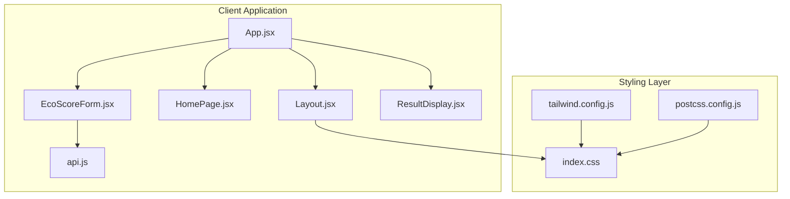
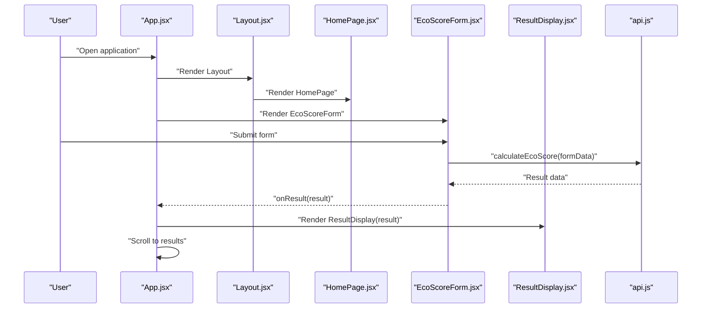
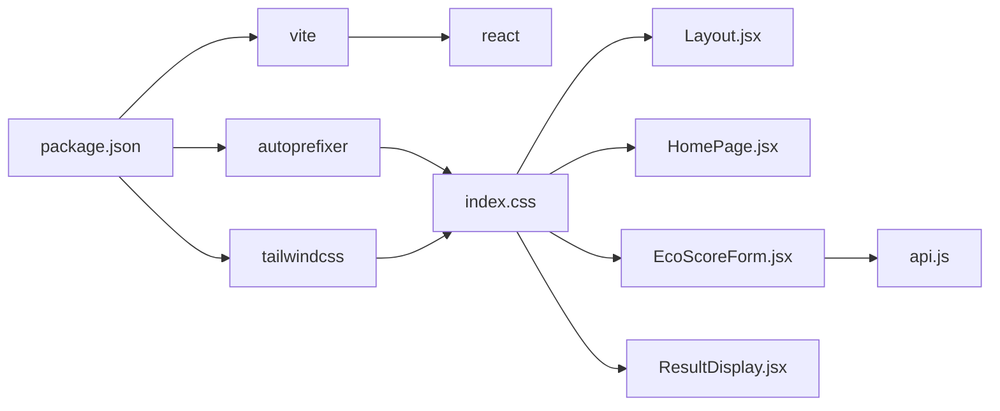

# Layout and Theming System

<cite>
**Referenced Files in This Document**
- [Layout.jsx](file://client/src/components/Layout.jsx)
- [App.jsx](file://client/src/App.jsx)
- [HomePage.jsx](file://client/src/components/HomePage.jsx)
- [EcoScoreForm.jsx](file://client/src/components/EcoScoreForm.jsx)
- [ResultDisplay.jsx](file://client/src/components/ResultDisplay.jsx)
- [api.js](file://client/src/services/api.js)
- [tailwind.config.js](file://client/tailwind.config.js)
- [postcss.config.js](file://client/postcss.config.js)
- [index.css](file://client/src/index.css)
- [App.css](file://client/src/App.css)
- [package.json](file://client/package.json)
- [vite.config.js](file://client/vite.config.js)
</cite>

## Table of Contents
1. [Introduction](#introduction)
2. [Project Structure](#project-structure)
3. [Core Components](#core-components)
4. [Architecture Overview](#architecture-overview)
5. [Detailed Component Analysis](#detailed-component-analysis)
6. [Dependency Analysis](#dependency-analysis)
7. [Performance Considerations](#performance-considerations)
8. [Troubleshooting Guide](#troubleshooting-guide)
9. [Conclusion](#conclusion)

## Introduction
This document explains the layout and theming system of the Eco Score Predictor application. It focuses on how the wrapper Layout component provides consistent styling, navigation, and responsive design patterns, and how the CSS architecture integrates Tailwind CSS, custom styles, and global styling approaches. It also documents the theming system, color schemes, typography hierarchy, responsive breakpoints, component composition patterns, header/footer implementation, accessibility features, cross-browser compatibility, and performance optimization strategies.

## Project Structure
The client-side application is organized around a small set of React components and a minimal build pipeline. The layout system centers on a single Layout wrapper that applies global background gradients, spacing, and responsive container sizing. Child components render content inside this wrapper, enabling consistent styling across pages.

**Diagram sources**
- [App.jsx](file://client/src/App.jsx#L1-L37)
- [Layout.jsx](file://client/src/components/Layout.jsx#L1-L12)
- [HomePage.jsx](file://client/src/components/HomePage.jsx#L1-L19)
- [EcoScoreForm.jsx](file://client/src/components/EcoScoreForm.jsx#L1-L225)
- [ResultDisplay.jsx](file://client/src/components/ResultDisplay.jsx#L1-L82)
- [api.js](file://client/src/services/api.js#L1-L13)
- [index.css](file://client/src/index.css#L1-L11)
- [tailwind.config.js](file://client/tailwind.config.js#L1-L28)
- [postcss.config.js](file://client/postcss.config.js#L1-L7)

**Section sources**
- [App.jsx](file://client/src/App.jsx#L1-L37)
- [Layout.jsx](file://client/src/components/Layout.jsx#L1-L12)
- [index.css](file://client/src/index.css#L1-L11)
- [tailwind.config.js](file://client/tailwind.config.js#L1-L28)
- [postcss.config.js](file://client/postcss.config.js#L1-L7)

## Core Components
- Layout: Provides a full-screen gradient background, a centered container with horizontal padding, and vertical spacing to ensure consistent page framing across all views.
- App: Orchestrates state for results, composes HomePage, the form, and the results display area, and handles smooth scrolling to results after calculation.
- HomePage: Renders the hero section with a gradient accent bar and descriptive text.
- EcoScoreForm: Implements a comprehensive form with inputs, radio groups, select dropdowns, and submit handling, styled consistently with the dark theme.
- ResultDisplay: Presents calculated results with dynamic color-coded badges and score visualization.

These components collectively establish a cohesive layout and theming foundation.

**Section sources**
- [Layout.jsx](file://client/src/components/Layout.jsx#L1-L12)
- [App.jsx](file://client/src/App.jsx#L1-L37)
- [HomePage.jsx](file://client/src/components/HomePage.jsx#L1-L19)
- [EcoScoreForm.jsx](file://client/src/components/EcoScoreForm.jsx#L1-L225)
- [ResultDisplay.jsx](file://client/src/components/ResultDisplay.jsx#L1-L82)

## Architecture Overview
The layout architecture follows a wrapper pattern where the Layout component acts as a global shell. App composes child components inside this shell, and ResultDisplay appears below the form. Styling is primarily driven by Tailwind utility classes with a custom color palette extension and global base styles.

**Diagram sources**
- [App.jsx](file://client/src/App.jsx#L1-L37)
- [Layout.jsx](file://client/src/components/Layout.jsx#L1-L12)
- [HomePage.jsx](file://client/src/components/HomePage.jsx#L1-L19)
- [EcoScoreForm.jsx](file://client/src/components/EcoScoreForm.jsx#L1-L225)
- [ResultDisplay.jsx](file://client/src/components/ResultDisplay.jsx#L1-L82)
- [api.js](file://client/src/services/api.js#L1-L13)

## Detailed Component Analysis

### Layout Component
The Layout component serves as the global wrapper:
- Full-screen minimum height ensures consistent viewport coverage.
- Background gradient from slate to emerald creates a nature-inspired dark theme.
- Container with horizontal padding and vertical spacing centralizes content and maintains readable margins.

Responsibilities:
- Provide consistent background and spacing.
- Encapsulate page-wide styling without duplicating styles in child components.

Accessibility and responsiveness:
- Uses padding utilities for mobile-first spacing.
- No explicit ARIA attributes here; child components should manage their own accessibility.

**Section sources**
- [Layout.jsx](file://client/src/components/Layout.jsx#L1-L12)

### App Component
App manages application state and orchestrates rendering:
- Holds result state and passes it down to ResultDisplay.
- Handles smooth scrolling to the results section after receiving a result.
- Composes HomePage, the form, and the results area within Layout.

Composition patterns:
- Passes onResult callback to EcoScoreForm to receive calculation outcomes.
- Wraps all content in Layout to inherit global styling.

**Section sources**
- [App.jsx](file://client/src/App.jsx#L1-L37)

### HomePage Component
HomePage establishes the header content:
- Centered hero title with large font sizes and tracking adjustments.
- Gradient accent bar under the title.
- Descriptive paragraph with responsive typography and leading.

Responsive behavior:
- Uses responsive variants for font sizes and spacing to adapt to larger screens.

**Section sources**
- [HomePage.jsx](file://client/src/components/HomePage.jsx#L1-L19)

### EcoScoreForm Component
EcoScoreForm implements the interactive form:
- State management for numeric inputs, radio selections, and a select dropdown.
- Form submission handling with loading and error states.
- Tailwind-styled inputs, labels, and buttons aligned with the dark theme.
- Focus states and transitions for interactive feedback.

Accessibility considerations:
- Uses labels associated with inputs.
- Radio groups and selects are keyboard navigable.
- Focus ring utilities improve keyboard accessibility.

Responsive design:
- Grid layouts and flexible button widths adapt to different screen sizes.

**Section sources**
- [EcoScoreForm.jsx](file://client/src/components/EcoScoreForm.jsx#L1-L225)

### ResultDisplay Component
ResultDisplay renders the calculated results:
- Dynamic score visualization with gradient backgrounds based on score ranges.
- Category badge color-coded according to score thresholds.
- Carbon impact color-coded based on impact level.
- Animated entrance and bordered content areas for emphasis.

Composition patterns:
- Uses computed color classes to reflect score categories dynamically.
- Includes a breakdown legend for score interpretation.

**Section sources**
- [ResultDisplay.jsx](file://client/src/components/ResultDisplay.jsx#L1-L82)

### Theming System and Color Schemes
The theming system is built around a dark color scheme with green accents:
- Primary color palette extension defines a custom green scale suitable for environmental themes.
- Background gradients in Layout and ResultDisplay reinforce the eco-friendly aesthetic.
- Form elements use slates and subtle borders to maintain contrast against the dark background.
- Buttons utilize gradient backgrounds with hover effects and transitions.

Typography hierarchy:
- Headings use large, bold fonts with tracking adjustments for readability.
- Paragraphs use moderate font sizes and increased line heights for readability.
- Inputs and labels use consistent text colors and focus states.

Responsive breakpoints:
- Responsive variants are used for typography and layout (e.g., md: prefixes).
- Grid layouts and spacing utilities adapt to tablet and desktop widths.

**Section sources**
- [tailwind.config.js](file://client/tailwind.config.js#L1-L28)
- [Layout.jsx](file://client/src/components/Layout.jsx#L1-L12)
- [HomePage.jsx](file://client/src/components/HomePage.jsx#L1-L19)
- [EcoScoreForm.jsx](file://client/src/components/EcoScoreForm.jsx#L1-L225)
- [ResultDisplay.jsx](file://client/src/components/ResultDisplay.jsx#L1-L82)

### CSS Architecture and Global Styling
Global base styles:
- Tailwind directives enable utility-first styling across the app.
- Body styles set a minimum viewport height and a system UI font stack for native feel.

Custom styles:
- App.css contains animations and card layouts for the React demo scaffolding.
- These are not used in the current layout; the theming relies on Tailwind utilities.

Build integration:
- PostCSS configuration enables Tailwind and Autoprefixer.
- Vite plugin chain includes React and Tailwind processing.

**Section sources**
- [index.css](file://client/src/index.css#L1-L11)
- [App.css](file://client/src/App.css#L1-L43)
- [postcss.config.js](file://client/postcss.config.js#L1-L7)
- [vite.config.js](file://client/vite.config.js#L1-L8)

### Component Composition Patterns
- Wrapper pattern: Layout wraps all page content.
- Composition: App composes HomePage, form, and results within Layout.
- Conditional rendering: ResultDisplay only renders when a result exists.
- Callback-driven updates: App receives results from the form and triggers re-render.

**Section sources**
- [App.jsx](file://client/src/App.jsx#L1-L37)
- [Layout.jsx](file://client/src/components/Layout.jsx#L1-L12)
- [ResultDisplay.jsx](file://client/src/components/ResultDisplay.jsx#L1-L82)

### Header/Footer Implementation
- Header: HomePage provides the top-level branding and description.
- Footer: Not implemented in the current codebase; the Layout component does not include a footer region.

**Section sources**
- [HomePage.jsx](file://client/src/components/HomePage.jsx#L1-L19)
- [Layout.jsx](file://client/src/components/Layout.jsx#L1-L12)

### Accessibility Features
- Semantic labels and inputs improve screen reader support.
- Focus ring utilities enhance keyboard navigation visibility.
- Color contrast maintained through dark backgrounds and appropriate text colors.
- Reduced motion media query accommodates user preferences.

**Section sources**
- [EcoScoreForm.jsx](file://client/src/components/EcoScoreForm.jsx#L1-L225)
- [App.css](file://client/src/App.css#L30-L34)

### Cross-Browser Compatibility
- Tailwind CSS and PostCSS toolchain ensure vendor-prefixed properties and modern CSS features.
- System UI font stack improves cross-platform readability.
- Autoprefixer adds necessary vendor prefixes during build.

**Section sources**
- [postcss.config.js](file://client/postcss.config.js#L1-L7)
- [index.css](file://client/src/index.css#L8-L9)
- [package.json](file://client/package.json#L17-L30)

## Dependency Analysis
The layout and theming system depends on Tailwind CSS and PostCSS for styling, with React components composing the UI. The form interacts with a backend service via Axios.

**Diagram sources**
- [package.json](file://client/package.json#L1-L32)
- [index.css](file://client/src/index.css#L1-L11)
- [Layout.jsx](file://client/src/components/Layout.jsx#L1-L12)
- [HomePage.jsx](file://client/src/components/HomePage.jsx#L1-L19)
- [EcoScoreForm.jsx](file://client/src/components/EcoScoreForm.jsx#L1-L225)
- [ResultDisplay.jsx](file://client/src/components/ResultDisplay.jsx#L1-L82)
- [api.js](file://client/src/services/api.js#L1-L13)

**Section sources**
- [package.json](file://client/package.json#L1-L32)
- [postcss.config.js](file://client/postcss.config.js#L1-L7)
- [tailwind.config.js](file://client/tailwind.config.js#L1-L28)

## Performance Considerations
- Utility-first CSS minimizes custom CSS bloat and reduces runtime style calculations.
- Tailwind purging (enabled via content globs) removes unused styles in production builds.
- Minimal JavaScript state management reduces re-renders.
- Gradients and backdrop blur are used sparingly to balance aesthetics and performance.
- Smooth scrolling is implemented with minimal overhead.

[No sources needed since this section provides general guidance]

## Troubleshooting Guide
Common issues and resolutions:
- Styles not applying: Ensure Tailwind directives are present in global CSS and content paths in Tailwind config match the project structure.
- Build errors: Verify PostCSS and Tailwind versions align with the configured plugins.
- Form submission failures: Check API URL environment variable and network connectivity.
- Scroll behavior: Confirm the results element ID exists and the smooth scroll timeout allows DOM updates.

**Section sources**
- [index.css](file://client/src/index.css#L1-L11)
- [tailwind.config.js](file://client/tailwind.config.js#L3-L6)
- [postcss.config.js](file://client/postcss.config.js#L1-L7)
- [api.js](file://client/src/services/api.js#L3-L12)
- [App.jsx](file://client/src/App.jsx#L13-L18)

## Conclusion
The layout and theming system leverages a clean wrapper pattern with Tailwind CSS for consistent, responsive styling. The dark theme with green accents reinforces the environmental focus, while utility classes ensure maintainability and performance. The system supports accessibility through labels, focus states, and reduced motion accommodations. Future enhancements could include a dedicated footer, expanded color customization, and additional responsive refinements.