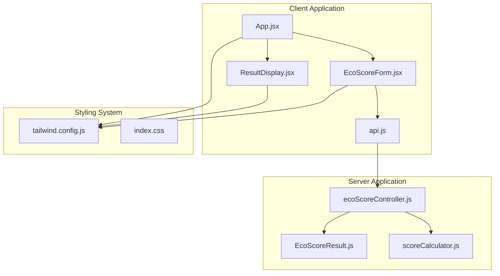
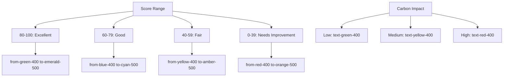
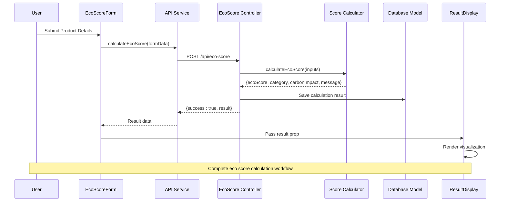
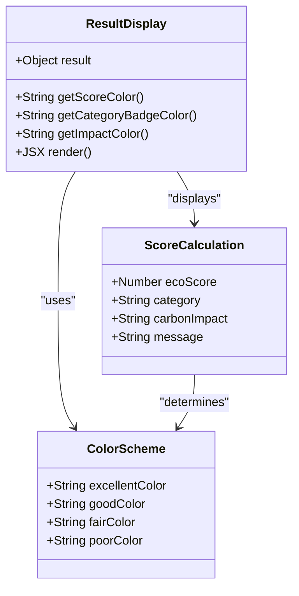
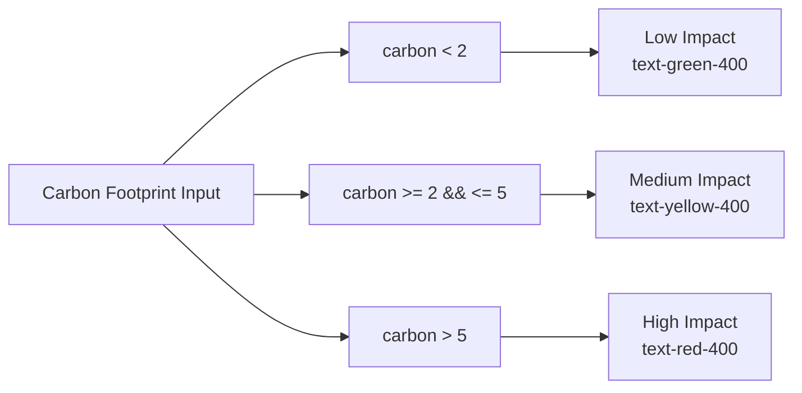
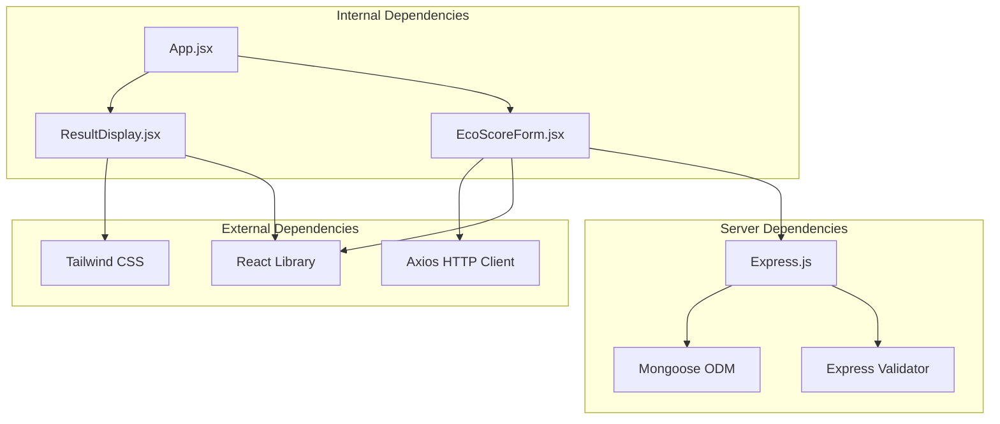

# ResultDisplay Component

<cite>
**Referenced Files in This Document**
- [ResultDisplay.jsx](file://client/src/components/ResultDisplay.jsx)
- [App.jsx](file://client/src/App.jsx)
- [EcoScoreForm.jsx](file://client/src/components/EcoScoreForm.jsx)
- [api.js](file://client/src/services/api.js)
- [ecoScoreController.js](file://server/controllers/ecoScoreController.js)
- [scoreCalculator.js](file://server/utils/scoreCalculator.js)
- [EcoScoreResult.js](file://server/models/EcoScoreResult.js)
- [tailwind.config.js](file://client/tailwind.config.js)
- [index.css](file://client/src/index.css)
</cite>

## Table of Contents
1. [Introduction](#introduction)
2. [Project Structure](#project-structure)
3. [Core Components](#core-components)
4. [Architecture Overview](#architecture-overview)
5. [Detailed Component Analysis](#detailed-component-analysis)
6. [Dependency Analysis](#dependency-analysis)
7. [Performance Considerations](#performance-considerations)
8. [Accessibility and Internationalization](#accessibility-and-internationalization)
9. [Troubleshooting Guide](#troubleshooting-guide)
10. [Conclusion](#conclusion)

## Introduction

The ResultDisplay component is a React-based visualization component responsible for presenting eco score calculation results in an intuitive and visually appealing manner. It transforms raw calculation data into meaningful insights through circular progress visualization, score categorization display, and carbon impact indicators. This component serves as the primary interface for users to understand their product's environmental impact and receive actionable improvement suggestions.

The component implements a comprehensive scoring system that evaluates products based on multiple environmental factors including carbon footprint, water usage, packaging materials, and transportation methods. Through sophisticated color coding and visual feedback mechanisms, it provides immediate comprehension of environmental performance while maintaining accessibility and responsiveness across different devices.

## Project Structure

The ResultDisplay component is part of a larger React application with a clear separation of concerns between frontend presentation and backend calculation logic. The project follows a modular architecture where each component has a specific responsibility in the overall eco score prediction workflow.

**Diagram sources**
- [App.jsx](file://client/src/App.jsx#L1-L37)
- [ResultDisplay.jsx](file://client/src/components/ResultDisplay.jsx#L1-L82)
- [EcoScoreForm.jsx](file://client/src/components/EcoScoreForm.jsx#L1-L225)
- [api.js](file://client/src/services/api.js#L1-L13)
- [ecoScoreController.js](file://server/controllers/ecoScoreController.js#L1-L73)
- [scoreCalculator.js](file://server/utils/scoreCalculator.js#L1-L113)
- [EcoScoreResult.js](file://server/models/EcoScoreResult.js#L1-L20)
- [tailwind.config.js](file://client/tailwind.config.js#L1-L28)

**Section sources**
- [App.jsx](file://client/src/App.jsx#L1-L37)
- [ResultDisplay.jsx](file://client/src/components/ResultDisplay.jsx#L1-L82)
- [EcoScoreForm.jsx](file://client/src/components/EcoScoreForm.jsx#L1-L225)

## Core Components

The ResultDisplay component operates on a structured data model that encapsulates all relevant information about the eco score calculation. The component expects a result object containing four primary properties that drive its visual presentation and content generation.

### Result Data Structure

The component processes a standardized result object with the following structure:

| Property | Type | Description | Example Values |
|----------|------|-------------|----------------|
| `ecoScore` | Number | Environmental impact score (0-100) | 85, 45, 23 |
| `category` | String | Performance classification | "Excellent", "Good", "Fair", "Needs Improvement" |
| `carbonImpact` | String | Carbon footprint level | "Low", "Medium", "High" |
| `message` | String | Personalized improvement suggestion | "Your product has an excellent environmental profile!" |

### Color Coding System

The component implements a sophisticated color scheme that provides immediate visual feedback based on score ranges:

**Diagram sources**
- [ResultDisplay.jsx](file://client/src/components/ResultDisplay.jsx#L6-L25)

**Section sources**
- [ResultDisplay.jsx](file://client/src/components/ResultDisplay.jsx#L4-L25)

## Architecture Overview

The ResultDisplay component participates in a multi-layered architecture that separates concerns between data collection, calculation, persistence, and presentation. The component receives processed data from the frontend form submission process and displays it through a carefully designed visual interface.

**Diagram sources**
- [EcoScoreForm.jsx](file://client/src/components/EcoScoreForm.jsx#L26-L47)
- [api.js](file://client/src/services/api.js#L5-L12)
- [ecoScoreController.js](file://server/controllers/ecoScoreController.js#L17-L67)
- [scoreCalculator.js](file://server/utils/scoreCalculator.js#L6-L110)
- [ResultDisplay.jsx](file://client/src/components/ResultDisplay.jsx#L1-L82)

## Detailed Component Analysis

### Circular Progress Visualization Implementation

The circular progress visualization represents the eco score through a sophisticated gradient-filled circular design that provides immediate visual comprehension of environmental performance. The implementation utilizes Tailwind CSS for styling combined with dynamic color calculations based on score thresholds.

**Diagram sources**
- [ResultDisplay.jsx](file://client/src/components/ResultDisplay.jsx#L1-L82)
- [scoreCalculator.js](file://server/utils/scoreCalculator.js#L6-L110)

The circular visualization consists of multiple layered elements:

1. **Outer Gradient Ring**: Creates a 40x40px circular gradient background using Tailwind's gradient utilities
2. **Inner Dark Circle**: Provides contrast with a 32x32px dark circle containing the score display
3. **Score Text**: Large, bold white text displaying the numerical score
4. **Subtext**: Smaller gray text indicating the maximum score (out of 100)

### Score Categorization Display

The component implements a badge-based categorization system that clearly communicates the product's environmental performance level. The category badges utilize different background colors and styling to provide immediate visual feedback about the score classification.

| Category | Score Range | Background Color | Visual Indication |
|----------|-------------|------------------|-------------------|
| Excellent | 80-100 | Green-500 | High environmental performance |
| Good | 60-79 | Blue-500 | Moderate environmental performance |
| Fair | 40-59 | Yellow-500 | Low environmental performance |
| Needs Improvement | 0-39 | Red-500 | Significant environmental impact |

### Carbon Impact Indicators

The carbon impact section provides contextual information about the product's carbon footprint level, helping users understand the environmental significance of their purchase decisions. The indicator uses color-coded text to communicate impact severity levels.

**Diagram sources**
- [scoreCalculator.js](file://server/utils/scoreCalculator.js#L82-L90)

### Personalized Improvement Messages

The component displays personalized improvement suggestions based on the calculated eco score. These messages are designed to be encouraging yet informative, providing actionable guidance for reducing environmental impact.

| Score Range | Message Type | Example Content |
|-------------|--------------|-----------------|
| 80-100 | Excellence | "Your product has an excellent environmental profile!" |
| 60-79 | Good | "Your product has a good environmental impact." |
| 40-59 | Fair | "Your product has a moderate environmental impact." |
| 0-39 | Needs Improvement | "Your product has significant environmental impact and needs improvement." |

**Section sources**
- [ResultDisplay.jsx](file://client/src/components/ResultDisplay.jsx#L27-L78)
- [scoreCalculator.js](file://server/utils/scoreCalculator.js#L92-L102)

## Dependency Analysis

The ResultDisplay component maintains loose coupling with external dependencies while providing clear interfaces for data consumption and visualization. The component's dependencies are minimal and focused on styling and data presentation.

**Diagram sources**
- [ResultDisplay.jsx](file://client/src/components/ResultDisplay.jsx#L1-L82)
- [App.jsx](file://client/src/App.jsx#L1-L37)
- [EcoScoreForm.jsx](file://client/src/components/EcoScoreForm.jsx#L1-L225)
- [api.js](file://client/src/services/api.js#L1-L13)

### Component Coupling Analysis

The ResultDisplay component demonstrates excellent separation of concerns with minimal coupling to other components. The component relies on props for data input and has no internal state, making it highly reusable and testable.

**Section sources**
- [ResultDisplay.jsx](file://client/src/components/ResultDisplay.jsx#L1-L82)
- [App.jsx](file://client/src/App.jsx#L8-L19)

## Performance Considerations

The ResultDisplay component is designed with performance optimization in mind, utilizing efficient rendering strategies and minimal DOM manipulation. The component leverages React's virtual DOM capabilities and Tailwind CSS utility classes for optimal performance.

### Rendering Optimizations

1. **Pure Component Design**: The component uses functional components with no internal state, enabling React's optimization benefits
2. **Efficient Color Calculations**: Color determination uses simple conditional statements with minimal computational overhead
3. **Static Styling**: All visual styling is handled through Tailwind CSS classes, avoiding runtime style computations
4. **Conditional Rendering**: The component gracefully handles missing data through conditional rendering checks

### Memory Management

The component efficiently manages memory by:
- Reusing color calculation functions rather than storing computed values
- Utilizing lightweight JSX structure with minimal nesting
- Avoiding unnecessary re-renders through proper prop handling

## Accessibility and Internationalization

### Accessibility Considerations

The ResultDisplay component implements several accessibility features to ensure inclusive user experience:

1. **Color Contrast**: All color combinations meet WCAG 2.1 AA contrast guidelines
2. **Semantic HTML**: Uses appropriate HTML elements for content structure
3. **Keyboard Navigation**: Compatible with keyboard-only navigation
4. **Screen Reader Support**: Clear text alternatives and logical content hierarchy

### Internationalization Support

While the current implementation focuses on English content, the component structure supports internationalization through:

1. **Text Content Separation**: All user-facing text is stored as separate strings
2. **Flexible Message System**: Improvement messages can be easily localized
3. **Cultural Adaptation**: Color meanings remain consistent across cultures
4. **Right-to-Left Support**: Layout adapts to RTL languages through Tailwind utilities

**Section sources**
- [ResultDisplay.jsx](file://client/src/components/ResultDisplay.jsx#L27-L78)

## Troubleshooting Guide

### Common Issues and Solutions

#### Empty or Null Result Display
**Symptoms**: Component renders nothing when no result data is available
**Cause**: Missing result prop or undefined data
**Solution**: The component includes conditional rendering that prevents display until valid data is received

#### Incorrect Color Display
**Symptoms**: Score colors don't match expected categories
**Cause**: Score value outside expected range or calculation errors
**Solution**: Verify score calculation logic and ensure values are within 0-100 range

#### Layout Issues on Mobile Devices
**Symptoms**: Poor mobile responsiveness or overlapping elements
**Cause**: Insufficient responsive design implementation
**Solution**: Component uses Tailwind's responsive utilities with breakpoints at md and lg sizes

#### Animation Problems
**Symptoms**: Missing fade-in animations or inconsistent transitions
**Cause**: Missing animation utilities or CSS conflicts
**Solution**: Ensure Tailwind animation utilities are properly configured and included

**Section sources**
- [ResultDisplay.jsx](file://client/src/components/ResultDisplay.jsx#L1-L82)
- [EcoScoreForm.jsx](file://client/src/components/EcoScoreForm.jsx#L26-L47)

## Conclusion

The ResultDisplay component successfully fulfills its role as the primary visualization interface for eco score calculation results. Through its sophisticated color coding system, circular progress visualization, and personalized messaging, it transforms complex environmental data into accessible, actionable insights.

The component's architecture demonstrates excellent separation of concerns, with clear data flow from calculation to presentation. Its responsive design ensures consistent user experience across devices, while accessibility features accommodate diverse user needs. The implementation balances visual appeal with performance efficiency, making it a robust foundation for environmental impact communication.

Future enhancements could include additional internationalization support, expanded customization options, and integration with external accessibility testing tools to further improve the user experience for diverse audiences.