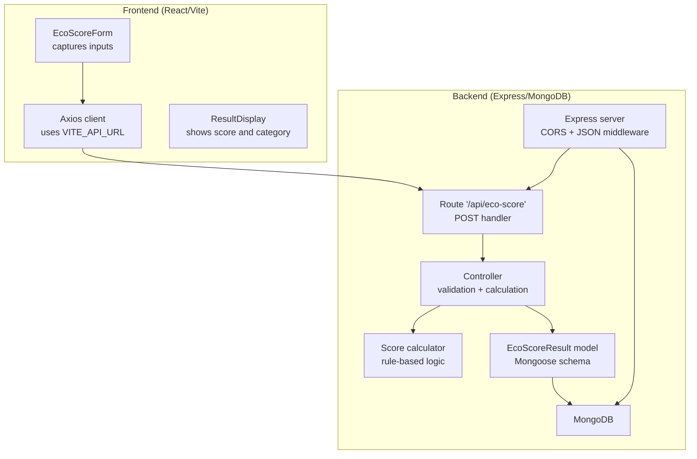

# Getting Started

<cite>
**Referenced Files in This Document**
- [README.md](file://README.md)
- [client/package.json](file://client/package.json)
- [server/package.json](file://server/package.json)
- [client/.env.example](file://client/.env.example)
- [server/.env.example](file://server/.env.example)
- [client/src/services/api.js](file://client/src/services/api.js)
- [server/server.js](file://server/server.js)
- [server/config/db.js](file://server/config/db.js)
- [server/routes/ecoScore.js](file://server/routes/ecoScore.js)
- [server/controllers/ecoScoreController.js](file://server/controllers/ecoScoreController.js)
- [server/utils/scoreCalculator.js](file://server/utils/scoreCalculator.js)
- [server/models/EcoScoreResult.js](file://server/models/EcoScoreResult.js)
- [client/src/App.jsx](file://client/src/App.jsx)
- [client/src/main.jsx](file://client/src/main.jsx)
- [client/src/components/EcoScoreForm.jsx](file://client/src/components/EcoScoreForm.jsx)
- [client/src/components/ResultDisplay.jsx](file://client/src/components/ResultDisplay.jsx)
</cite>

## Table of Contents
1. [Introduction](#introduction)
2. [Prerequisites](#prerequisites)
3. [Installation](#installation)
4. [Environment Configuration](#environment-configuration)
5. [Running the Application](#running-the-application)
6. [Development Workflow](#development-workflow)
7. [Verification Steps](#verification-steps)
8. [Troubleshooting Guide](#troubleshooting-guide)
9. [Architecture Overview](#architecture-overview)
10. [Conclusion](#conclusion)

## Introduction
This guide helps you set up and run the Eco Score Predictor application locally. It covers prerequisites, installation for both frontend and backend, environment configuration, launching the app, and verifying that everything works correctly. The application is a full-stack MERN project with a rule-based scoring engine and a responsive React UI.

## Prerequisites
Ensure the following tools are installed on your machine:
- Node.js v14 or higher
- MongoDB (local instance or MongoDB Atlas)
- npm or yarn package manager

These requirements are used throughout the project and are reflected in the repository’s documentation and configuration files.

**Section sources**
- [README.md](file://README.md#L78-L82)
- [server/package.json](file://server/package.json#L15-L21)
- [client/package.json](file://client/package.json#L12-L16)

## Installation
Follow these steps to install both the frontend and backend:

1) Clone the repository
- Use your preferred Git client to clone the repository and navigate into the project directory.

2) Install backend dependencies
- Open a terminal, change to the server directory, and install dependencies using npm or yarn.

3) Install frontend dependencies
- Open another terminal, change to the client directory, and install dependencies using npm or yarn.

Notes:
- The repository provides explicit commands for installing backend and frontend dependencies.
- The frontend uses Vite for development and build tasks, while the backend uses Express with Nodemon for development.

**Section sources**
- [README.md](file://README.md#L83-L87)
- [README.md](file://README.md#L89-L94)
- [README.md](file://README.md#L124-L130)
- [client/package.json](file://client/package.json#L6-L11)
- [server/package.json](file://server/package.json#L6-L10)

## Environment Configuration
Configure environment variables for both frontend and backend:

- Backend environment
  - Create a .env file in the server directory using the example template.
  - Set the port, MongoDB URI, and environment mode as needed.

- Frontend environment
  - Create a .env file in the client directory using the example template.
  - Set the API URL pointing to the backend endpoint.

How the frontend resolves the API base URL:
- The frontend reads the VITE_API_URL environment variable and falls back to a default localhost address if not set.

How the backend connects to MongoDB:
- The backend loads environment variables and connects to MongoDB using Mongoose.

**Section sources**
- [README.md](file://README.md#L96-L101)
- [README.md](file://README.md#L132-L135)
- [client/.env.example](file://client/.env.example#L1-L2)
- [server/.env.example](file://server/.env.example#L1-L4)
- [client/src/services/api.js](file://client/src/services/api.js#L3)
- [server/server.js](file://server/server.js#L1-L4)
- [server/config/db.js](file://server/config/db.js#L3-L15)

## Running the Application
Start the backend and frontend servers concurrently:

1) Start the backend
- From the server directory, run the development script to start the Express server with hot reloading.

2) Start the frontend
- From the client directory, run the development script to start the Vite-based React app.

3) Access the application
- The frontend runs on http://localhost:5173 by default.
- The backend runs on http://localhost:5000 by default.

Optional: If you prefer a production-like backend startup, use the start script in the server directory.

**Section sources**
- [README.md](file://README.md#L115-L122)
- [README.md](file://README.md#L137-L142)
- [README.md](file://README.md#L215-L219)
- [README.md](file://README.md#L221-L226)
- [server/package.json](file://server/package.json#L6-L10)
- [client/package.json](file://client/package.json#L6-L11)

## Development Workflow
A typical development session includes:
- Starting both servers in separate terminals.
- Making changes to frontend components or backend routes/controllers.
- Observing live reload in the browser during frontend development.
- Verifying backend behavior with the health check endpoint and API routes.

Key entry points:
- Frontend entry point initializes the React app and renders the main layout and components.
- Backend entry point sets up Express, connects to MongoDB, registers routes, and defines a health check.

**Section sources**
- [client/src/main.jsx](file://client/src/main.jsx#L1-L11)
- [client/src/App.jsx](file://client/src/App.jsx#L1-L37)
- [server/server.js](file://server/server.js#L1-L34)

## Verification Steps
Confirm that the application is functioning correctly after setup:

1) Backend health check
- Visit the root endpoint to confirm the backend is running.

2) Database connectivity
- On startup, the backend attempts to connect to MongoDB. Look for a successful connection log in the backend terminal.

3) API endpoint availability
- Send a POST request to the scoring endpoint with valid fields to ensure the route and controller work as expected.

4) Frontend integration
- Open the frontend in the browser, submit a form, and verify that the UI displays results and handles loading states.

5) Environment variables
- Confirm that the frontend uses the configured API URL and that the backend reads the port and MongoDB URI from the .env file.

**Section sources**
- [server/server.js](file://server/server.js#L21-L24)
- [server/config/db.js](file://server/config/db.js#L10-L14)
- [server/routes/ecoScore.js](file://server/routes/ecoScore.js#L5-L6)
- [client/src/services/api.js](file://client/src/services/api.js#L5-L12)
- [client/src/components/EcoScoreForm.jsx](file://client/src/components/EcoScoreForm.jsx#L26-L47)

## Troubleshooting Guide
Common setup issues and resolutions:

- MongoDB connection failures
  - Ensure MongoDB is running locally or update the MongoDB URI in the backend .env file to point to your Atlas cluster.
  - Verify the connection logs show a successful connection on backend startup.

- Port conflicts
  - Change the backend port in the server .env file if port 5000 is in use.
  - Ensure the frontend VITE_API_URL matches the backend port.

- CORS errors
  - The backend enables CORS globally. If you encounter cross-origin issues, verify the frontend API URL matches the backend origin.

- Frontend not reaching backend
  - Confirm the VITE_API_URL in the client .env file points to the backend host and port.
  - Check that the frontend proxy or environment variable is correctly loaded.

- Validation errors on submission
  - Ensure all required fields are present and match allowed values as defined by the backend validation rules.

**Section sources**
- [server/config/db.js](file://server/config/db.js#L11-L14)
- [server/server.js](file://server/server.js#L14)
- [client/.env.example](file://client/.env.example#L1)
- [server/.env.example](file://server/.env.example#L1-L2)
- [server/controllers/ecoScoreController.js](file://server/controllers/ecoScoreController.js#L6-L14)

## Architecture Overview
The application follows a classic MERN stack pattern with a clear separation of concerns:

- Frontend (React + Vite)
  - Provides a responsive UI with form input, real-time feedback, and result visualization.
  - Communicates with the backend via Axios using the configured API URL.

- Backend (Express + MongoDB)
  - Exposes a RESTful API with input validation, scoring logic, and persistence.
  - Uses Mongoose to model and store scoring results.

**Diagram sources**
- [client/src/services/api.js](file://client/src/services/api.js#L1-L13)
- [client/src/components/EcoScoreForm.jsx](file://client/src/components/EcoScoreForm.jsx#L1-L225)
- [client/src/components/ResultDisplay.jsx](file://client/src/components/ResultDisplay.jsx#L1-L82)
- [server/server.js](file://server/server.js#L1-L34)
- [server/routes/ecoScore.js](file://server/routes/ecoScore.js#L1-L9)
- [server/controllers/ecoScoreController.js](file://server/controllers/ecoScoreController.js#L1-L73)
- [server/utils/scoreCalculator.js](file://server/utils/scoreCalculator.js#L1-L113)
- [server/models/EcoScoreResult.js](file://server/models/EcoScoreResult.js#L1-L20)
- [server/config/db.js](file://server/config/db.js#L1-L18)

## Conclusion
You now have the complete steps to install, configure, and run the Eco Score Predictor application locally. By following the environment setup, dependency installation, and verification steps, you can confidently develop and test the application. Use the troubleshooting guide to resolve common issues and refer to the architecture overview to understand how components interact.