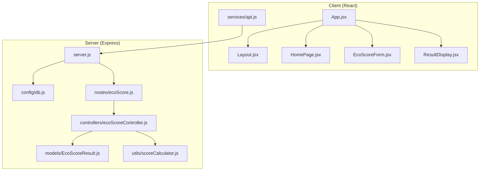
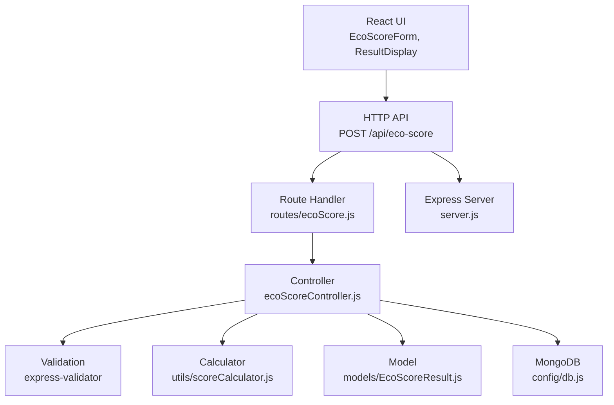
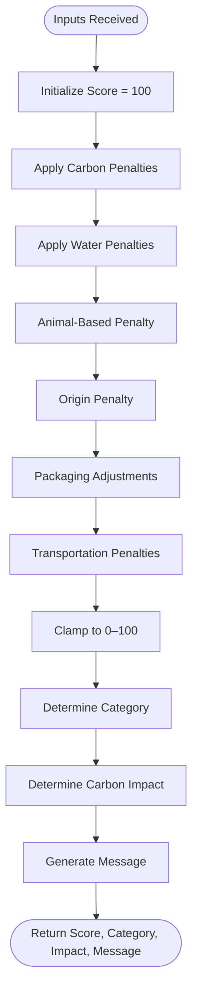
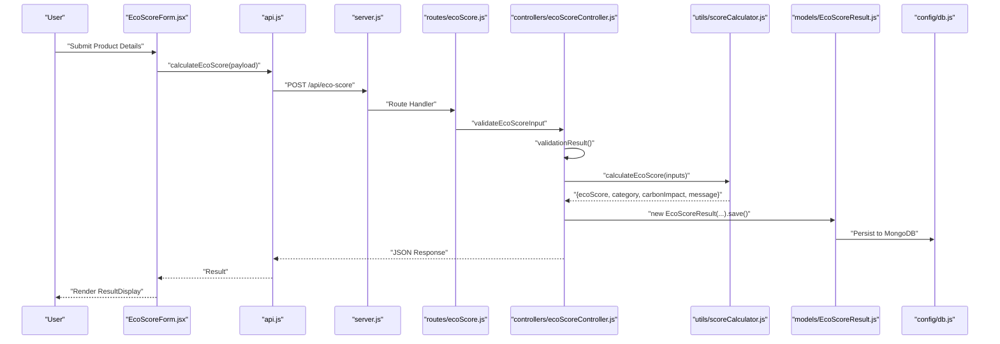
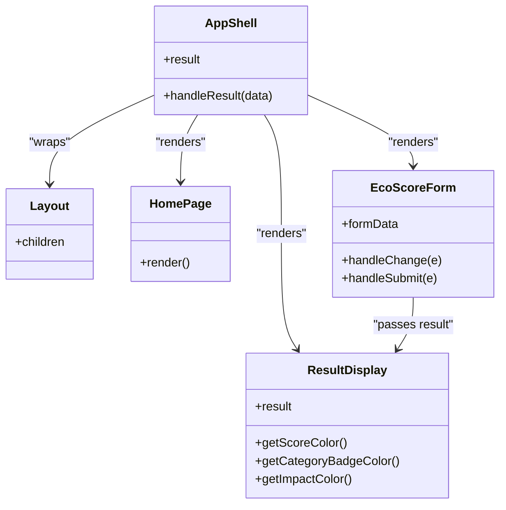
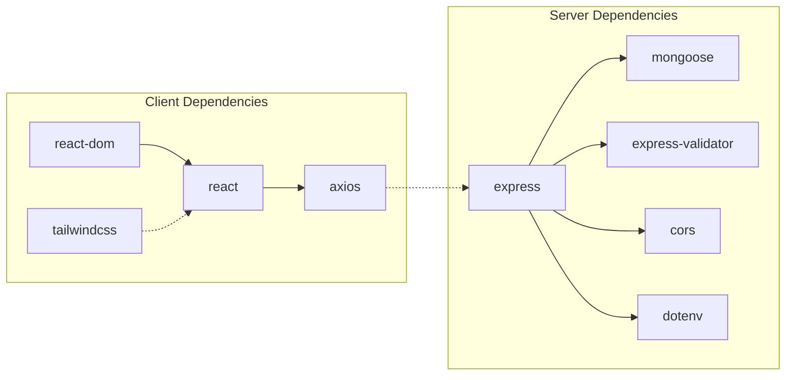

# Project Overview

<cite>
**Referenced Files in This Document**
- [README.md](file://README.md)
- [server.js](file://server/server.js)
- [db.js](file://server/config/db.js)
- [ecoScore.js](file://server/routes/ecoScore.js)
- [ecoScoreController.js](file://server/controllers/ecoScoreController.js)
- [scoreCalculator.js](file://server/utils/scoreCalculator.js)
- [EcoScoreResult.js](file://server/models/EcoScoreResult.js)
- [App.jsx](file://client/src/App.jsx)
- [Layout.jsx](file://client/src/components/Layout.jsx)
- [HomePage.jsx](file://client/src/components/HomePage.jsx)
- [EcoScoreForm.jsx](file://client/src/components/EcoScoreForm.jsx)
- [ResultDisplay.jsx](file://client/src/components/ResultDisplay.jsx)
- [api.js](file://client/src/services/api.js)
- [package.json](file://client/package.json)
- [package.json](file://server/package.json)
</cite>

## Table of Contents
1. [Introduction](#introduction)
2. [Project Structure](#project-structure)
3. [Core Components](#core-components)
4. [Architecture Overview](#architecture-overview)
5. [Detailed Component Analysis](#detailed-component-analysis)
6. [Dependency Analysis](#dependency-analysis)
7. [Performance Considerations](#performance-considerations)
8. [Troubleshooting Guide](#troubleshooting-guide)
9. [Conclusion](#conclusion)

## Introduction
Eco Score Predictor is a full-stack MERN web application designed to calculate product sustainability scores based on environmental impact factors. The project emphasizes transparency by using a rule-based scoring methodology rather than machine learning, enabling users to understand exactly how scores are derived. It serves as a modern, resume-ready demonstration of clean architecture and contemporary web development practices, combining a responsive React frontend with a robust Node.js and Express backend backed by MongoDB.

Key goals:
- Provide a clear, rule-based eco scoring system grounded in environmental factors such as carbon footprint, water usage, packaging, transportation, and product origin.
- Deliver a real-time, interactive user experience with immediate feedback and persistent storage of results.
- Showcase best practices in full-stack development, including RESTful APIs, input validation, error handling, and responsive UI design.

Educational value:
- Demonstrates clean separation of concerns across frontend and backend layers.
- Highlights practical use of Express routing, controller logic, and database modeling.
- Illustrates transparent, explainable scoring versus opaque AI/ML models.

Target audience and use cases:
- Consumers seeking to assess product sustainability.
- Students and developers building portfolio projects focused on environmental impact assessment.
- Organizations evaluating supply chain or product lifecycle impacts using a standardized, rule-based approach.

## Project Structure
The repository follows a clear MERN architecture with distinct client and server directories. The frontend is a React application built with Vite and styled with Tailwind CSS. The backend is an Express server with RESTful routes, input validation, and MongoDB persistence.

**Diagram sources**
- [App.jsx](file://client/src/App.jsx#L1-L37)
- [Layout.jsx](file://client/src/components/Layout.jsx#L1-L12)
- [HomePage.jsx](file://client/src/components/HomePage.jsx#L1-L19)
- [EcoScoreForm.jsx](file://client/src/components/EcoScoreForm.jsx#L1-L225)
- [ResultDisplay.jsx](file://client/src/components/ResultDisplay.jsx#L1-L82)
- [api.js](file://client/src/services/api.js#L1-L13)
- [server.js](file://server/server.js#L1-L34)
- [db.js](file://server/config/db.js#L1-L18)
- [ecoScore.js](file://server/routes/ecoScore.js#L1-L9)
- [ecoScoreController.js](file://server/controllers/ecoScoreController.js#L1-L73)
- [scoreCalculator.js](file://server/utils/scoreCalculator.js#L1-L113)
- [EcoScoreResult.js](file://server/models/EcoScoreResult.js#L1-L20)

**Section sources**
- [README.md](file://README.md#L50-L74)
- [server.js](file://server/server.js#L1-L34)
- [client/src/App.jsx](file://client/src/App.jsx#L1-L37)

## Core Components
- Frontend:
  - App shell orchestrating layout, home page, form, and results display.
  - EcoScoreForm captures user inputs and triggers real-time calculation.
  - ResultDisplay renders the score visualization and contextual feedback.
  - API service encapsulates HTTP requests to the backend.
- Backend:
  - Express server initializes middleware, routes, and error handling.
  - Route module defines the POST endpoint for eco score calculation.
  - Controller validates inputs, computes the score, and persists results.
  - Utility module implements the rule-based scoring logic.
  - Model defines the MongoDB schema for storing results.
  - Database configuration connects to MongoDB.

Key features:
- Real-time calculation: Inputs are validated and processed immediately upon submission.
- MongoDB persistence: Every calculation is saved to the database with timestamps.
- Responsive UI: Mobile-first design with a sustainability-themed dark interface and animated feedback.
- Transparent scoring: Clear penalty rules and score categories for interpretability.

**Section sources**
- [EcoScoreForm.jsx](file://client/src/components/EcoScoreForm.jsx#L1-L225)
- [ResultDisplay.jsx](file://client/src/components/ResultDisplay.jsx#L1-L82)
- [api.js](file://client/src/services/api.js#L1-L13)
- [server.js](file://server/server.js#L1-L34)
- [ecoScore.js](file://server/routes/ecoScore.js#L1-L9)
- [ecoScoreController.js](file://server/controllers/ecoScoreController.js#L1-L73)
- [scoreCalculator.js](file://server/utils/scoreCalculator.js#L1-L113)
- [EcoScoreResult.js](file://server/models/EcoScoreResult.js#L1-L20)
- [db.js](file://server/config/db.js#L1-L18)

## Architecture Overview
The system adheres to a layered architecture:
- Presentation Layer (React): Handles user interaction, form submission, and result rendering.
- Application Layer (Express): Manages routing, validation, and orchestration of business logic.
- Domain Layer (Rule-based Calculator): Encapsulates scoring rules and category determination.
- Data Access Layer (MongoDB): Persists results with structured schemas and timestamps.

**Diagram sources**
- [EcoScoreForm.jsx](file://client/src/components/EcoScoreForm.jsx#L1-L225)
- [ResultDisplay.jsx](file://client/src/components/ResultDisplay.jsx#L1-L82)
- [api.js](file://client/src/services/api.js#L1-L13)
- [ecoScore.js](file://server/routes/ecoScore.js#L1-L9)
- [ecoScoreController.js](file://server/controllers/ecoScoreController.js#L1-L73)
- [scoreCalculator.js](file://server/utils/scoreCalculator.js#L1-L113)
- [EcoScoreResult.js](file://server/models/EcoScoreResult.js#L1-L20)
- [db.js](file://server/config/db.js#L1-L18)
- [server.js](file://server/server.js#L1-L34)

## Detailed Component Analysis

### Rule-Based Scoring Methodology
The scoring engine begins with a perfect score of 100 and subtracts penalties based on input characteristics. It also applies small bonuses for minimal packaging and local sourcing. Final score is clamped between 0 and 100, then categorized into four bands with associated messages and carbon impact descriptors.

**Diagram sources**
- [scoreCalculator.js](file://server/utils/scoreCalculator.js#L6-L110)

**Section sources**
- [README.md](file://README.md#L33-L49)
- [scoreCalculator.js](file://server/utils/scoreCalculator.js#L1-L113)

### API Workflow: Calculation and Persistence
The frontend submits product details to the backend, which validates inputs, computes the score, persists the result, and returns a structured JSON response.

**Diagram sources**
- [EcoScoreForm.jsx](file://client/src/components/EcoScoreForm.jsx#L26-L47)
- [api.js](file://client/src/services/api.js#L5-L12)
- [server.js](file://server/server.js#L19-L27)
- [ecoScore.js](file://server/routes/ecoScore.js#L5-L6)
- [ecoScoreController.js](file://server/controllers/ecoScoreController.js#L17-L67)
- [scoreCalculator.js](file://server/utils/scoreCalculator.js#L6-L110)
- [EcoScoreResult.js](file://server/models/EcoScoreResult.js#L3-L17)
- [db.js](file://server/config/db.js#L3-L15)

**Section sources**
- [README.md](file://README.md#L144-L182)
- [api.js](file://client/src/services/api.js#L1-L13)
- [server.js](file://server/server.js#L1-L34)
- [ecoScore.js](file://server/routes/ecoScore.js#L1-L9)
- [ecoScoreController.js](file://server/controllers/ecoScoreController.js#L1-L73)
- [EcoScoreResult.js](file://server/models/EcoScoreResult.js#L1-L20)

### Frontend Components and UI
- Layout.jsx provides a dark, gradient-based container for the entire app.
- HomePage.jsx introduces the application with a concise description.
- EcoScoreForm.jsx collects numeric and categorical inputs with real-time validation and loading states.
- ResultDisplay.jsx presents the score visually with color-coded categories and contextual messaging.

**Diagram sources**
- [Layout.jsx](file://client/src/components/Layout.jsx#L1-L12)
- [HomePage.jsx](file://client/src/components/HomePage.jsx#L1-L19)
- [EcoScoreForm.jsx](file://client/src/components/EcoScoreForm.jsx#L1-L225)
- [ResultDisplay.jsx](file://client/src/components/ResultDisplay.jsx#L1-L82)
- [App.jsx](file://client/src/App.jsx#L7-L19)

**Section sources**
- [Layout.jsx](file://client/src/components/Layout.jsx#L1-L12)
- [HomePage.jsx](file://client/src/components/HomePage.jsx#L1-L19)
- [EcoScoreForm.jsx](file://client/src/components/EcoScoreForm.jsx#L1-L225)
- [ResultDisplay.jsx](file://client/src/components/ResultDisplay.jsx#L1-L82)
- [App.jsx](file://client/src/App.jsx#L1-L37)

## Dependency Analysis
- Frontend dependencies include React, Axios for HTTP requests, and Tailwind CSS for styling.
- Backend dependencies include Express, Mongoose for MongoDB, Express Validator for input validation, CORS for cross-origin requests, and dotenv for environment configuration.

**Diagram sources**
- [package.json](file://client/package.json#L12-L31)
- [package.json](file://server/package.json#L15-L21)

**Section sources**
- [package.json](file://client/package.json#L1-L32)
- [package.json](file://server/package.json#L1-L23)

## Performance Considerations
- Real-time responsiveness: The frontend performs immediate client-side conversion of numeric inputs and disables the submit button during calculation to prevent duplicate submissions.
- Backend throughput: The calculation is lightweight and CPU-bound, suitable for single-threaded Node.js execution. For scale, consider offloading heavy computations to worker threads or microservices.
- Database writes: Each calculation writes a record; ensure MongoDB is provisioned appropriately and consider indexing frequently queried fields if analytics are introduced.
- Network efficiency: The API returns only necessary fields, minimizing payload sizes.

## Troubleshooting Guide
Common issues and resolutions:
- Backend not starting:
  - Verify environment variables for port and MongoDB URI.
  - Confirm MongoDB is running and reachable.
- CORS errors:
  - Ensure the frontend’s API URL matches the backend origin and that CORS is enabled.
- Validation failures:
  - Confirm input types match expected formats (positive numbers, allowed enums).
- Database connection errors:
  - Check MongoDB URI and network connectivity; review connection logs.

**Section sources**
- [server.js](file://server/server.js#L26-L27)
- [db.js](file://server/config/db.js#L3-L15)
- [ecoScoreController.js](file://server/controllers/ecoScoreController.js#L17-L26)
- [api.js](file://client/src/services/api.js#L5-L12)

## Conclusion
Eco Score Predictor exemplifies a clean, transparent, and educational full-stack application. By combining a rule-based scoring model with a responsive UI and persistent data storage, it demonstrates modern web development practices while remaining interpretable and maintainable. Its portfolio-ready architecture and clear separation of concerns make it an ideal showcase for job applications and learning environments.