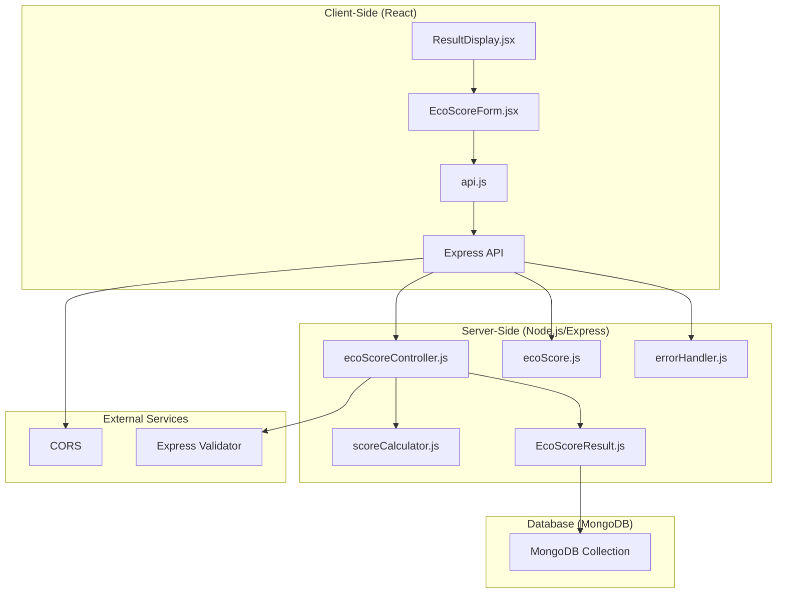
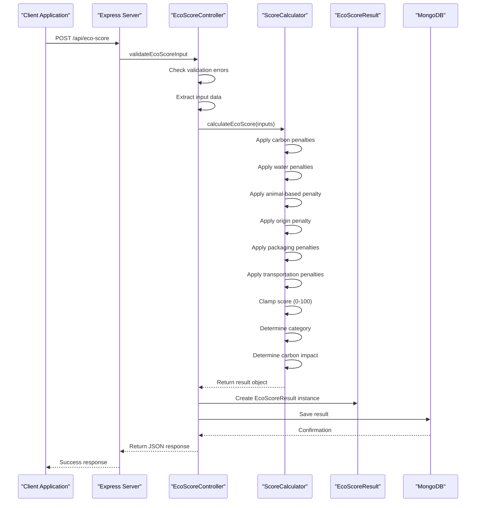
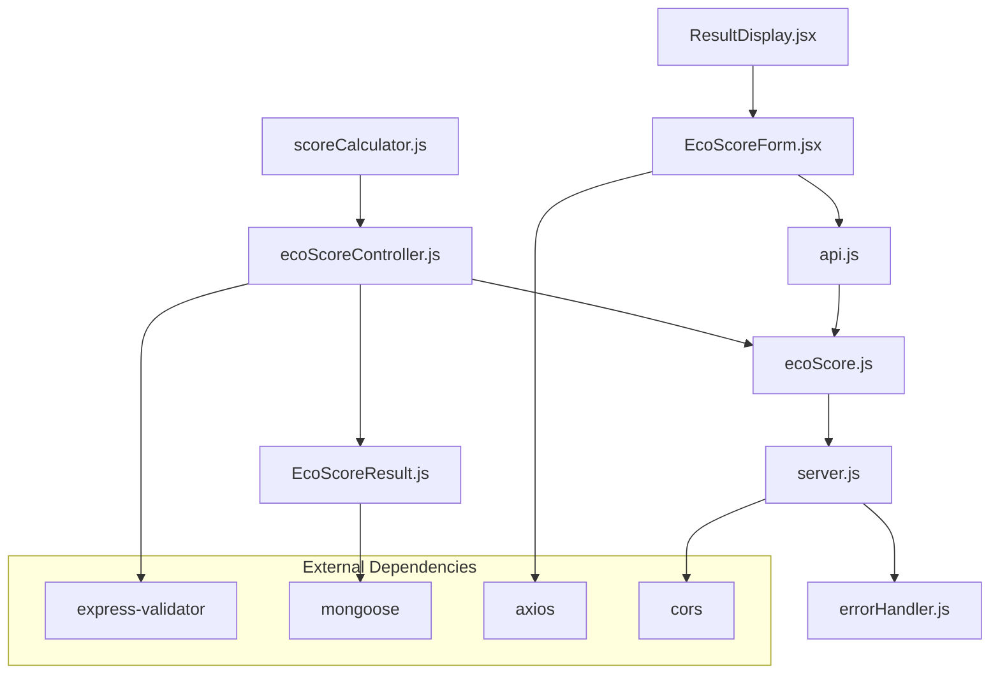

# Scoring Engine Implementation

<cite>
**Referenced Files in This Document**
- [scoreCalculator.js](file://server/utils/scoreCalculator.js)
- [ecoScoreController.js](file://server/controllers/ecoScoreController.js)
- [EcoScoreResult.js](file://server/models/EcoScoreResult.js)
- [ecoScore.js](file://server/routes/ecoScore.js)
- [errorHandler.js](file://server/middleware/errorHandler.js)
- [server.js](file://server/server.js)
- [EcoScoreForm.jsx](file://client/src/components/EcoScoreForm.jsx)
- [ResultDisplay.jsx](file://client/src/components/ResultDisplay.jsx)
- [api.js](file://client/src/services/api.js)
- [README.md](file://README.md)
</cite>

## Table of Contents
1. [Introduction](#introduction)
2. [Project Structure](#project-structure)
3. [Core Components](#core-components)
4. [Architecture Overview](#architecture-overview)
5. [Detailed Component Analysis](#detailed-component-analysis)
6. [Dependency Analysis](#dependency-analysis)
7. [Performance Considerations](#performance-considerations)
8. [Troubleshooting Guide](#troubleshooting-guide)
9. [Conclusion](#conclusion)
10. [Appendices](#appendices)

## Introduction
This document provides comprehensive documentation for the rule-based scoring engine implementation that calculates product sustainability scores. The system evaluates environmental impact based on seven key factors: carbon footprint, water usage, animal-based products, product origin, packaging materials, transportation modes, and product categories. The scoring algorithm applies weighted penalties to produce a normalized score between 0 and 100, with clear categorization and carbon impact assessment.

The implementation follows a clean, layered architecture with explicit separation of concerns between the frontend user interface, backend API, and database persistence. All calculations are performed using transparent, rule-based logic without machine learning or artificial intelligence components.

## Project Structure
The application follows a standard MERN stack architecture with clear separation between client and server components:

**Diagram sources**
- [server.js](file://server/server.js#L1-L34)
- [ecoScore.js](file://server/routes/ecoScore.js#L1-L9)
- [ecoScoreController.js](file://server/controllers/ecoScoreController.js#L1-L73)

The project structure demonstrates a well-organized layered architecture where each component has a specific responsibility:

- **Client Layer**: Handles user interaction and displays results
- **API Layer**: Manages HTTP requests and responses
- **Business Logic Layer**: Contains the scoring algorithm implementation
- **Data Access Layer**: Manages database operations
- **Infrastructure Layer**: Provides middleware and configuration

**Section sources**
- [README.md](file://README.md#L50-L74)
- [server.js](file://server/server.js#L1-L34)

## Core Components
The scoring engine consists of several interconnected components that work together to provide accurate environmental impact assessments:

### Scoring Algorithm Core
The heart of the system is the rule-based scoring algorithm implemented in the calculator utility. This algorithm initializes with a perfect score of 100 and systematically applies penalties based on input parameters.

### Input Validation System
The controller implements comprehensive input validation using Express Validator middleware to ensure data integrity and prevent invalid submissions.

### Database Persistence
Results are automatically persisted to MongoDB for historical tracking and analysis capabilities.

### Frontend Integration
The React-based frontend provides an intuitive interface for users to input product details and view calculated results with visual indicators.

**Section sources**
- [scoreCalculator.js](file://server/utils/scoreCalculator.js#L6-L113)
- [ecoScoreController.js](file://server/controllers/ecoScoreController.js#L1-L73)
- [EcoScoreResult.js](file://server/models/EcoScoreResult.js#L1-L20)

## Architecture Overview
The system employs a RESTful API architecture with clear separation of concerns and robust error handling mechanisms:

**Diagram sources**
- [ecoScore.js](file://server/routes/ecoScore.js#L5-L6)
- [ecoScoreController.js](file://server/controllers/ecoScoreController.js#L17-L67)
- [scoreCalculator.js](file://server/utils/scoreCalculator.js#L6-L113)

The architecture ensures that:
- Input validation occurs before any business logic processing
- The scoring algorithm remains isolated and testable
- Database operations are handled asynchronously
- Error conditions are properly managed and communicated

**Section sources**
- [server.js](file://server/server.js#L1-L34)
- [errorHandler.js](file://server/middleware/errorHandler.js#L1-L14)

## Detailed Component Analysis

### Score Calculation Algorithm
The scoring algorithm implements a comprehensive penalty-based system that evaluates seven critical environmental factors:

#### Base Score Initialization
The algorithm begins with a perfect score of 100, providing a clean slate for penalty application. This approach ensures that products with optimal characteristics achieve the highest possible score.

#### Carbon Footprint Penalties
Carbon footprint evaluation uses tiered penalty application:
- **High Impact**: Products exceeding 5 kg CO₂ receive maximum penalty of -20 points
- **Medium Impact**: Products between 2-5 kg CO₂ receive moderate penalty of -10 points
- **Low Impact**: Products below 2 kg CO₂ incur no carbon penalties

This tiered approach reflects the disproportionate environmental impact of high-carbon products while acknowledging the minimal impact of low-carbon alternatives.

#### Water Usage Penalties
Water consumption evaluation applies a straightforward threshold-based penalty:
- **Excessive Usage**: Products consuming more than 50 liters receive penalty of -15 points
- **Normal Usage**: Products within acceptable limits incur no water penalties

This threshold reflects the significant environmental impact of intensive water usage in manufacturing processes.

#### Animal-Based Product Penalty
Products containing animal ingredients receive a fixed penalty of -10 points, acknowledging the higher environmental costs associated with animal agriculture.

#### Product Origin Impact
Imported products incur a penalty of -10 points, reflecting the environmental costs of long-distance transportation and supply chain complexity.

#### Packaging Material Evaluation
Packaging materials are evaluated with varying penalty weights:
- **Plastic**: Maximum penalty of -15 points due to environmental persistence
- **Glass**: Moderate penalty of -5 points for energy-intensive production
- **Paper/Cardboard**: Minor penalty of -3 points for resource consumption
- **Compostable**: No penalty (0 points) as biodegradable materials
- **None**: Small bonus of +2 points for minimal packaging

This system encourages sustainable packaging choices while acknowledging the trade-offs between different materials.

#### Transportation Mode Assessment
Transportation methods are weighted according to their environmental impact:
- **Air Freight**: Maximum penalty of -20 points due to high fuel consumption
- **Sea Freight**: Moderate penalty of -10 points for shipping emissions
- **Road Transport**: Minor penalty of -5 points for trucking emissions

This ranking reflects the environmental costs of different transportation modes, with air freight being the most impactful and road transport being the least.

#### Score Normalization and Categorization
After penalty application, the score is clamped between 0 and 100 to maintain normalization. The algorithm then determines:
- **Excellent**: Scores of 80-100 (outstanding environmental performance)
- **Good**: Scores of 60-79 (good environmental performance)
- **Fair**: Scores of 40-59 (moderate environmental performance)
- **Needs Improvement**: Scores below 40 (poor environmental performance)

Additionally, carbon impact is categorized separately:
- **Low**: Carbon footprint below 2 kg CO₂
- **Medium**: Carbon footprint between 2-5 kg CO₂
- **High**: Carbon footprint above 5 kg CO₂

**Section sources**
- [scoreCalculator.js](file://server/utils/scoreCalculator.js#L6-L113)

### Controller Implementation
The controller serves as the central orchestrator for the scoring process, managing validation, calculation, and result generation:

#### Input Validation Pipeline
The controller implements comprehensive validation using Express Validator middleware:
- **Numeric Validation**: Ensures carbon and water values are positive numbers
- **Boolean Validation**: Confirms animal-based field is a valid boolean
- **Enum Validation**: Restricts origin, category, packaging, and transport fields to predefined values
- **Error Handling**: Returns structured error responses for validation failures

#### Request Processing Workflow
The controller follows a systematic approach to handle incoming requests:
1. **Validation Check**: Executes validation pipeline before processing
2. **Input Extraction**: Extracts validated data from request body
3. **Calculation Execution**: Invokes the scoring algorithm
4. **Database Persistence**: Saves results to MongoDB collection
5. **Response Generation**: Returns standardized success response

#### Error Management
The controller implements robust error handling:
- **Validation Errors**: Returns 400 status with detailed error messages
- **Processing Errors**: Passes exceptions to global error handler
- **Database Errors**: Handles persistence failures gracefully

**Section sources**
- [ecoScoreController.js](file://server/controllers/ecoScoreController.js#L1-L73)

### Database Schema Design
The MongoDB schema provides comprehensive storage for all scoring data:

#### Input Parameter Storage
The system stores all original input parameters for transparency and auditability:
- **Quantitative Fields**: Carbon footprint and water usage as numbers
- **Qualitative Fields**: Boolean for animal-based products
- **Enumerated Fields**: Origin, category, packaging, and transport options

#### Result Storage
Calculated results are stored alongside input data:
- **Score Value**: Final normalized score (0-100)
- **Category Classification**: Text-based category assignment
- **Carbon Impact**: Separate carbon impact assessment
- **Message Content**: Human-readable interpretation of results

#### Timestamp Management
Automatic timestamp tracking provides temporal context for all calculations.

**Section sources**
- [EcoScoreResult.js](file://server/models/EcoScoreResult.js#L1-L20)

### Frontend Integration Components
The React frontend provides an intuitive interface for user interaction:

#### Form Component Architecture
The form component manages state for all input parameters:
- **Real-time Validation**: Immediate feedback on input changes
- **Type Conversion**: Automatic conversion of string inputs to appropriate numeric types
- **Default Values**: Pre-populated selections for quick testing
- **Loading States**: Visual feedback during calculation processing

#### Result Visualization
Results are presented through a comprehensive display component:
- **Score Visualization**: Circular progress indicator with color-coded segments
- **Category Display**: Prominent badge showing score classification
- **Impact Assessment**: Clear carbon impact categorization
- **Actionable Feedback**: Constructive messaging based on score outcomes

#### API Integration
The frontend communicates with the backend through a clean service layer:
- **Environment Configuration**: Flexible API URL configuration
- **Error Propagation**: Proper handling of network and server errors
- **Response Processing**: Structured handling of calculation results

**Section sources**
- [EcoScoreForm.jsx](file://client/src/components/EcoScoreForm.jsx#L1-L225)
- [ResultDisplay.jsx](file://client/src/components/ResultDisplay.jsx#L1-L82)
- [api.js](file://client/src/services/api.js#L1-L13)

## Dependency Analysis
The system exhibits clear dependency relationships that support maintainability and scalability:

**Diagram sources**
- [scoreCalculator.js](file://server/utils/scoreCalculator.js#L1-L113)
- [ecoScoreController.js](file://server/controllers/ecoScoreController.js#L1-L73)
- [EcoScoreResult.js](file://server/models/EcoScoreResult.js#L1-L20)
- [ecoScore.js](file://server/routes/ecoScore.js#L1-L9)
- [server.js](file://server/server.js#L1-L34)

### Internal Dependencies
The system maintains clean internal dependencies:
- **Calculator Utility**: Pure function with no external dependencies
- **Controller Layer**: Depends on calculator utility and model
- **Route Layer**: Depends on controller implementation
- **Model Layer**: Depends on Mongoose for database operations

### External Dependencies
The system relies on well-established libraries:
- **Express Validator**: Robust input validation framework
- **Mongoose**: Comprehensive MongoDB object modeling
- **Axios**: Reliable HTTP client for frontend-backend communication
- **CORS**: Essential middleware for cross-origin resource sharing

**Section sources**
- [server.js](file://server/server.js#L1-L34)
- [ecoScoreController.js](file://server/controllers/ecoScoreController.js#L1-L73)

## Performance Considerations
The scoring engine is designed for optimal performance and scalability:

### Computational Efficiency
- **Linear Complexity**: Algorithm runs in O(n) time where n equals the number of evaluation criteria
- **Minimal Memory Usage**: Single pass calculation with constant memory overhead
- **Early Termination**: No branching complexity that would increase computational load

### Database Performance
- **Indexing Strategy**: MongoDB collections benefit from automatic indexing on timestamps
- **Write Optimization**: Asynchronous database operations prevent blocking
- **Connection Pooling**: Mongoose manages connection pooling efficiently

### Network Optimization
- **Lightweight Payloads**: JSON responses contain only essential calculation data
- **Efficient Serialization**: Minimal data transformation reduces processing overhead
- **Caching Opportunities**: Results can be cached for frequently accessed scenarios

### Scalability Factors
- **Horizontal Scaling**: Stateless nature allows easy horizontal scaling
- **Database Scaling**: MongoDB supports sharding for large datasets
- **Load Distribution**: Frontend and backend can scale independently

## Troubleshooting Guide

### Common Input Validation Issues
**Problem**: Validation errors when submitting forms
**Causes**: 
- Non-numeric values in carbon/water fields
- Invalid enumeration values in dropdown selections
- Missing required fields
- Incorrect data types for boolean fields

**Solutions**:
- Ensure carbon and water values are positive numbers
- Select valid options from dropdown menus
- Verify all required fields are completed
- Use radio buttons for boolean selections

**Section sources**
- [ecoScoreController.js](file://server/controllers/ecoScoreController.js#L6-L14)

### Database Connection Problems
**Problem**: MongoDB connection failures
**Causes**:
- Incorrect MONGODB_URI configuration
- Local MongoDB service not running
- Network connectivity issues
- Authentication failures

**Solutions**:
- Verify MongoDB URI format and credentials
- Ensure MongoDB service is running locally or accessible remotely
- Check network connectivity to MongoDB instance
- Validate authentication credentials if using cloud MongoDB

**Section sources**
- [server.js](file://server/server.js#L10-L11)

### API Communication Errors
**Problem**: Frontend fails to communicate with backend
**Causes**:
- Incorrect API URL configuration
- CORS policy restrictions
- Network connectivity issues
- Server downtime

**Solutions**:
- Verify VITE_API_URL environment variable
- Check CORS configuration in server.js
- Ensure backend server is running and accessible
- Monitor server logs for error messages

**Section sources**
- [api.js](file://client/src/services/api.js#L3-L12)
- [server.js](file://server/server.js#L14-L16)

### Calculation Logic Issues
**Problem**: Unexpected score calculations
**Causes**:
- Misunderstanding of penalty thresholds
- Incorrect interpretation of category boundaries
- Misconfigured input parameters
- Database persistence failures

**Solutions**:
- Review scoring thresholds in scoreCalculator.js
- Verify category boundary conditions
- Test with known input combinations
- Check database persistence status

**Section sources**
- [scoreCalculator.js](file://server/utils/scoreCalculator.js#L67-L90)

## Conclusion
The rule-based scoring engine implementation demonstrates a sophisticated yet transparent approach to environmental impact assessment. The system successfully balances computational efficiency with comprehensive evaluation criteria, providing actionable insights for sustainable product development.

Key strengths of the implementation include:
- **Transparency**: All scoring logic is explicit and easily auditable
- **Scalability**: Well-structured architecture supports future enhancements
- **Maintainability**: Clear separation of concerns facilitates ongoing development
- **User Experience**: Intuitive interface with immediate feedback
- **Data Integrity**: Comprehensive validation and error handling

The scoring algorithm effectively captures the environmental impact of various product characteristics through weighted penalties, providing meaningful categorization and actionable insights for consumers and manufacturers alike.

Future enhancements could include expanded evaluation criteria, historical trend analysis, and integration with product databases for automated scoring capabilities.

## Appendices

### Scoring Algorithm Reference
The following table summarizes the complete scoring algorithm:

| Factor | Condition | Penalty | Notes |
|--------|-----------|---------|-------|
| Carbon Footprint | > 5 kg CO₂ | -20 | High impact |
| Carbon Footprint | 2-5 kg CO₂ | -10 | Medium impact |
| Carbon Footprint | < 2 kg CO₂ | 0 | Low impact |
| Water Usage | > 50 L | -15 | Excessive usage |
| Water Usage | ≤ 50 L | 0 | Normal usage |
| Animal-Based | Yes | -10 | Animal agriculture |
| Animal-Based | No | 0 | Plant-based |
| Product Origin | Imported | -10 | Long-distance transport |
| Product Origin | Local | 0 | Reduced transport |
| Packaging | Plastic | -15 | Non-biodegradable |
| Packaging | Glass | -5 | Energy-intensive |
| Packaging | Paper/Cardboard | -3 | Resource consumption |
| Packaging | Compostable | 0 | Biodegradable |
| Packaging | None | +2 | Minimal packaging |
| Transportation | Air | -20 | Highest emissions |
| Transportation | Ship | -10 | Sea freight |
| Transportation | Truck | -5 | Road transport |

### Example Calculation Workflows

#### Example 1: Excellent Score Scenario
Input: Carbon: 1.0 kg, Water: 20 L, Animal-based: No, Origin: Local, Packaging: None, Transport: Truck
Calculation: 100 - 0 - 0 - 0 - 0 + 2 - 5 = 97
Result: Excellent (97/100), Carbon Impact: Low

#### Example 2: Poor Score Scenario
Input: Carbon: 10 kg, Water: 100 L, Animal-based: Yes, Origin: Imported, Packaging: Plastic, Transport: Air
Calculation: 100 - 20 - 15 - 10 - 10 - 15 - 20 = 10
Result: Needs Improvement (10/100), Carbon Impact: High

#### Example 3: Balanced Product
Input: Carbon: 3.0 kg, Water: 40 L, Animal-based: No, Origin: Local, Packaging: Paper, Transport: Ship
Calculation: 100 - 10 - 0 - 0 - 0 - 3 - 10 = 77
Result: Good (77/100), Carbon Impact: Medium

### API Endpoint Specifications

**Endpoint**: POST `/api/eco-score`
**Description**: Calculate environmental impact score for a product
**Request Body**: Complete product sustainability data
**Response**: Standardized score calculation result with metadata

**Section sources**
- [README.md](file://README.md#L144-L182)
- [scoreCalculator.js](file://server/utils/scoreCalculator.js#L6-L113)