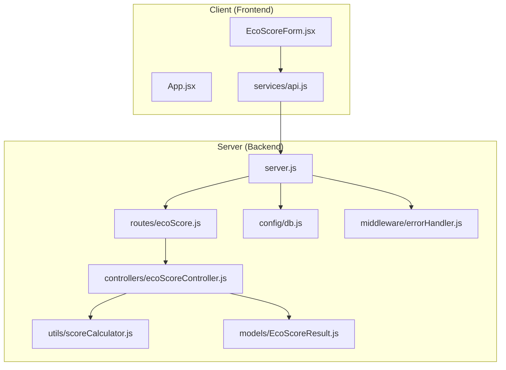
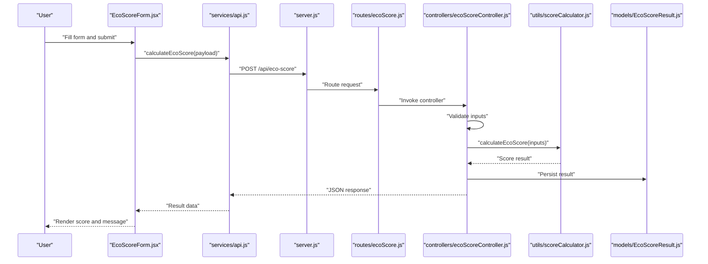

# Testing and Deployment

<cite>
**Referenced Files in This Document**
- [README.md](file://README.md)
- [client/package.json](file://client/package.json)
- [client/vite.config.js](file://client/vite.config.js)
- [client/.env.example](file://client/.env.example)
- [client/src/App.jsx](file://client/src/App.jsx)
- [client/src/components/EcoScoreForm.jsx](file://client/src/components/EcoScoreForm.jsx)
- [client/src/services/api.js](file://client/src/services/api.js)
- [server/package.json](file://server/package.json)
- [server/server.js](file://server/server.js)
- [server/.env.example](file://server/.env.example)
- [server/config/db.js](file://server/config/db.js)
- [server/middleware/errorHandler.js](file://server/middleware/errorHandler.js)
- [server/routes/ecoScore.js](file://server/routes/ecoScore.js)
- [server/controllers/ecoScoreController.js](file://server/controllers/ecoScoreController.js)
- [server/utils/scoreCalculator.js](file://server/utils/scoreCalculator.js)
- [server/models/EcoScoreResult.js](file://server/models/EcoScoreResult.js)
</cite>

## Table of Contents
1. [Introduction](#introduction)
2. [Project Structure](#project-structure)
3. [Core Components](#core-components)
4. [Architecture Overview](#architecture-overview)
5. [Manual Testing Procedures](#manual-testing-procedures)
6. [Automated Testing Strategies](#automated-testing-strategies)
7. [Build Process](#build-process)
8. [Production Optimization](#production-optimization)
9. [Deployment Preparation](#deployment-preparation)
10. [Environment Configuration](#environment-configuration)
11. [Monitoring and Maintenance](#monitoring-and-maintenance)
12. [Troubleshooting Guide](#troubleshooting-guide)
13. [Conclusion](#conclusion)

## Introduction
This document provides comprehensive testing and deployment guidance for the Eco Score Predictor application. It covers manual testing procedures with example test cases for excellent and poor scores, validation scenarios, and edge cases. It also outlines automated testing strategies, unit test implementation, and integration testing approaches. Additionally, it details the build process for both frontend and backend, production optimization techniques, deployment preparation, environment configuration, monitoring setup, maintenance procedures, troubleshooting guides for common deployment issues, and performance optimization strategies.

## Project Structure
The application follows a clear separation of concerns:
- Frontend (React + Vite): Handles user input, form submission, and display of results.
- Backend (Express + MongoDB): Provides REST endpoints, validates inputs, computes eco scores, persists results, and handles errors.

**Diagram sources**
- [client/src/App.jsx](file://client/src/App.jsx#L1-L37)
- [client/src/components/EcoScoreForm.jsx](file://client/src/components/EcoScoreForm.jsx#L1-L225)
- [client/src/services/api.js](file://client/src/services/api.js#L1-L13)
- [server/server.js](file://server/server.js#L1-L34)
- [server/routes/ecoScore.js](file://server/routes/ecoScore.js#L1-L9)
- [server/controllers/ecoScoreController.js](file://server/controllers/ecoScoreController.js#L1-L73)
- [server/utils/scoreCalculator.js](file://server/utils/scoreCalculator.js#L1-L113)
- [server/models/EcoScoreResult.js](file://server/models/EcoScoreResult.js#L1-L20)
- [server/config/db.js](file://server/config/db.js#L1-L18)
- [server/middleware/errorHandler.js](file://server/middleware/errorHandler.js#L1-L14)

**Section sources**
- [README.md](file://README.md#L50-L74)
- [client/package.json](file://client/package.json#L1-L32)
- [server/package.json](file://server/package.json#L1-L23)

## Core Components
- Frontend
  - App: Orchestrates layout and result display.
  - EcoScoreForm: Collects product attributes, performs client-side conversion, and submits to the backend.
  - API service: Encapsulates HTTP calls to the backend endpoint.
- Backend
  - Server: Initializes Express, connects to MongoDB, configures middleware, defines routes, and error handling.
  - Routes: Exposes POST /api/eco-score for score calculation.
  - Controller: Validates inputs, computes score via calculator, persists result, and returns structured JSON.
  - Calculator: Implements rule-based scoring logic with penalties and categories.
  - Model: Defines schema for persisted results.
  - DB Config: Establishes connection to MongoDB.
  - Error Handler: Centralized error response formatting.

**Section sources**
- [client/src/App.jsx](file://client/src/App.jsx#L1-L37)
- [client/src/components/EcoScoreForm.jsx](file://client/src/components/EcoScoreForm.jsx#L1-L225)
- [client/src/services/api.js](file://client/src/services/api.js#L1-L13)
- [server/server.js](file://server/server.js#L1-L34)
- [server/routes/ecoScore.js](file://server/routes/ecoScore.js#L1-L9)
- [server/controllers/ecoScoreController.js](file://server/controllers/ecoScoreController.js#L1-L73)
- [server/utils/scoreCalculator.js](file://server/utils/scoreCalculator.js#L1-L113)
- [server/models/EcoScoreResult.js](file://server/models/EcoScoreResult.js#L1-L20)
- [server/config/db.js](file://server/config/db.js#L1-L18)
- [server/middleware/errorHandler.js](file://server/middleware/errorHandler.js#L1-L14)

## Architecture Overview
The system uses a RESTful API pattern:
- Client sends product attributes to POST /api/eco-score.
- Server validates inputs, computes eco score, saves result to MongoDB, and returns a JSON response.
- Client displays the result and scrolls smoothly to the results section.

**Diagram sources**
- [client/src/components/EcoScoreForm.jsx](file://client/src/components/EcoScoreForm.jsx#L26-L47)
- [client/src/services/api.js](file://client/src/services/api.js#L5-L12)
- [server/server.js](file://server/server.js#L18-L27)
- [server/routes/ecoScore.js](file://server/routes/ecoScore.js#L5-L6)
- [server/controllers/ecoScoreController.js](file://server/controllers/ecoScoreController.js#L17-L66)
- [server/utils/scoreCalculator.js](file://server/utils/scoreCalculator.js#L6-L110)
- [server/models/EcoScoreResult.js](file://server/models/EcoScoreResult.js#L3-L17)

## Manual Testing Procedures
Objective: Validate correctness of scoring logic, input validation, and UI behavior.

- Example Test Case 1: Excellent Score
  - Inputs: Low carbon footprint, low water usage, not animal-based, local origin, food category, no packaging, truck transport.
  - Expected outcome: High eco score and category “Excellent”.
  - Reference: [README.md](file://README.md#L193-L201)

- Example Test Case 2: Poor Score
  - Inputs: High carbon footprint, high water usage, animal-based, imported origin, plastic packaging, air transport.
  - Expected outcome: Low eco score and category “Needs Improvement”.
  - Reference: [README.md](file://README.md#L203-L211)

Validation Scenarios
- Positive numeric constraints for carbon and water.
- Enumerated values for origin, category, packaging, and transport.
- Boolean for animal-based flag.
- Reference: [server/controllers/ecoScoreController.js](file://server/controllers/ecoScoreController.js#L6-L14)

Edge Cases
- Zero values for carbon and water.
- Maximum plausible values within constraints.
- Mixed valid/invalid combinations to trigger validation errors.
- Reference: [server/controllers/ecoScoreController.js](file://server/controllers/ecoScoreController.js#L20-L26)

UI Behavior
- Loading state during submission.
- Error message display on failure.
- Smooth scrolling to results after submission.
- Reference: [client/src/components/EcoScoreForm.jsx](file://client/src/components/EcoScoreForm.jsx#L26-L47), [client/src/App.jsx](file://client/src/App.jsx#L10-L19)

**Section sources**
- [README.md](file://README.md#L191-L211)
- [client/src/components/EcoScoreForm.jsx](file://client/src/components/EcoScoreForm.jsx#L26-L47)
- [client/src/App.jsx](file://client/src/App.jsx#L10-L19)
- [server/controllers/ecoScoreController.js](file://server/controllers/ecoScoreController.js#L6-L14)

## Automated Testing Strategies
Current State
- Backend lacks explicit test scripts; the test script currently reports no tests.
  - Reference: [server/package.json](file://server/package.json#L9)

Recommended Unit Tests (Backend)
- Module: scoreCalculator.js
  - Purpose: Verify scoring logic for various input combinations.
  - Coverage: Excellent, Good, Fair, Needs Improvement thresholds; carbon impact mapping; message generation.
  - References: [server/utils/scoreCalculator.js](file://server/utils/scoreCalculator.js#L6-L110)

- Module: ecoScoreController.js
  - Purpose: Validate input validation pipeline and successful response shape.
  - Coverage: Valid inputs produce 200 with expected fields; invalid inputs produce 400 with errors array.
  - References: [server/controllers/ecoScoreController.js](file://server/controllers/ecoScoreController.js#L17-L66)

Recommended Integration Tests (Backend)
- Endpoint: POST /api/eco-score
  - Purpose: End-to-end verification of request processing, database persistence, and response format.
  - Coverage: Happy path, validation failures, and error handling.
  - References: [server/routes/ecoScore.js](file://server/routes/ecoScore.js#L5-L6), [server/controllers/ecoScoreController.js](file://server/controllers/ecoScoreController.js#L17-L66), [server/models/EcoScoreResult.js](file://server/models/EcoScoreResult.js#L3-L17)

Frontend Unit Tests (Optional)
- Module: services/api.js
  - Purpose: Mock network requests and assert correct URL construction and error propagation.
  - References: [client/src/services/api.js](file://client/src/services/api.js#L3-L12)

- Module: EcoScoreForm.jsx
  - Purpose: Validate form state updates, payload transformation, and error rendering.
  - References: [client/src/components/EcoScoreForm.jsx](file://client/src/components/EcoScoreForm.jsx#L5-L47)

Test Execution Commands
- Backend: Add a test script to run unit/integration tests using a framework such as Jest or Mocha.
  - Reference: [server/package.json](file://server/package.json#L6-L10)

**Section sources**
- [server/package.json](file://server/package.json#L6-L10)
- [server/utils/scoreCalculator.js](file://server/utils/scoreCalculator.js#L6-L110)
- [server/controllers/ecoScoreController.js](file://server/controllers/ecoScoreController.js#L17-L66)
- [server/routes/ecoScore.js](file://server/routes/ecoScore.js#L5-L6)
- [server/models/EcoScoreResult.js](file://server/models/EcoScoreResult.js#L3-L17)
- [client/src/services/api.js](file://client/src/services/api.js#L3-L12)
- [client/src/components/EcoScoreForm.jsx](file://client/src/components/EcoScoreForm.jsx#L5-L47)

## Build Process
Frontend
- Scripts: Development, build, preview, lint.
- Build tool: Vite with React plugin.
- Environment variable: VITE_API_URL for backend base URL.
- References: [client/package.json](file://client/package.json#L6-L11), [client/vite.config.js](file://client/vite.config.js#L1-L8), [client/.env.example](file://client/.env.example#L1)

Backend
- Scripts: Start (production), dev (development with nodemon).
- References: [server/package.json](file://server/package.json#L6-L10)

Build Commands
- Frontend: npm run build (production bundle).
- Backend: npm start (production server).
- References: [client/package.json](file://client/package.json#L8), [server/package.json](file://server/package.json#L7)

**Section sources**
- [client/package.json](file://client/package.json#L6-L11)
- [client/vite.config.js](file://client/vite.config.js#L1-L8)
- [client/.env.example](file://client/.env.example#L1)
- [server/package.json](file://server/package.json#L6-L10)

## Production Optimization
Frontend
- Bundle optimization: Vite’s production build minimizes assets and enables tree-shaking.
- Environment configuration: Ensure VITE_API_URL points to the production backend.
- References: [client/package.json](file://client/package.json#L8), [client/.env.example](file://client/.env.example#L1)

Backend
- Environment: Set NODE_ENV=production and configure MONGODB_URI for the production database.
- References: [server/.env.example](file://server/.env.example#L1-L4)

Security Hardening
- CORS: Enabled; restrict origins in production as needed.
- Validation: Input validation prevents malformed data.
- References: [server/server.js](file://server/server.js#L14), [server/controllers/ecoScoreController.js](file://server/controllers/ecoScoreController.js#L6-L14)

**Section sources**
- [client/package.json](file://client/package.json#L8)
- [client/.env.example](file://client/.env.example#L1)
- [server/.env.example](file://server/.env.example#L1-L4)
- [server/server.js](file://server/server.js#L14)
- [server/controllers/ecoScoreController.js](file://server/controllers/ecoScoreController.js#L6-L14)

## Deployment Preparation
Prerequisites
- MongoDB instance (local or cloud Atlas).
- Node.js runtime.
- Ports 5000 (backend) and 5173 (frontend dev) open as applicable.

Backend
- Configure environment variables (PORT, MONGODB_URI, NODE_ENV).
- Start production server using npm start.
- References: [server/.env.example](file://server/.env.example#L1-L4), [server/package.json](file://server/package.json#L7), [server/server.js](file://server/server.js#L29-L33)

Frontend
- Build production bundle using npm run build.
- Serve static assets behind a reverse proxy or CDN.
- References: [client/package.json](file://client/package.json#L8), [client/.env.example](file://client/.env.example#L1)

Reverse Proxy and HTTPS
- Use Nginx/Apache to serve the frontend and proxy /api to the backend.
- Terminate TLS at the proxy for HTTPS.

CI/CD Pipeline (Recommended)
- Build frontend and backend artifacts.
- Run unit and integration tests.
- Deploy backend to a container or platform (e.g., Render, Railway, Docker).
- Deploy frontend static assets to a CDN or static hosting provider.

**Section sources**
- [server/.env.example](file://server/.env.example#L1-L4)
- [server/package.json](file://server/package.json#L7)
- [server/server.js](file://server/server.js#L29-L33)
- [client/package.json](file://client/package.json#L8)
- [client/.env.example](file://client/.env.example#L1)

## Environment Configuration
Backend
- Required variables: PORT, MONGODB_URI, NODE_ENV.
- References: [server/.env.example](file://server/.env.example#L1-L4)

Frontend
- Required variables: VITE_API_URL (must match backend base URL).
- References: [client/.env.example](file://client/.env.example#L1)

Runtime Behavior
- Server health check responds at root path.
- References: [server/server.js](file://server/server.js#L21-L24)

**Section sources**
- [server/.env.example](file://server/.env.example#L1-L4)
- [client/.env.example](file://client/.env.example#L1)
- [server/server.js](file://server/server.js#L21-L24)

## Monitoring and Maintenance
Logging
- Server logs startup and database connection status.
- Error handler logs stack traces in development; returns sanitized messages in production.
- References: [server/server.js](file://server/server.js#L31-L33), [server/config/db.js](file://server/config/db.js#L10), [server/middleware/errorHandler.js](file://server/middleware/errorHandler.js#L1-L11)

Health Checks
- Root GET endpoint indicates API availability.
- References: [server/server.js](file://server/server.js#L21-L24)

Database Maintenance
- Schema enforces enumerated values and required fields.
- Timestamps included automatically.
- References: [server/models/EcoScoreResult.js](file://server/models/EcoScoreResult.js#L3-L17)

Operational Alerts (Recommended)
- Monitor MongoDB connectivity and response latency.
- Track API error rates and response times.
- Alert on database connection failures and uncaught exceptions.

**Section sources**
- [server/server.js](file://server/server.js#L31-L33)
- [server/config/db.js](file://server/config/db.js#L10)
- [server/middleware/errorHandler.js](file://server/middleware/errorHandler.js#L1-L11)
- [server/models/EcoScoreResult.js](file://server/models/EcoScoreResult.js#L3-L17)

## Troubleshooting Guide
Common Issues and Resolutions
- Backend fails to start
  - Verify MONGODB_URI and that MongoDB is reachable.
  - Check PORT availability.
  - References: [server/.env.example](file://server/.env.example#L1-L4), [server/config/db.js](file://server/config/db.js#L11-L14), [server/server.js](file://server/server.js#L29-L33)

- Frontend cannot reach backend
  - Ensure VITE_API_URL matches the deployed backend base URL.
  - Confirm CORS is enabled and cross-origin requests are allowed.
  - References: [client/.env.example](file://client/.env.example#L1), [server/server.js](file://server/server.js#L14)

- Validation errors on submission
  - Confirm inputs meet constraints (positive numbers, enumerated values, boolean).
  - Review validation messages returned by the API.
  - References: [server/controllers/ecoScoreController.js](file://server/controllers/ecoScoreController.js#L6-L14), [server/controllers/ecoScoreController.js](file://server/controllers/ecoScoreController.js#L20-L26)

- Unexpected score categories
  - Validate input ranges against scoring thresholds.
  - Use example test cases as baselines.
  - References: [server/utils/scoreCalculator.js](file://server/utils/scoreCalculator.js#L67-L110), [README.md](file://README.md#L33-L49)

- Database persistence failures
  - Check model schema and required fields.
  - Inspect error logs from the error handler.
  - References: [server/models/EcoScoreResult.js](file://server/models/EcoScoreResult.js#L3-L17), [server/middleware/errorHandler.js](file://server/middleware/errorHandler.js#L1-L11)

**Section sources**
- [server/.env.example](file://server/.env.example#L1-L4)
- [server/config/db.js](file://server/config/db.js#L11-L14)
- [server/server.js](file://server/server.js#L14)
- [client/.env.example](file://client/.env.example#L1)
- [server/controllers/ecoScoreController.js](file://server/controllers/ecoScoreController.js#L6-L14)
- [server/controllers/ecoScoreController.js](file://server/controllers/ecoScoreController.js#L20-L26)
- [server/utils/scoreCalculator.js](file://server/utils/scoreCalculator.js#L67-L110)
- [README.md](file://README.md#L33-L49)
- [server/models/EcoScoreResult.js](file://server/models/EcoScoreResult.js#L3-L17)
- [server/middleware/errorHandler.js](file://server/middleware/errorHandler.js#L1-L11)

## Conclusion
This guide consolidates testing and deployment practices for the Eco Score Predictor application. By following the manual test cases, implementing unit and integration tests, preparing production builds, configuring environments securely, and establishing monitoring and maintenance routines, teams can reliably deliver and operate the application. The provided references map each recommendation to actual source files, ensuring traceability and accuracy.